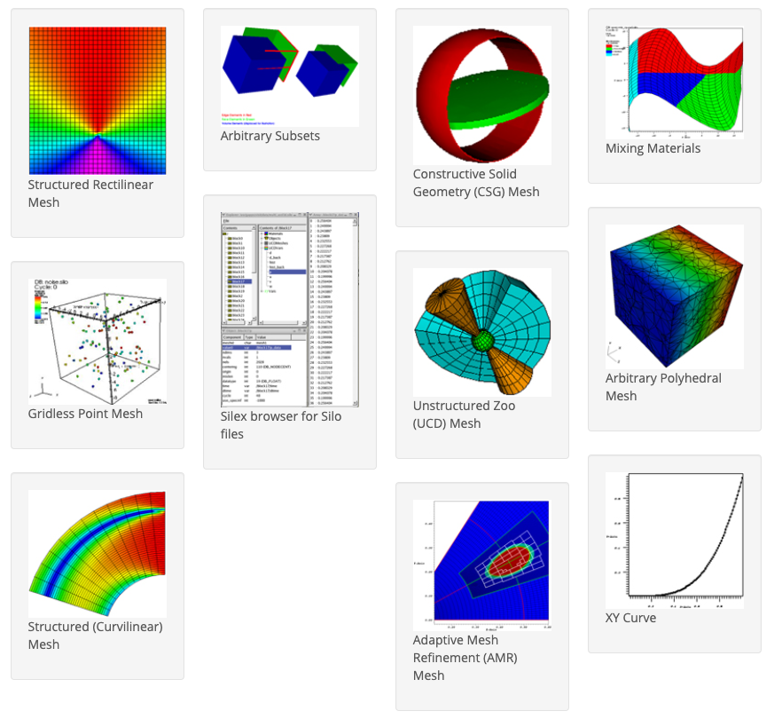

Silo is a [C/Fortran API](https://silo.readthedocs.io/) for reading and writing a wide variety of scientific data to binary files.
Silo files can be easily shared and exchanged between wholly independently developed applications running on disparate computing platforms.

Consequently, Silo facilitates the development of general purpose tools for processing scientific data.
One of the more popular tools to process Silo data is the [VisIt](https://github.com/visit-dav/visit) visualization tool.

Silo supports a variety of mesh types (pictured below) including simple curves, gridless (point), structured, unstructured-zoo and unstructured-arbitrary, block structured AMR, and constructive solid geometry (CSG).

In addition, Silo supports piecewise-constant (e.g., zone-centered) and piecewise-linear (e.g., node-centered) variables (e.g., *fields*) defined on the node, edge, face or volume elements of meshes.

Silo also supports the decomposition of meshes into arbitrary subsets and subset hierarchies including materials with optimal mixing.

Although Silo is a serial library, key features enable it to be applied easily and effectively in scalable, parallel applications using the [Multiple Independent File (MIF)](https://www.hdfgroup.org/2017/03/mif-parallel-io-with-hdf5/) parallel I/O paradigm.
