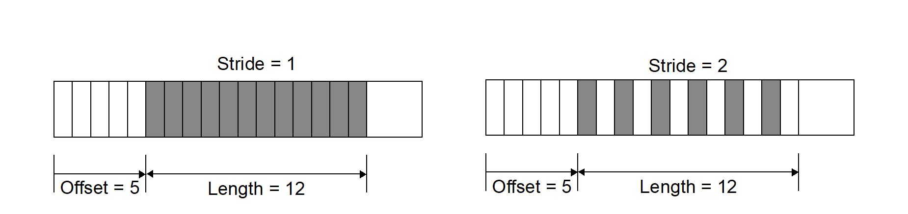

# User Defined (Generic) Data and Objects

If you want to create data that other applications (not written by you or someone working closely with you) can read and understand, these are **not** the right functions to use.
That is because the data that these functions create is not self-describing and inherently non-shareable.

However, if you need to write data that only you (or someone working closely with you) will read such as for restart purposes, the functions described here may be helpful.
The functions described here allow users to read and write arbitrary arrays of raw data as well as to create and write or read user-defined Silo objects.

{{ EndFunc }}

## `DBWrite()`

* **Summary:** Write a simple variable.

* **C Signature:**

  ```
  int DBWrite (DBfile *dbfile, char const *varname, void const *var,
      int const *dims, int ndims, int datatype)
  ```

* **Fortran Signature:**

  ```

* **Arguments:**

  Arg name | Description
  :---|:---
  `dbfile` | Database file pointer.
  `varname` | Name of the simple variable.
  `var` | Array defining the values associated with the variable.
  `dims` | Array of length `ndims` which describes the dimensionality of the variable. Each value in the `dims` array indicates the number of elements contained in the variable along that dimension.
  `ndims` | Number of dimensions.
  `datatype` | Datatype of the variable. One of the predefined Silo data types.

* **Returned value:**

  Returns zero on success and -1 on failure.

* **Description:**

  The `DBWrite` function writes a simple variable into a Silo file.
  It is not associated with any other Silo object.

{{ EndFunc }}

## `DBWriteSlice()`

* **Summary:** Write a (hyper)slab of a simple variable

* **C Signature:**

  ```
  int DBWriteSlice (DBfile *dbfile, char const *varname,
      void const *var, int datatype, int const *offset,
      int cost *length, int const *stride, int const *dims,
      int ndims)
  ```

* **Fortran Signature:**

  ```
  integer function dbwriteslice(dbid, varname, lvarname, var,
     datatype, offset, length, stride, dims, ndims)
  ```

* **Arguments:**

  Arg name | Description
  :---|:---
  `dbfile` | Database file pointer.
  `varname` | Name of the simple variable.
  `var` | Array defining the values associated with the slab.
  `datatype` | Datatype of the variable. One of the predefined Silo data types.
  `offset` | Array of `length` `ndims` of offsets in each dimension of the variable. This is the 0-origin position from which to begin writing the slice.
  `length` | Array of `length` `ndims` of lengths of data in each dimension to write to the variable. All lengths must be positive.
  `stride` | Array of `length` `ndims` of `stride` steps in each dimension. If no striding is desired, zeroes should be passed in this array.
  `dims` | Array of `length` `ndims` which describes the dimensionality of the entire variable. Each value in the `dims` array indicates the number of elements contained in the entire variable along that dimension.
  `ndims` | Number of dimensions.

* **Returned value:**

  zero on success and -1 on failure.

* **Description:**

  The `DBWriteSlice` function writes a slab of data to a simple variable from the data provided in the `var` pointer.
  Any hyperslab of data may be written.

  The size of the entire variable (after all slabs have been written) must be known when the `DBWriteSlice` function is called.
  The data in the `var` parameter is written into the entire variable using the location specified in the offset, length, and `stride` parameters.
  The data that makes up the entire variable may be written with one or more calls to `DBWriteSlice`.

  The minimum `length` value is 1 and the minimum `stride` value is one.

  A one-dimensional array slice:

  
  Figure 0-11: Array slice

{{ EndFunc }}

## `DBReadVar()`

* **Summary:** Read a simple Silo variable.

* **C Signature:**

  ```
  int DBReadVar (DBfile *dbfile, char const *varname, void *result)
  ```

* **Fortran Signature:**

  ```
  integer function dbrdvar(dbid, varname, lvarname, ptr)
  ```

* **Arguments:**

  Arg name | Description
  :---|:---
  `dbfile` | Database file pointer.
  `varname` | Name of the simple variable.
  `result` | Pointer to memory into which the variable should be read. It is up to the application to provide sufficient space in which to read the variable.

* **Returned value:**

  zero on success and -1 on failure.

* **Description:**

  The `DBReadVar` function reads a simple variable into the given space.

  See [`DBGetVar`](#dbgetvar) for a memory-allocating version of this function.

{{ EndFunc }}

## `DBReadVarSlice()`

* **Summary:** Read a (hyper)slab of data from a simple variable.

* **C Signature:**

  ```
  int DBReadVarSlice (DBfile *dbfile, char const *varname,
      int const *offset, int const *length, int const *stride,
      int ndims, void *result)
  ```

* **Fortran Signature:**

  ```
  integer function dbrdvarslice(dbid, varname, lvarname, offset,
     length, stride, ndims, ptr)
  ```

* **Arguments:**

  Arg name | Description
  :---|:---
  `dbfile` | Database file pointer.
  `varname` | Name of the simple variable.
  `offset` | Array of `length` `ndims` of offsets in each dimension of the variable. This is the 0-origin position from which to begin reading the slice.
  `length` | Array of `length` `ndims` of lengths of data in each dimension to read from the variable. All lengths must be positive.
  `stride` | Array of `length` `ndims` of `stride` steps in each dimension. If no striding is desired, zeroes should be passed in this array.
  `ndims` | Number of dimensions in the variable.
  `result` | Pointer to location where the slice is to be written. It is up to the application to provide sufficient space in which to read the variable.

* **Returned value:**

  zero on success and -1 on failure.

* **Description:**

  The `DBReadVarSlice` function reads a slab of data from a simple variable into a location provided in the `result` pointer.
  Any hyperslab of data may be read.

  Note that the minimum `length` value is 1 and the minimum `stride` value is one.

  A one-dimensional array slice:

  
  Figure 0-12: Array slice

{{ EndFunc }}

## `DBGetVar()`

* **Summary:** Allocate space for, and return, a simple variable.

* **C Signature:**

  ```
  void *DBGetVar (DBfile *dbfile, char const *varname)
  ```

* **Fortran Signature:**

  ```
  None
  ```

* **Arguments:**

  Arg name | Description
  :---|:---
  `dbfile` | Database file pointer.
  `varname` | Name of the variable

* **Returned value:**

  A pointer to newly allocated and populated memory on success and `NULL` on failure.

* **Description:**

  The `DBGetVar` function allocates space for a simple variable, reads the variable from the Silo database, and returns a pointer to the new space.
  If an error occurs, `NULL` is returned.
  It is up to the application to cast the returned pointer to the correct data type.

  See [`DBReadVar`](#dbreadvar) for non-memory allocating versions of this function.

{{ EndFunc }}

## `DBInqVarExists()`

* **Summary:** Queries variable existence

* **C Signature:**

  ```
  int DBInqVarExists (DBfile *dbfile, char const *name);
  ```

* **Fortran Signature:**

  ```
  None
  ```

* **Arguments:**

  Arg name | Description
  :---|:---
  `dbfile` | Database file pointer.
  `name` | Object name.

* **Returned value:**

  DBInqVarExists returns non-zero if the object exists in the file.
  Zero otherwise.

* **Description:**

  The `DBInqVarExists` function is used to check for existence of an object in the given file.

  If an object was written to a file, but the file has yet to be DBClose'd, the results of this function querying that variable are undefined.

{{ EndFunc }}

## `DBInqVarType()`

* **Summary:** Return the type of the given object

* **C Signature:**

  ```
  DBObjectType DBInqVarType (DBfile *dbfile, char const *name);
  ```

* **Fortran Signature:**

  ```
  None
  ```

* **Arguments:**

  Arg name | Description
  :---|:---
  `dbfile` | Database file pointer.
  `name` | Object `name`.

* **Returned value:**

 Returns the [`DBObjectType`](header.md#dbobjecttype) corresponding to the given object.

* **Description:**

  The `DBInqVarType` function returns the [`DBObjectType`](header.md#dbobjecttype) of the given object.
  The value returned is described in the following table:

  Object Type|Returned Value
  :---|:---
  Invalid or object not found|`DB_INVALID_OBJECT`
  Quadmesh|`DB_QUADMESH`
  Quadvar|`DB_QUADVAR`
  UCD mesh|`DB_UCDMESH`
  UCD variable|`DB_UCDVAR`
  CSG mesh|`DB_CSGMESH`
  CSG variable|`DB_CSGVAR`
  Multiblock mesh|`DB_MULTIMESH`
  Multiblock variable|`DB_MULTIVAR`
  Multiblock material|`DB_MULTIMAT`
  Multiblock material species|`DB_MULTIMATSPECIES`
  Material|`DB_MATERIAL`
  Material species|`DB_MATSPECIES`
  Facelist|`DB_FACELIST`
  Zonelist|`DB_ZONELIST`
  Polyhedral-Zonelist|`DB_PHZONELIST`
  CSG-Zonelist|`DB_CSGZONELIST`
  Edgelist|`DB_EDGELIST`
  Curve|`DB_CURVE`
  Pointmesh|`DB_POINTMESH`
  Pointvar|`DB_POINTVAR`
  Defvars|`DB_DEFVARS`
  Compound array|`DB_ARRAY`
  Directory|`DB_DIR`
  Other variable (one written out using `DBWrite`.)|`DB_VARIABLE`
  User-defined|`DB_USERDEF`

{{ EndFunc }}

## `DBGetVarByteLength()`

* **Summary:** Return the memory byte length of a simple variable.

* **C Signature:**

  ```
  int DBGetVarByteLength(DBfile *dbfile, char const *varname)
  ```

* **Fortran Signature:**

  ```
  None
  ```

* **Arguments:**

  Arg name | Description
  :---|:---
  `dbfile` | Database file pointer.
  `varname` | Variable name.


* **Returned value:**

  The length of the given simple variable in bytes on success and -1 on failure.

* **Description:**

  The `DBGetVarByteLength` function returns the *memory* length of the requested simple variable, in bytes.
  This is useful for determining how much memory to allocate before reading a simple variable with `DBReadVar`.
  Note that this would not be a concern if one used the `DBGetVar` function, which allocates space itself.

{{ EndFunc }}

## `DBGetVarByteLengthInFile()`

* **Summary:** Get the *file* length of a simple variable

* **C Signature:**

  ```
  DBGetVarByteLengthInFile(DBfile *file, char const *name)
  ```

* **Fortran Signature:**

  ```
  None
  ```

* **Arguments:**

  Arg name | Description
  :---|:---
  `dbfile` | The silo database file handle
  `name` | Name of a simple variable in the file
  
* **Returned value:**

  Length of variable in file on success; -1 on failure.

* **Description:**

  Sometimes, the length of a variable in a file may be different from its length in memory.
  This is especially true if type conversion is performed on the variable when it is being read or when compression is applied.
  This function returns the number of bytes the variable takes up in the file.

{{ EndFunc }}

## `DBGetVarDims()`

* **Summary:** Get dimension information of a variable in a Silo file

* **C Signature:**

  ```
  int DBGetVarDims(DBfile *file, const char const *name, int
      maxdims, int *dims)
  ```

* **Fortran Signature:**

  ```
  None
  ```

* **Arguments:**

  Arg name | Description
  :---|:---
  `file` | The Silo database `file` handle.
  `name` | The `name` of the Silo object to obtain dimension information for.
  `maxdims` | The maximum size of `dims`.
  `dims` | An array of `maxdims` integer values to be populated with the dimension information returned by this call.

* **Returned value:**

  The number of dimensions on success; -1 on failure

* **Description:**

  This function will populate the `dims` array up to a maximum of `maxdims` values with dimension information of the specified Silo variable (object) `name`.
  The number of dimensions is returned as the function's return value.

{{ EndFunc }}

## `DBGetVarLength()`

* **Summary:** Return the number of elements in a simple variable.

* **C Signature:**

  ```
  int DBGetVarLength (DBfile *dbfile, char const *varname)
  ```

* **Fortran Signature:**

  ```
  integer function dbinqlen(dbid, varname, lvarname, len)
  ```


* **Arguments:**

  Arg name | Description
  :---|:---
  `dbfile` | Database file pointer.
  `varname` | Variable name.

* **Returned value:**

  The number of *elements* in the given simple variable on success and -1 on failure.

* **Description:**

  The `DBGetVarLength` function returns the length of the requested simple variable, in number of elements.
  For example a 16 byte array containing 4 floats has 4 elements.

{{ EndFunc }}

## `DBGetVarType()`

* **Summary:** Return the Silo datatype of a simple variable.

* **C Signature:**

  ```
  int DBGetVarType (DBfile *dbfile, char const *varname)
  ```

* **Fortran Signature:**

  ```
  None
  ```

* **Arguments:**

  Arg name | Description
  :---|:---
  `dbfile` | Database file pointer.
  `varname` | Variable name.

* **Returned value:**

  The Silo [`DBdatatype`](header.md#dbdatatype) of the given simple variable on success and -1 on failure.

* **Description:**

  The `DBGetVarType` function returns the Silo [`DBdatatype`](header.md#dbdatatype) of the requested simple variable.
  This works only for simple Silo variables (those written using [`DBWrite`](#dbwrite) or [`DBWriteSlice`](#dbwriteslice)).
  To query the type of other variables, use [`DBInqVarType`](#dbinqvartype) instead.

{{ EndFunc }}

## `DBPutCompoundarray()`

* **Summary:** Write a Compound Array object into a Silo file.

* **C Signature:**

  ```
  int DBPutCompoundarray (DBfile *dbfile, char const *name,
      char const * const elemnames[], int const *elemlengths,
      int nelems, void const *values, int nvalues, int datatype,
      DBoptlist const *optlist);
  ```

* **Fortran Signature:**

  ```
  integer function dbputca(dbid, name, lname, elemnames,
     lelemnames, elemlengths, nelems, values, datatype, optlist_id,
     status)
  ```

  character*N elemnames (See [`dbset2dstrlen`](./fortran.md#dbset2dstrlen).)

* **Arguments:**

  Arg name | Description
  :---|:---
  `dbfile` | Database file pointer
  `name` | Name of the compound array structure.
  `elemnames` | Array of length `nelems` containing pointers to the names of the elements.
  `elemlengths` | Array of length `nelems` containing the lengths of the elements.
  `nelems` | Number of simple array elements.
  `values` | Array whose length is determined by `nelems` and `elemlengths` containing the `values` of the simple array elements.
  `nvalues` | Total length of the `values` array.
  `datatype` | Data type of the `values` array. One of the predefined Silo types.
  `optlist` | Pointer to an option list structure containing additional information to be included in the compound array object written into the Silo file. Use `NULL` is there are no options.

* **Returned value:**

  DBPutCompoundarray returns zero on success and -1 on failure.

* **Description:**

  The `DBPutCompoundarray` function writes a compound array object into a Silo file.
  A compound array is an array whose elements are simple arrays all of which are the same [`DBdatatype`](header.md#dbdatatype).

  Often, an application will partition a block of memory into named pieces, but write the block to a database as a single entity.
  Fortran common blocks are used in this way.
  The compound array object is an abstraction of this partitioned memory block.

{{ EndFunc }}

## `DBInqCompoundarray()`

* **Summary:** Inquire Compound Array attributes.

* **C Signature:**

  ```
  int DBInqCompoundarray (DBfile *dbfile, char const *name,
      char ***elemnames, int *elemlengths,
      int *nelems, int *nvalues, int *datatype)
  ```

* **Fortran Signature:**

  ```
  integer function dbinqca(dbid, name, lname, maxwidth,
     nelems, nvalues, datatype)
  ```

* **Arguments:**

  Arg name | Description
  :---|:---
  `dbfile` | Database file pointer.
  `name` | Name of the compound array.
  `elemnames` | Returned array of length `nelems` containing pointers to the names of the array elements.
  `elemlengths` | Returned array of length `nelems` containing the lengths of the array elements.
  `nelems` | Returned number of array elements.
  `nvalues` | Returned number of total values in the compound array.
  `datatype` | Datatype of the data values. One of the predefined Silo data types.

* **Returned value:**

  Zero on success and -1 on failure.

* **Description:**

  The `DBInqCompoundarray` function returns information about the compound array.
  It does not return the data values themselves; use [`DBGetCompoundarray`](#dbgetcompoundarray) instead.

{{ EndFunc }}

## `DBGetCompoundarray()`

* **Summary:** Read a compound array from a Silo database.

* **C Signature:**

  ```
  DBcompoundarray *DBGetCompoundarray (DBfile *dbfile,
      char const *arrayname)
  ```

* **Fortran Signature:**

  ```
  integer function dbgetca(dbid, name, lname, lelemnames,
     elemnames, elemlengths, nelems, values, nvalues, datatype)
  ```

* **Arguments:**

  Arg name | Description
  :---|:---
  `dbfile` | Database file pointer.
  `arrayname` | Name of the compound array.

* **Returned value:**

  A pointer to a [`DBcompoundarray`](header.md#dbcompoundarray) structure on success and `NULL` on failure.

* **Description:**

  The `DBGetCompoundarray` function allocates a [`DBcompoundarray`](header.md#dbcompoundarray) structure, reads a compound array from the Silo database, and returns a pointer to that structure.
  If an error occurs, `NULL` is returned.

{{ EndFunc }}

## `DBMakeObject()`

* **Summary:** Allocate an object of the specified length and initialize it.

* **C Signature:**

  ```
  DBobject *DBMakeObject (char const *objname, int objtype,
      int maxcomps)
  ```

* **Fortran Signature:**

  ```
  None
  ```

* **Arguments:**

  Arg name | Description
  :---|:---
  `objname` | Name of the object.
  `objtype` | Type of object. One of the predefined [`DBObjectType`](header.md#dbobjecttype) types.
  `maxcomps` | Initial maximum number of components needed for this object. If this number is exceeded, the library will silently re-allocate more space using the golden rule.

* **Returned value:**

  DBMakeObject returns a pointer to the newly allocated and initialized Silo object on success and `NULL` on failure.

* **Description:**

  The `DBMakeObject` function allocates space for an object of `maxcomps` components.

  In releases of the Silo library prior to 4.10, if a `DBobject` ever had more components added to it than the `maxcomps` it was created with, an error would be generated and the operation to add a component would fail.
  However, starting in version 4.10, the `maxcomps` argument is used only for the initial object creation.
  If a caller attempts to add more than this number of components to an object, Silo will simply re-allocate the object to accommodate the additional components.

  Data producers may use this method to either modify an existing Silo object type or create an empty, new user-defined object using the type `DB_USERDEF`.
  Modified Silo objects will be recognized by Silo as long as they are not modified in ways that remove *essential* data members.
  Data producers may *add* data members to Silo objects and those objects will still behave as those Silo objects.
  However, obtaining any user-defined members of such an object may require *reading* the object via the [`DBGetObject`](#dbgetobject) method instead of the formal Silo method for the object (e.g. `DBGetUcdmesh` for a `DB_UCDMESH` type object).

{{ EndFunc }}

## `DBFreeObject()`

* **Summary:** Free memory associated with an object.

* **C Signature:**

  ```
  int DBFreeObject (DBobject *object)
  ```

* **Fortran Signature:**

  ```
  None
  ```

* **Arguments:**

  Arg name | Description
  :---|:---
  `object` | Pointer to the `object` to be freed. This `object` is created with the `DBMakeObject` function.

* **Returned value:**

  zero on success and -1 on failure.

* **Description:**

  The `DBFreeObject` function releases the memory associated with the given `object`.
  The data associated with the object's components is not released.

  `DBFreeObject` will not fail if a `NULL` pointer is passed to it.

{{ EndFunc }}

## `DBChangeObject()`

* **Summary:** Overwrite an existing object in a Silo file with a new object

* **C Signature:**

  ```
  int DBChangeObject(DBfile *file, DBobject *obj)
  ```

* **Fortran Signature:**

  ```
  None
  ```

* **Arguments:**

  Arg name | Description
  :---|:---
  `file` | The Silo database `file` handle.
  `obj` | The new `DBobject` object (which knows its name) to write to the `file`.

* **Returned value:**

  Zero on success; -1 on failure

* **Description:**

  `DBChangeObject` writes a new `DBobject` object to a file, replacing the object in the `file` with the same name.
  Changing (e.g. overwriting) existing objects in Silo files is fraught with peril.
  See [`DBSetAllowOverwrites`](globals.md#dbsetallowoverwrites) for more information.

{{ EndFunc }}

## `DBClearObject()`

* **Summary:** Clear an object.

* **C Signature:**

  ```
  int DBClearObject (DBobject *object)
  ```

* **Fortran Signature:**

  ```
  None
  ```

* **Arguments:**

  Arg name | Description
  :---|:---
  `object` | Pointer to the `object` to be cleared. This `object` is created with the `DBMakeObject` function.

* **Returned value:**

  Zero on success and -1 on failure.

* **Description:**

  The `DBClearObject` function clears an existing `object`.
  The number of components associated with the `object` is set to zero.

{{ EndFunc }}

## `DBAddDblComponent()`

* **Summary:** Add a double precision floating point component to an object.

* **C Signature:**

  ```
  int DBAddDblComponent (DBobject *object, char const *compname,
      double d)
  ```

* **Fortran Signature:**

  ```
  None
  ```

* **Arguments:**

  Arg name | Description
  :---|:---
  `object` | Pointer to an `object`. This `object` is created with the `DBMakeObject` function.
  `compname` | The component name.
  `d` | The value of the double precision floating point component.


* **Returned value:**

  Zero on success and -1 on failure.

* **Description:**

  The `DBAddDblComponent` function adds a component of double precision floating point data to an existing object.

{{ EndFunc }}

## `DBAddFltComponent()`

* **Summary:** Add a floating point component to an object.

* **C Signature:**

  ```
  int DBAddFltComponent (DBobject *object, char const *compname,
      double f)
  ```

* **Fortran Signature:**

  ```
  None
  ```

* **Arguments:**

  Arg name | Description
  :---|:---
  `object` | Pointer to an `object`. This `object` is created with the `DBMakeObject` function.
  `compname` | The component name.
  `f` | The value of the floating point component.

* **Returned value:**

  Zero on success and -1 on failure.

* **Description:**

  The `DBAddFltComponent` function adds a component of floating point data to an existing object.

{{ EndFunc }}

## `DBAddIntComponent()`

* **Summary:** Add an integer component to an object.

* **C Signature:**

  ```
  int DBAddIntComponent (DBobject *object, char const *compname,
      int i)
  ```

* **Fortran Signature:**

  ```
  None
  ```

* **Arguments:**

  Arg name | Description
  :---|:---
  `object` | Pointer to an `object`. This `object` is created with the `DBMakeObject` function.
  `compname` | The component name.
  `i` | The value of the integer component.

* **Returned value:**

  Zero on success and -1 on failure.

* **Description:**

  The `DBAddIntComponent` function adds a component of integer data to an existing object.

{{ EndFunc }}

## `DBAddStrComponent()`

* **Summary:** Add a string component to an object.

* **C Signature:**

  ```
  int DBAddStrComponent (DBobject *object, char const *compname,
      char const *s)
  ```

* **Fortran Signature:**

  ```
  None
  ```

* **Arguments:**

  Arg name | Description
  :---|:---
  `object` | Pointer to the `object`. This `object` is created with the `DBMakeObject` function.
  `compname` | The component name.
  `s` | The value of the string component. Silo copies the contents of the string.

* **Returned value:**

  Zero on success and -1 on failure.

* **Description:**

  The `DBAddStrComponent` function adds a component of string data to an existing object.

{{ EndFunc }}

## `DBAddVarComponent()`

* **Summary:** Add a variable component to an object.

* **C Signature:**

  ```
  int DBAddVarComponent (DBobject *object, char const *compname,
      char const *vardata)
  ```

* **Fortran Signature:**

  ```
  None
  ```

* **Arguments:**

  Arg name | Description
  :---|:---
  `object` | Pointer to the `object`. This `object` is created with the `DBMakeObject` function.
  `compname` | Component name.
  `vardata` | Name of the variable `object` associated with the component (see Description).

* **Returned value:**

  Zero on success and -1 on failure.

* **Description:**

  The `DBAddVarComponent` function adds a component of the variable type to an existing object.

  The variable name in `vardata` is stored verbatim into the object.
  No translation or typing is done on the variable as it is added to the object.

{{ EndFunc }}

## `DBWriteComponent()`

* **Summary:** Add a variable component to an object and write the associated data.

* **C Signature:**

  ```
  int DBWriteComponent (DBfile *dbfile, DBobject *object,
      char const *compname, char const *prefix,
      char const *datatype, void const *var, int nd,
      long const *count)
  ```

* **Fortran Signature:**

  ```
  None
  ```

* **Arguments:**

  Arg name | Description
  :---|:---
  `dbfile` | Database file pointer.
  `object` | Pointer to the `object`.
  `compname` | Component name.
  `prefix` | Path name `prefix` of the `object`.
  `datatype` | Data type of the component's data. One of: "short", "integer", "long", "float", "double", "char".
  `var` | Pointer to the component's data.
  `nd` | Number of dimensions of the component.
  `count` | An array of length `nd` containing the length of the component in each of its dimensions.

* **Returned value:**

  Zero on success and -1 on failure.

* **Description:**

  The `DBWriteComponent` function adds a component to an existing object and also writes the component's data to a Silo file.

{{ EndFunc }}

## `DBWriteObject()`

* **Summary:** Write an object into a Silo file.

* **C Signature:**

  ```
  int DBWriteObject (DBfile *dbfile, DBobject const *object,
      int freemem)
  ```

* **Fortran Signature:**

  ```
  None
  ```

* **Arguments:**

  Arg name | Description
  :---|:---
  `dbfile` | Database file pointer.
  `object` | Object created with `DBMakeObject` and populated with DBAddFltComponent, DBAddIntComponent, DBAddStrComponent, and `DBAddVarComponent`.
  `freemem` | If non-zero, then the `object` will be freed after writing.

* **Returned value:**

  Zero on success and -1 on failure.

* **Description:**

  The `DBWriteObject` function writes an object into a Silo file.
  This method may be used to write any of Silo's known, high-level [Objects](objects.md).
  This method is more often used to write user-defined objects.
  They are used when the basic Silo structures are not sufficient.

{{ EndFunc }}

## `DBGetObject()`

* **Summary:** Read an object from a Silo file as a generic object

* **C Signature:**

  ```
  DBobject *DBGetObject(DBfile *file, char const *objname)
  ```

* **Fortran Signature:**

  ```
  None
  ```

* **Arguments:**

  Arg name | Description
  :---|:---
  `file` | The Silo database `file` handle.
  `objname` | The name of the object to get.

* **Returned value:**

  On success, a pointer to a [`DBobject`](header.md#dbobject) struct containing the object's data.
  `NULL` on failure.

* **Description:**

  Each of the objects Silo supports has corresponding methods to both write them to a Silo database file via `DBPutXxx` and get them from a file via `DBGetXxx`.

  However, Silo objects can also be accessed as generic objects through the generic object interface.
  This is recommended only for objects that were written with `DBWriteObject()` method.

{{ EndFunc }}

## `DBGetComponent()`

* **Summary:** Allocate space for, and return, an object component.

* **C Signature:**

  ```
  void *DBGetComponent (DBfile *dbfile, char const *objname,
      char const *compname)
  ```

* **Fortran Signature:**

  ```
  None
  ```

* **Arguments:**

  Arg name | Description
  :---|:---
  `dbfile` | Database file pointer.
  `objname` | Object name.
  `compname` | Component name.


* **Returned value:**

  A pointer to newly allocated space containing the component value on success, and `NULL` on failure.

* **Description:**

  The `DBGetComponent` function allocates space for one object component, reads the component, and returns a pointer to that space.
  If either the object or component does not exist, `NULL` is returned.
  It is up to the application to cast the returned pointer to the appropriate type.

{{ EndFunc }}

## `DBGetComponentType()`

* **Summary:** Return the type of an object component.

* **C Signature:**

  ```
  int DBGetComponentType (DBfile *dbfile, char const *objname,
      char const *compname)
  ```

* **Fortran Signature:**

  ```
  None
  ```

* **Arguments:**

  Arg name | Description
  :---|:---
  `dbfile` | Database file pointer.
  `objname` | Object name.
  `compname` | Component name.

* **Returned value:**

  The values that are returned depend on the component's type and how the component was written into the object.
  The component types and their corresponding return values are listed in the table below.

  Component Type | Return value
  :--- | :---
  `int` | `DB_INT`
  `float` | `DB_FLOAT`
  `double` | `DB_DOUBLE`
  `char*` | `DB_CHAR`
  variable | `DB_VARIABLE`
  everything else | `DB_NOTYPE` 

* **Description:**

  The `DBGetComponentType` function reads the component's type and returns it.
  If either the object or component does not exist, `DB_NOTYPE` is returned.
  This function allows the application to process the component without having to know its type in advance.

{{ EndFunc }}
