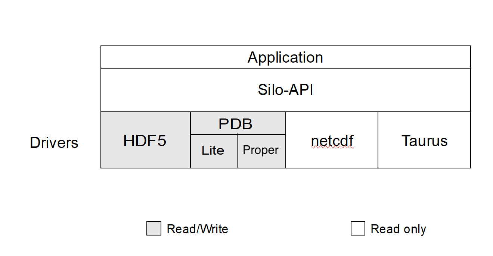
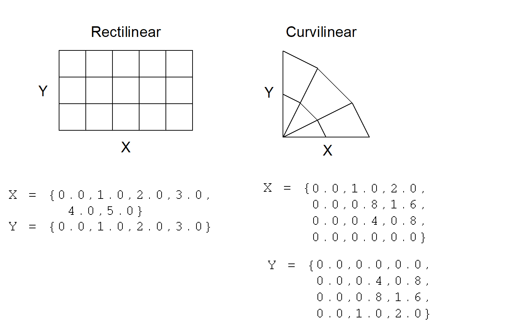
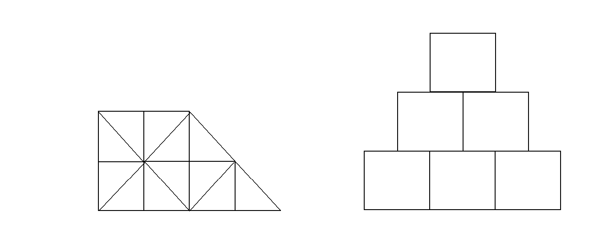
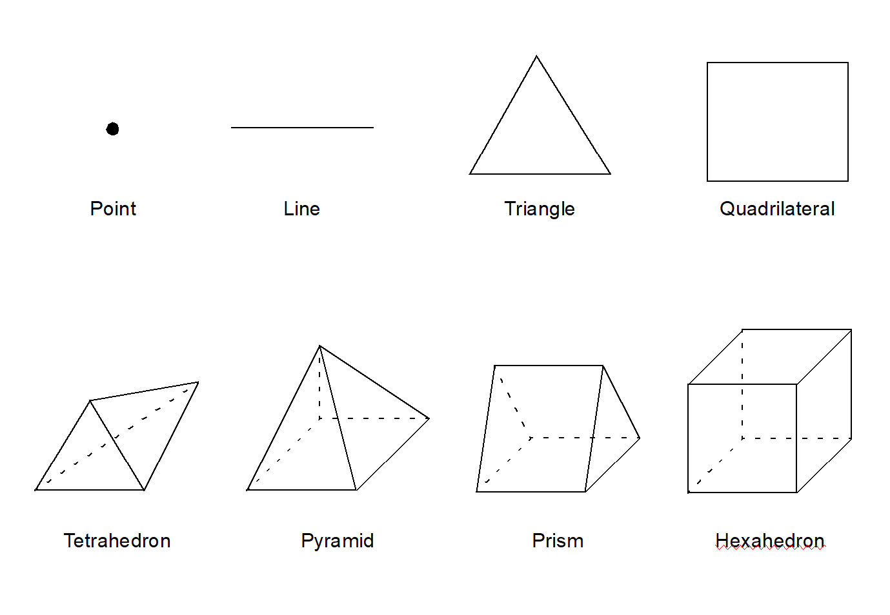

# Introduction to Silo

## Overview

Silo is a library which implements an application programming interface (API) designed for reading and writing a wide variety of scientific data to binary, files.
The files Silo produces and the data within them can be easily shared and exchanged between wholly independently developed applications running on disparate computing platforms.

Consequently, the Silo API facilitates the development of general purpose tools for processing scientific data.
One of the more popular tools that process Silo data files is the [VisIt](https://visit.llnl.gov) visualization tool.

Silo supports gridless (point) meshes, structured meshes, unstructured-zoo and unstructured-arbitrary-polyhedral meshes, block structured AMR meshes, constructive solid geometry (CSG) meshes as well as piecewise-constant (e.g. zone-centered) and piecewise-linear (e.g. node-centered) variables defined on the node, edge, face or volume elements of meshes as well as the decomposition of meshes into arbitrary subset hierarchies including materials and mixing materials.
In addition, Silo supports a wide variety of other useful objects and metadata to address various scientific computing application needs.
Although the Silo library is a serial library, key features enable it to be applied effectively in scalable, parallel applications using the [Multiple Independent File (MIF)](https://www.hdfgroup.org/2017/03/mif-parallel-io-with-hdf5/) parallel I/O paradigm.

Architecturally, the library is divided into two main pieces; an upper-level application programming interface (API) and a lower-level I/O implementation called a *driver*.
Silo supports multiple I/O drivers, the two most common of which are the HDF5 (Hierarchical Data Format 5) and [PDB](https://code.google.com/archive/p/pactnew/source/default/source?page=50) (Portable DataBase, an API and binary database file format developed at LLNL by Stewart Brown and not to be confused with Protein Database also abbreviated as PDB) drivers.
However, the reader should take care not to infer from this that Silo can read *any* HDF5 or PDB file.
It cannot.
For the most part, Silo is able to read only files that it has also written.

## Installing Silo

As of version 4.12.0, CMake 3.12 or newer is used to install Silo.
Autotools is still available but deprecated in 4.12.0 and will be completely removed after 4.12.0.

### Installing with CMake

CMake installation supports the CMake options described below.
Default values are specified with `=<value>` for each option.

[`CMAKE_INSTALL_PREFIX:PATH=$CWD/../SiloInstall`](https://cmake.org/cmake/help/latest/variable/CMAKE_INSTALL_PREFIX.html)
: This is the standard CMake variable for specifying the installation directory which will hold `bin`, `lib` and `include` sub-directories of the installed product.
  The default is a directory named `SiloInstall` which is a peer to the directory where the CMake build is don.

[`CMAKE_BUILD_TYPE:STRING=Release`](https://cmake.org/cmake/help/latest/variable/CMAKE_BUILD_TYPE.html)
: This is the standard CMake variable for specifying the type of build.
  Choices are `Release`, `Debug`, `RelWithDebInfo` or `MinSizeRel`.
  The default is `Release`.

`BUILD_TESTING:BOOL=OFF`
: This is the standard CMake variable for controlling whether testing of the product with [`ctest`](https://cmake.org/cmake/help/latest/manual/ctest.1.html) is enabled.
  Silo has a large number of test clients.
  Enabling testing probably doubles the total build time for Silo (e.g. from 1-2 mins to 2-4 mins).

`SILO_ENABLE_SHARED:BOOL=ON`
: Build Silo as a shared library.
  This is *required* for the python module.

`SILO_BUILD_FOR_ASAN:BOOL=OFF`
: Build to run testing with GNU/Clang address sanitizer enabled.
  Currently works only for newish GCC compilers.
  Requires `CMAKE_BUILD_TYPE` of `Debug` to be enabled.
  As of version 4.12.0, Silo's Continuous Integration (CI) testing currently runs the entire test suite with address sanitizer and no faults or leaks are detected.

`SILO_BUILD_FOR_BSD_LICENSE:BOOL=ON`
: Build only BSD licensed code.
  Two compression libraries built into Silo, [fpzip](https://computing.llnl.gov/projects/fpzip) and [hzip](https://computing.llnl.gov/projects/hzip), are not available in a BSD licensed build.

`SILO_ENABLE_INSTALL_LITE_HEADERS:BOOL=OFF`
: Install PDB Lite headers.
  PDB Lite is an ancient version of the [PACT/PDB Library](https://pubs.aip.org/aip/cip/article/7/3/304/281673/Software-for-Portable-Scientific-Data-Management), a revolutionary C data structure I/O support library, that was frozen into Silo back in 1996.
  Many Silo customers have come to rely on PDB Lite for PDB-only applications.
  For those customers, the option of *installing* PDB Lite headers is provided so that PDB-only applications can compile and link against Silo.
  However, PDB Lite headers are NOT required simply to use Silo's PDB driver to read and write Silo/PDB files.

`SILO_PACT_DIR:PATH=`
: Silo has the ability to also link to the most recent relase of PACT/PDB.
  This creates a second, separate PDB driver identified with the `DB_PDBP` (note the trailing `P` for **PDB Proper**) driver id.
  This driver produces Silo/PDB files using the newest PDB Library available in PACT instead of the PDB Lite library frozen into Silo back in 1996.
  The specified path is the directory holding `bin`, `lib` and `include` sub-directories of a PACT installation.
  This functionality and CMake variable is likely relevant only to LLNL customers.

`SILO_ENABLE_FORTRAN:BOOL=ON`
: Enable Fortran interface using CMake's `enable_language()` feature.
  The default is for Fortran to be enabled. 
  However, if the `enable_language()` feature of CMake fails to set the value of `CMAKE_Fortran_COMPILER`, Fortran will be disabled.

`SILO_ENABLE_PYTHON_MODULE:BOOL=OFF`
: Enable the python module using CMake's `find_package()`.
  This will create a shared library, `Silo.so` which you can import into Python with `import Silo`.
  If a Python interpreter and Python header files cannot be found, this feature will be disabled.

`SILO_PYTHON_DIR:PATH=`
: Tell Silo's CMake where to find a Python installation if it is not in *standard* places CMake looks for it.

`SILO_ENABLE_JSON:BOOL=OFF`
: Enable the Json interface for Silo, based on the [`json-c`](https://github.com/json-c/json-c/wiki) library, using CMake's `find_path()` and `find_library()` for `json-c`.
  Silo's CMake will look for `json-c` library and header files in the standard places CMake looks for it.
  There is no companion `SILO_JSON_DIR` CMake variable to tell CMake where to look for `json-c`.
  If you wish to use a `json-c` installed in a non-standard place, add the path to `CMAKE_PREFIX_PATH`.

`SILO_INSTALL_PYTHONDIR:PATH=${CMAKE_INSTALL_LIBDIR}`
: Specify a separate installation dir for the python module.

`SILO_ENABLE_SILOCK:BOOL=ON`
: Enable building of the `silock` tool.

`SILO_ENABLE_BROWSER:BOOL=ON`
: Enable building of the textual browser tool, `browser`.
  This tool can be used much like a `sh` shell to navigate, browse and even diff contents of Silo files.

`SILO_ENABLE_SILEX:BOOL=OFF`
: Enable building of the `silex` tool, a GUI based tool similar to `browser` to examine Silo files.
  This feature requires Qt6 and it will look for Qt6 using `find_package()`.
  If Qt6 cannot be found, this feature will be disabled.

`SILO_QT6_DIR:PATH=`
: Tell Silo's CMake where to find a Qt6 installation if it is not in *standard* places CMake looks for it.
  The specified path must be to a directory holding the `Qt6Config.cmake` file.

`SILO_ENABLE_HDF5:BOOL=ON`
: Enable the HDF5 driver using CMake's `find_package()`.
  The HDF5 driver supports many features the built-in, PDB driver does not.
  This includes things like compression of Silo objects, application level checksuming of raw data, memory files, etc.
  In addition, the HDF5 driver tends to provide better time performance though with earlier versions of HDF5, space performance was sometimes poorer.

`SILO_HDF5_DIR:PATH=`
: Tell Silo's CMake where to find an HDF5 installation if it is not in *standard* places CMake looks for it.

`SILO_HDF5_SZIP_DIR:PATH=`
: Tell Silo's CMake where to find an SZIP compression library installation if it is not in *standard* places CMake looks for it.
  Sometimes, an HDF5 installation has a dependence on SZIP and getting Silo to link to that HDF5 installation then also requires telling it where to find SZIP.

`SILO_ZLIB_DIR:PATH=`
: Tell Silo's CMake where to find a ZLIB installation if it is not in *standard* places CMake looks for it.
  Sometimes, an HDF5 installation has a dependence on ZLIB and getting Silo to link to that HDF5 installation then also requires telling it where to find ZLIB.

`SILO_ENABLE_FPZIP:BOOL=OFF`
: Enable [fpzip](https://computing.llnl.gov/projects/fpzip) compression features including a built-in version of the fpzip library.
  Even if HDF5 is enabled, fpzip is off by default because fpzip is not BSD licensed.
  To enable fpzip, you also have to disable a BSD only build. 
  Although more recent versions of fpzip are available under BSD license, the version built-in with Silo is version 1.0.2 and was not released as BSD licensed open source.

`SILO_ENABLE_HZIP:BOOL=OFF`
: Enable [hzip](https://computing.llnl.gov/projects/hzip) compression features including a built-in version of the hzip library.
  Even if HDF5 is enabled, hzip is off by default because hzip is not BSD licensed.
  To enable hzip, you also have to disable a BSD only build.

`SILO_ENABLE_ZFP:BOOL=ON`
: Enable [zfp](https://computing.llnl.gov/projects/zfp) compression features including a built-in version of the zfp library.
  This requires HDF5 to also be enabled.
  If HDF5 is enabled, ZFP is enabled by default.
  While the zfp library that comes *built-in* with Silo has been properly name-mangled to avoid any conflicts with any released version of zfp, unfortunately neither the hzip or fpzip libraries built-in to Silo have been.

Below is an example of a CMake command-line used to build Silo.
After untaring the release distribution, cd into `silo-4.12.0` and make a `build` directory.
Then, cd into `build` and enter a command like the following...

```
cmake -DCMAKE_INSTALL_PREFIX=`pwd`/my_install \
      -DSILO_BUILD_FOR_BSD_LICENSE:BOOL=OFF \
      -DSILO_ENABLE_HDF5:BOOL=ON \
      -DSILO_ENABLE_FPZIP:BOOL=ON \
      -DBUILD_TESTING:BOOL=ON \
      -DSILO_HDF5_DIR:PATH=/mnt/nvme/mark/silo/hdf5-1.14.4/build/my_install \
      -DSILO_ENABLE_SILOCK:BOOL=ON \
      -DCMAKE_BUILD_TYPE:STRING=Release \
      -DSILO_ENABLE_PYTHON_MODULE:BOOL=ON \
      -DSILO_ENABLE_INSTALL_LITE_HEADERS=ON \
      ..
```

### Installing with [Spack](https://spack.io/)

Immediately after the release of version 4.12.0 of Silo, the Spack recipe to build Silo was updated to use CMake.
Spack will retain the ability to build older versions of Silo with Autotools but will use only CMake for versions of Silo *after* 4.12.0.
For version 4.12.0 only, Spack will support either Autotools or CMake builds of Silo.

The `+mpi` variant for Silo is deprecated for versions of Silo 4.12.0 and newer.
The presence of the `+mpi` variant for Silo 4.12.0 and newer will not cause any error and will simply be ignored.
Support for a `+zfp` variant was added.

License support was also added with two options; `bsdonly` and `llnllegacy`.
A `bsdonly` license build is the default.
Spack builds using a `bsdonly` license will conflict with `+hzip` and `+fpzip` variants.
The CMake build of Silo will build both `silock` and `browser` tools and install PDB Lite headers by fiat; no Spack variants will be made available to control these behaviors.

Also starting in version 4.12.0, the `silex` Qt-GUI browsing tool requires Qt6.
Be aware that in Spack, Qt6 variants are handled somewhat differently than Qt5.
For Qt5, the variant is `+qt` whereas for Qt6, there is a main variant, `+qt-base`, and a number of commonly used additional variants for key Qt6 components such as `+widgets` and/or `+gui`.

## Where to Find Example Code

In the [`tests`](https://github.com/LLNL/Silo/tree/main/tests) directory within the Silo source tree, there are numerous example C codes that demonstrate the use of Silo for writing various types of data.
There are not as many examples of reading the data there.

If you are interested in point meshes, for example, you would search (e.g. `grep -i pointmesh`) for `DBPutPointMesh`.
Or, if you are interested in how to use some option like `DBOPT_CONSERVED`, search for it within the C files in the `tests` directory.

## Brief History and Background

Development of the Silo library began in the early 1990's at Lawrence Livermore National Laboratory to address a range of issues related to the storage and exchange of data among a wide variety of scientific computing applications and platforms.

In the early days of scientific computing, roughly 1950 - 1980, simulation software development at many labs, like Livermore, invariably took the form of a number of software *stovepipes*.
Each big code effort included sub-efforts to develop supporting tools for data browsing and differencing, visualization, and management.

Developers working in a particular stovepipe designed every piece of software they wrote, simulation code and tools alike, to conform to a common representation for the data.
In a sense, all software in a particular stovepipe was really just one big, monolithic application, held together by a common, binary or ASCII file format.

Data exchanges across stovepipes were laborious and often achieved only by employing one or more computer scientists whose sole task in life was to write a conversion tool called a *linker*.
Worse, each linker needed to be kept it up to date as changes were made to one or the other codes that it linked.
In short, there was nothing but brute force data sharing and exchange.
Furthermore, there was duplication of effort in the development of data analysis and management tools for each code.

Between 1980 and 2000, an important innovation emerged, the general purpose I/O library.
In fact, two variants emerged each working at a different level of abstraction.
One focused on lower level abstractions...the *objects* of computer science.
That is data structures such as arrays, structs and linked lists.
The other focused on higher level abstractions...the *objects* of computational science.
That is meshes and fields defined thereon.

Examples of the former are [netCDF](https://github.com/Unidata/netcdf-c), HDF (HDF4 and [HDF5](https://github.com/HDFGroup/hdf5)) and [PDB](https://code.google.com/archive/p/pactnew/source/default/source?page=50).
Examples of the latter are [ExodusII](https://github.com/sandialabs/exodusii), [Mili](https://github.com/mdg-graphics/mili) and Silo.
At the same time, the higher level libraries are often implemented on top the lower level libraries.
For example, Silo is implemented on top of either HDF5 or PDB and ExodusII is implemented on top of netCDF.

## Silo Architecture

Silo has several drivers.
Some are read-only and some are read-write.
These are illustrated in the figure below...



Silo supports both read and write on the PDB (Portable DataBase) and HDF5 drivers.
In addition, Silo supports two different *flavors* of PDB drivers.
One known within Silo as *PDBLite* and is just called *PDB* which is a very old version of PDB that was frozen into the Silo library in 1999.
That is the default driver.
The other flavor of PDB is known within Silo as *PDB Proper* and can use a more recent release of the PDB library.

Although Silo can write and read PDB and HDF5 files, it cannot read just any PDB or HDF5 file.
It can read only PDB or HDF5 files that were also written with Silo.
Silo supports only read on the Taurus and netCDF drivers. 
The particular driver used to write data is chosen by an application when a Silo file is created.
It can be automatically determined by the Silo library when a Silo file is opened.

### Reading Silo Files

The Silo library has application-level routines to be used for reading mesh and mesh-related data.
These functions return compound C data structures which represent data in a general way.

### Writing Silo files

The Silo library contains application-level routines to be used for writing mesh and mesh-related data into Silo files. 

In the C interface, the application provides a compound C data structure representing the data.
In the Fortran interface, the data is passed via individual arguments.

### Terminology

Here is a short summary of some of the terms used throughout the Silo interface and documentation. These terms are common to most computer simulation environments.

Mesh
: A discretization of a computational *domain* over which variables (fields) are defined.
  A mesh is a collection of *points* (aka *nodes*) optionally knitted together to form a network of higher dimensional primitive shapes (aka *elements*) via enumeration (explicit or implicit) of nodal *connectivities*.

  Practically speaking, a mesh consists of a list of nodes with coordinates and, optionally, one or more list(s) of elements, where each element is defined either directly in terms of the nodes or indirectly in terms of other elements which are ultimately defined in terms of the nodes.

  A mesh supports two notions of *dimension*.
  One is its *geometric* (or spatial) dimension and the other is its *parametric* (or topological) dimension.
  For example, the path of a rocket going into orbit around the Earth has three geometric dimensions (e.g. latitude, longitude and elevation).
  However, in *parametric* terms, that path is really just a one dimensional mesh (e.g. a curve).

Node
: A mathematical point.
  The fundamental building-block of the elements of a mesh.
  Other names for node are *point* or *vertex*.
  The topological dimension of a *node* is always zero.
  A point has no extent in any dimension or coordinate space.

Zone
: An element of a mesh.
  An element defines a region of support over which a variable (aka *field*, see below) may be interpolated.
  Zones are typically polygons or polyhedra with nodes as their vertices.
  Other names for zone are *cell* or *element*.

Variable (or *Field*)
: A field defined on a computational mesh or portion thereof.
  Variables usually represent some physical quantity (e.g., pressure or velocity) but that is not a requirement.
  Variables typically account for the overwhelming majority of data stored in a Silo database.

  The set of *numbers* stored for a variable are in general not the field's *values* but instead the field's *degrees of freedom* used in a given numerical scheme to *interpolate* the field over the *elements* of a mesh.
  However, for piecewise-constant and piecewise-linear interpolation schemes over the standard zoo of element shapes and types, the numbers stored are indeed also the field's values.
  This is due to the fact that the associated interpolation schemes are indeed *interpolating* as opposed to *approximating*.

  The terms *zone-centered* (or *cell-centered* or *element-centered*) and *node-centered* (or *vertex-centered*) are synonyms for piecewise-constant and piecewise-linear interpolation schemes, respectively

Coordinate Field
: The coordinates of a mesh are a field like any other field.
  The coordinates are a *special* field and must obey certain mathematical properties to serve as *coordinates*.
  However, it is important to understand that the coordinates of a mesh are also just a field.

  In Silo, coordinate fields are written as part of the `DBPutXxxmesh()` methods whereas other fields on the mesh are written with `DBPutXxxvar()` methods.
  The coordinates are always node-centered (e.g. piecewise-linear interpolating).
  It may be possible to support higher order interpolation schemes in the coordinate fields by adopting certain use conventions which downstream post-processing tools will also need to be made aware of.

Material
: A decomposition of a mesh into distinct regions having different properties of some kind.
  Typically, different groups of elements of the mesh represent different physical materials such as brass or steel.

  In the case of *mixing* materials, a single element may include contributions from more than one constituent material.
  In this case, the *fractions* of each material contained in the element is also part of the material description.

Material Species
: A decomposition of a material into different concentrations of pure, atomic table elements.
  For example, *common yellow brass* is, nominally, a mixture of Copper (Cu) and Zinc (Zn) while *tool steel* is composed primarily of Iron (Fe) but mixed with some Carbon (C) and a variety of other elements.
  In certain computational science scenarios, detailed knowledge of the concentration of the constituent atomic elements comprising each material is needed.

Block
: A *block* defines one coherent, contiguous piece (or fragment) of a larger mesh that has been decomposed into pieces typically for parallel processing but also potentially for other purposes such as streaming analysis, etc.
  The coordinates, connectivities and associated mesh variables of a block are all enumerated *relative* to the block and independently from any other block.
  In some sense, block's represent the fundamental storage *quanta* of a mesh that is too large to process as a single, monolithic whole.

  A mesh that is decomposed into blocks is called a *multi-block* mesh.
  To go along with multi-block meshes, there are multi-block variables, multi-block materials and multi-block species.
  Different blocks of a larger mesh may be stored in different Silo files.

  Frequently, blocks are also called *domains*.

## Computational Meshes Supported by Silo

Silo supports several classes, or types, of meshes. These are quadrilateral, unstructured-zoo, unstructured-arbitrary, point, constructive solid geometry (CSG), and adaptive refinement meshes.

### Quadrilateral-Based Meshes and Related Data

A quadrilateral mesh is one which contains four nodes per zone in 2-D and eight nodes per zone (four nodes per zone face) in 3-D.
Quad meshes can be either regular, rectilinear, or curvilinear, but they must be logically rectangular 



### UCD-Based Meshes and Related Data

An unstructured cell data (UCD) mesh is a very general mesh representation; it is composed of an arbitrary list of zones of arbitrary sizes and shapes.
Most meshes, including quadrilateral ones, can be represented as an unstructured mesh (Fig. 1-4).
Because of their generality, however, unstructured meshes require more storage space and more complex algorithms.

In UCD meshes, the basic concept of zones (cells) still applies, but there is no longer an implied connectivity between a zone and its neighbor, as with the quadrilateral mesh.
In other words, given a 2-D quadrilateral mesh zone accessed by (i, j), one knows that this zone's neighbors are (i-1,j), (i+1,j), (i, j-1), and so on.
This is not the case with a UCD mesh.

In a UCD mesh, a structure called a zonelist is used to define the nodes which make up each zone.
A UCD mesh need not be composed of zones of just one shape (Fig. 1-5).
Part of the zonelist structure describes the shapes of the zones in the mesh and a count of how many of each zone shape occurs in the mesh.
The facelist structure is analogous to the zonelist structure, but defines the nodes which make up each zone face.





Silo also supports...

  * Quadratic versions of the above elements.
  * These elements as degenerate hexahedra.
    See the details in the description of [`DBPutZonelist2()`](./objects.md#dbputzonelist2).
  * Arbitrary polyehedral zones.
    See the details in the description of [`DBPutPHZonelist()`](./objects.md/#dbputphzonelist).

### Point Meshes and Related Data

A point mesh consists of a set of locations, or points, in space.
This type of mesh is well suited for representing random scalar data, such as tracer particles.

### Constructive Solid Geometry (CSG) Meshes and Related Data

A constructive Solid Geometry mesh is constructed by boolean combinations of solid model primitives such as spheres, cones, planes and quadric surfaces.
In a CSG mesh, a *zone* is a region defined by such a boolean combination.
CSG meshes support only zone-centered variables.

### Block Structured, Adaptive Refinement Meshes (AMR) and Related Data

Block structured AMR meshes are composed of a large number of Quad meshes representing refinements of other quad meshes.
The hierarchy of refinement is characterized using a Mesh Region Grouping (MRG) tree.

### Summary of Silo's Computational Modeling Objects

Objects are a grouping mechanism for maintaining related variables, dimensions, and other data.
The Silo library understands and operates on specific types of objects including the previously described computational meshes and related data.
The user is also able to define arbitrary objects for storage of data if the standard Silo objects are not sufficient.

The objects are generalized representations for data commonly found in physics simulations.
These objects include:

Quadmesh
: A mesh where the elements are implicitly defined by a *logical* cross product of the parametric dimensions.
  In one dimension, the elements are edges.
  In two dimensions, they are quadrilaterals
  In three dimensions, cubes.
  The geometric dimensions may also be implicitly defined by a cross product (e.g. rectilinear mesh) or they may be explicit (e.g. curvilinear mesh).

Quadvar
: A variable associated with a quad mesh.
  This includes the variable's data, centering information (node-centered vs. zone centered), and the name of the quad mesh with which this variable is associated.
  Additional information, such as time, cycle, units, label, and index ranges can also be included.

Ucdmesh
: An unstructured cell data (UCD) mesh.
  This is a mesh where the elements are only ever explicitly defined via enumeration of nodal connectivities.
  This includes the dimension, connectivity, and coordinate data, but typically also includes the mesh's coordinate system, labeling and unit information, minimum and maximum extents, and a list of face indices.

  Any quad mesh can be represented as a UCD mesh.
  However, the reverse is not true.

  A quad mesh offers certain storage efficiencies (for the coordinate data) over UCD meshes.
  When the number of variables associated with a quad mesh is small, those efficiencies can be significant.
  However, as the number of variables grows, they are quickly washed out.

  When considering all the data stored in a Silo *file*, the storage efficiency is often not significant.
  However, when considering all the data needed in memory at any one time to perform a specific data analysis task (e.g. produce a Pseudocolor plot), the storage efficiency is indeed significant.

Ucdvar
: A variable associated with a UCD mesh.
  This includes the variable's data, centering information (node-centered vs.  zone-centered), and the name of the UCD mesh with which this variable is associated.
  Additional information, such as time, cycle, units, and label can also be included.

Pointmesh
: A mesh consisting entirely of points as the mesh elements.
  A pointmesh has a parametric (topological) dimension of zero.
  However, a pointmesh can have a geometric dimension of 1, 2 or 3 (or more).

Csgmesh
: A constructive solid geometry (CSG) mesh.
  This is a mesh where the elements are defined by set expressions (e.g. unions, intersections and differences) involving a handful of primitive shapes (e.g. spheres, cylinders, cones, etc.)

Csgvar
: A variable defined on a CSG mesh (always piecewise-constant or zone centered).

Defvar
: Defined variable representing an arithmetic expression involving other variables.
  The arithmetic expression may involve the names of functions (e.g. `log()`, `cos()`, etc.).
  The named functions may be specific to a given post-processing tool (e.g. the function `revolved_volume()` is known only to VisIt).

Material
: An object defining all the materials present in a given mesh.
  This includes the number of materials present, a list of valid material identifiers, a zonal-length array which contains the material identifiers for each zone and, optionally, the material fractions associated with materials *mixing* in one or more zones.

  Silo's mixed material data structure can trace its roots to Fortran codes developed at Livermore Labs in the early 1960s.
  It is a complicated data structure for software developers to deal with.

Zonelist
: An object enumerating the nodal connectivities of elements comprising a mesh.

PHZonelist
: An extension of a zonelist to support arbitrary polyhedra.
  In a PHZonelist, elements are enumerated in terms of their faces and the faces are enumerated in terms of their nodes.

Facelist
: Face-oriented connectivity information for a UCD mesh.
  This object contains a sequential list of nodes which identifies the *external* faces of a mesh, and arrays which describe the shape(s) of the faces in the mesh.
  It may optionally include arrays which provide type information for each face.

Material species
: Extra material information.
  A material species is a type of a material.
  They are used when a given material (i.e. air) may be made up of other materials (i.e. oxygen, nitrogen) in differing amounts.

Mesh Region Grouping (MRG) tree
: Generalized mechanism used to define arbitrary subsets of a mesh.
  MRG trees define how zones in the mesh may be grouped into parts, materials, boundary conditions, nodesets or facesets, etc.

Groupel Map
: A *grouping element* map.
  Used in concert with an MRG tree to hold problem-sized data defining subsetted regions of meshes.

Multiblock
: A way of specifying how a mesh is decomposed into pieces for I/O and computation

Multimesh
: A set of mesh pieces (usually parallel decomposition) comprising a larger aggregate mesh object.
  This object contains the names of and types of the meshes in the set.

Multivar
: A set of variable pieces comprising a larger aggregate variable object.
  Mesh variable data associated with a multimesh.

Multimat
: A set of material pieces.
  This object contains the names of the materials in the set.

Multimatspecies
: A set of material species.
  This object contains the names of the material species in the set.

Curve
: X versus Y data.
  This object must contain at least the domain and range values, along with the number of points in the curve.
  In addition, a title, variable names, labels, and units may be provided.

### Other Silo Objects

In addition to the objects listed in the previous section which are tailored to the job of representing computational data from scientific computing applications.
Silo supports a number of other objects useful to scientific computing applications.
Some of the more useful ones are briefly summarized here.

Compound Array
: A struct-like object which contains a list of similarly typed but differently named and sized (usually small) items that one often treats as a 
  group (particularly for I/O purposes).

Directory
: A silo file can be organized into directories (or folders) in much the same way as a Unix file system.

Optlist
: An options list object used to pass additional options to various Silo API functions.

Simple Variable
: A simple variable is just a named, multi-dimensional array of arbitrary data.
  This object contains, in addition to the data, the dimensions and data type of the array.
  This object is not required to be associated with any mesh.

User Defined Object
: A generic, user-defined object of arbitrary composition.

Extended Silo Object
: A Silo object which includes any number of user-defined additional data members.

## Silo's Fortran Interface

The Silo library is implemented in C.
Nonetheless, a set of Fortran callable wrappers have been written to make a majority of Silo's functionality available to Fortran applications.
These wrappers simply take the data that is passed through a Fortran function interface, re-package it and call the equivalent C function.
However, there are a few limitations of the Fortran interface.

### Limitations of Fortran Interface

First, the Fortran interface is primarily a write-only interface.
This means Fortran applications can use the interface to write Silo files so that other tools, like VisIt, can read them.
However, for all but a few of Silo's objects, only the functions necessary to write the objects to a Silo file have been implemented in the Fortran interface.
This means Fortran applications cannot really use Silo for restart file purposes.

Conceptually, the Fortran interface is identical to the C interface.
To avoid duplication of documentation, the Fortran interface is documented right along with the C interface.
However, because of differences in C and Fortran argument passing conventions, there are key differences in the interfaces.
Here, we use an example to outline the key differences in the interfaces as well as the rules to be used to construct the Fortran interface from the C.

### Conventions used to construct the Fortran interface from C

In this section, we show an example of a C function in Silo and its equivalent Fortran.
We use this example to demonstrate many of the conventions used to construct the Fortran interface from the C.

We describe these rules so that Fortran user's can be assured of having up to date documentation (which tends to always first come for the C interface) but still be aware of key differences between the two.

A C function specification...

```
int DBAddRegionArray(DBmrgtree *tree, int nregn, const char **regn_names,
    int info_bits, const char *maps_name, int nsegs, int *seg_ids, int *seg_lens, 
    int *seg_types, DBoptlist *opts)
```

The equivalent Fortran function...

```
integer function dbaddregiona(tree_id, nregn, regn_names, lregn_names, 
    type_info_bits, maps_name, lmaps_name, nsegs, seg_ids, seg_lens, seg_types, 
    optlist_id, status)

    integer tree_id, nregn, lregn_names, type_info_bits, lmaps_name
    integer nsegs, optlist_id, status
    integer lregn_names(), seg_ids(), seg_lens(), seg_types()
    character* maps_name
    character*N regn_names
```

#### About Fortran's `l<strname>` arguments

Wherever the C interface accepts a `char*`, the Fortran interface accepts two arguments; the `character*` argument followed by an integer argument indicating the string's length.
In the function specifications, it will always be identified with an ell (`l`) in front of the name of the `character*` argument that comes before it.
In the example above, this rule is evident in the `maps_name` and `lmaps_name` arguments.

#### About Fortran's `l<strname>s` arguments

Wherever the C interface accepts an array of `char*` (e.g. `char**`), the Fortran interface accepts a `character*N` followed by an array of lengths of the strings.
In the above example, this rule is evident by the `regn_names` and `lregn_names` arguments.
By default, N=32, but the value for N can be changed, as needed by the `dbset2dstrlen()` method.

#### About Fortran's `<object>_id` arguments

Wherever the C interface accepts a pointer to an abstract Silo object, like the Silo database file handle (`DBfile *`) or, as in the example above, a `DBmrgtree*`, the Fortran interface accepts an equivalent *pointer id*.
A *pointer id* really an integer index into an internally maintained table of pointers to Silo's objects.
In the above example, this rule is evident in the `tree_id` and `optlist_id` arguments.

#### About Fortran's `data_ids` arguments

Wherever the C interface accepts an array of `void*` (e.g. a `void**` argument), the Fortran interface accepts an array of integer *pointer ids*.
The Fortran application may use the `dbmkptr()` function to a create the pointer ids to populate this array.
The above example does not demonstrate this rule.

#### About Fortran's `status` arguments

Wherever the C interface returns integer error information in the return value of the function, the Fortran interface accepts an extra integer argument named `status` as the last argument in the list.
The above example demonstrates this rule.

Finally, there are a few function in Silo's API that are unique to the Fortran interface.
Those functions are described in the section of the API manual having to do with Fortran.

## Using Silo in Parallel

Silo is a serial library.
Nevertheless, it (as well as the tools that use it like VisIt) has several features that enable its effective use in parallel with excellent scaling behavior.
However, using Silo effectively in parallel does require an application to store its data to multiple Silo files typically depending on the number of concurrent I/O channels the application has available at the time of Silo file creation.

The two features that enable Silo to be used effectively in parallel are its ability to create separate namespaces (directories) within a single file and the fact that a multi-block object can span multiple Silo files.
With these features, a parallel application can easily divide its processors into N groups and write a separate Silo file for each group.

Within a group, each processor in the group writes to its own directory within the Silo file.
One and only one processor has write access to the group's Silo file at any one time.
So, I/O is serial within a group.
However, because each group has a separate Silo file to write to, each group has one processor writing concurrently with other processors from other groups.
So, I/O is parallel across groups.

After all processors have created all their individual objects in various directories within the each group's Silo file, one processor is designated to write multi-block objects.
The multi-block objects serve as an assembly of the names of all the individual objects written from various processors.

When N, the number of processor groups, is equal to one, I/O is effectively serial.
All the processors write their data to a single Silo file.
When N is equal to the number of processors, each processor writes its data to its own, unique Silo file.
Both of these extremes are bad for effective and scalable parallel I/O.
A good choice for N is the number of concurrent I/O channels available to the application when it is actually running.

This technique for using a serial I/O library effectively in parallel while being able to tune the number of files concurrently being written to is [*Multiple Independent File (MIF)*](https://www.hdfgroup.org/2017/03/mif-parallel-io-with-hdf5/) parallel I/O. 

There is a separate header file, `pmpio.h`, with a set of convenience CPP macros and methods to facilitate MIF parallel I/O with Silo.
