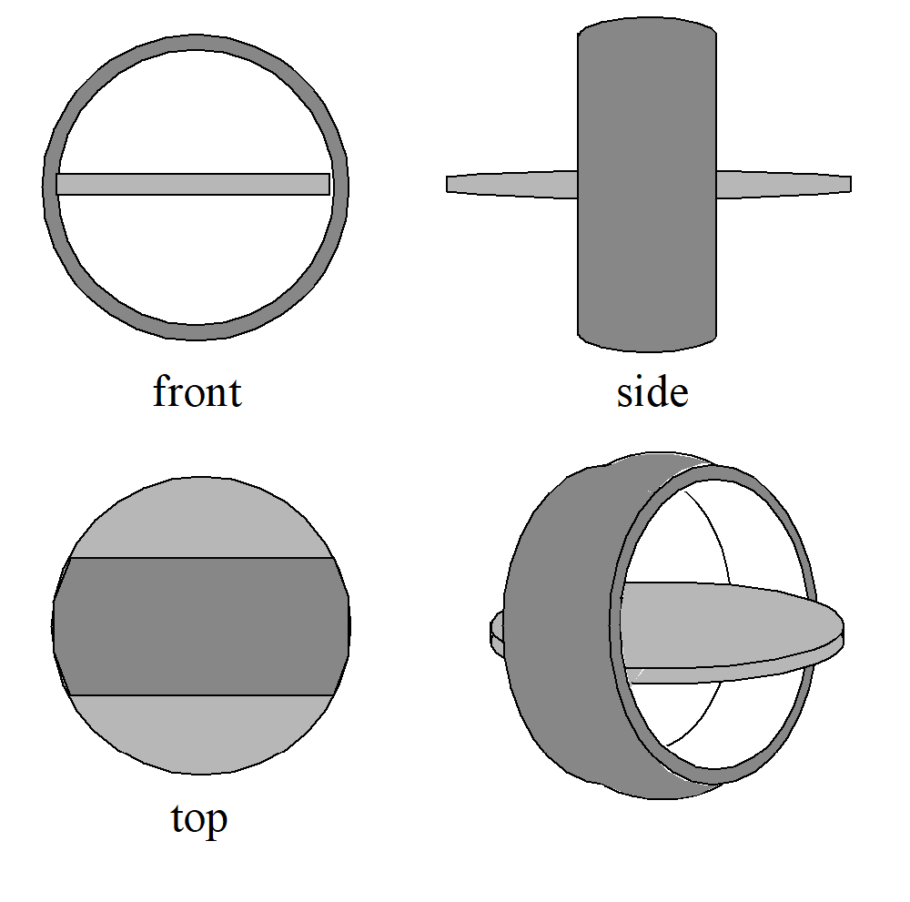
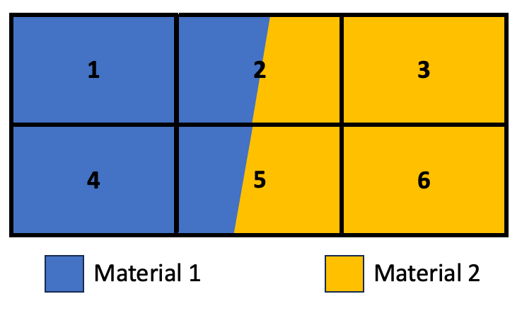
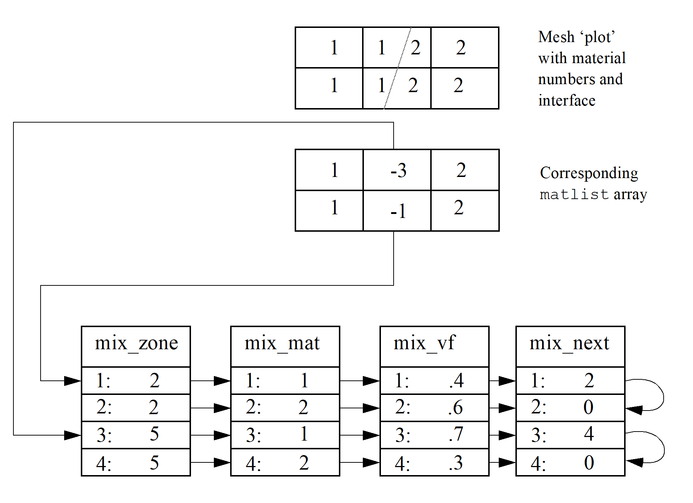

# Meshes, Variables and Materials

If you are interested in learning how to deal with these objects in parallel, See [Multi-Block Objects and Parallel I/O](#multi-block-objects-and-parallel-i-o).

This section of the Silo API manual describes all the high-level Silo objects that are sufficiently self-describing as to be easily shared between a variety of applications.

Silo supports a variety of mesh types including simple 1D curves, structured meshes including block-structured Adaptive Mesh Refinement (AMR) meshes, point (or gridless) meshes consisting entirely of points, unstructured meshes consisting of the standard zoo of element types, fully arbitrary polyhedral meshes and Constructive Solid Geometry meshes described by boolean operations of primitive quadric surfaces.

In addition, Silo supports both piecewise constant (e.g. zone-centered) and piecewise-linear (e.g. node-centered) variables (e.g. fields) defined on these meshes.
Silo also supports the decomposition of these meshes into materials (and material species) including cases where multiple materials are mixing within a single mesh element.
Finally, Silo also supports the specification of expressions representing derived variables.

{{ EndFunc }}

## `DBPutCurve()`

* **Summary:** Write a curve object into a Silo file

* **C Signature:**

  ```
  int DBPutCurve (DBfile *dbfile, char const *curvename,
      void const *xvals, void const *yvals, int datatype,
      int npoints, DBoptlist const *optlist)
  ```

* **Fortran Signature:**

  ```
  integer function dbputcurve(dbid, curvename, lcurvename, xvals,
     yvals, datatype, npoints, optlist_id, status)
  ```

* **Arguments:**

  Arg name | Description
  :---|:---
  `dbfile` | Database file pointer
  `curvename` | Name of the curve object
  `xvals` | Array of length `npoints` containing the x-axis data values. Must be `NULL` when either `DBOPT_XVARNAME` or `DBOPT_REFERENCE` is used.
  `yvals` | Array of length `npoints` containing the y-axis data values. Must be `NULL` when either `DBOPT_YVARNAME` or `DBOPT_REFERENCE` is used.
  `datatype` | Data type of the `xvals` and `yvals` arrays. One of the predefined Silo types.
  `npoints` | The number of points in the curve
  `optlist` | Pointer to an option list structure containing additional information to be included in the compound array object written into the Silo file. Use `NULL` is there are no options.

* **Returned value:**

  `DBPutCurve` returns zero on success and -1 on failure.

* **Description:**

  The `DBPutCurve` function writes a curve object into a Silo file.
  A curve is a set of x/y points that describes a two-dimensional curve.

  Both the `xvals` and `yvals` arrays must have the same `datatype`.

  The following table describes the options accepted by this function.
  See the section titled "Using the Silo Option Parameter" for details on the use of this construct.

  **Optlist options:**

  Option Name|Value Data Type|Option Meaning|Default Value
  :---|:---|:---|:---
  `DBOPT_LABEL`|`int`|Problem cycle value|`0`
  `DBOPT_XLABEL`|`char *`|Label for the x-axis|`NULL`
  `DBOPT_YLABEL`|`char *`|Label for the y-axis|`NULL`
  `DBOPT_XUNITS`|`char *`|Character string defining the units for the x-axis|`NULL`
  `DBOPT_YUNITS`|`char *`|Character string defining the units for the y-axis|`NULL`
  `DBOPT_XVARNAME`|`char *`|Name of the domain (x) variable. This is the problem variable name, not the code variable name passed into the `xvals` argument.|`NULL`
  `DBOPT_YVARNAME`|`char *`|Name of the domain (y) variable. This is problem variable name, not the code variable name passed into the `yvals` argument.|`NULL`
  `DBOPT_REFERENCE`|`char *`|Name of the real curve object this object references. The name can take the form of `"<file:/path-to-curve-object>"` just as mesh names in the `DBPutMultiMesh` call. Note also that if this option is set, then the caller must pass `NULL` for both `xvals` and `yvals` arguments but must also pass valid information for all other object attributes including not only `npoints` and `datatype` but also any options.|`NULL`
  `DBOPT_HIDE_FROM_GUI`|`int`|Specify a non-zero value if you do not want this object to appear in menus of downstream tools|`0`
  `DBOPT_COORDSYS`|`int`|Coordinate system. One of: `DB_CARTESIAN` or `DB_SPHERICAL`|`DB_CARTESIAN`
  `DBOPT_MISSING_VALUE`|`double`|Specify a numerical value that is intended to represent "missing values" in the x or y data arrays|`DB_MISSING_VALUE_NOT_SET`

  In some cases, particularly when writing multi-part silo files from parallel clients, it is convenient to write curve data to something other than the "master" or "root" file.
  However, for a visualization tool to become aware of such objects, the tool is then required to traverse all objects in all the files of a multi-part file to find such objects.
  The `DBOPT_REFERENCE` option helps address this issue by permitting the writer to create knowledge of a curve object in the "master" or "root" file but put the actual curve object (the referenced object) wherever is most convenient.
  This output option would be useful for other Silo objects, meshes and variables, as well.
  However, it is currently only available for curve objects.

{{ EndFunc }}

## `DBGetCurve()`

* **Summary:** Read a curve from a Silo database.

* **C Signature:**

  ```
  DBcurve *DBGetCurve (DBfile *dbfile, char const *curvename)
  ```

* **Fortran Signature:**

  ```
  integer function dbgetcurve(dbid, curvename, lcurvename, maxpts,
     xvals, yvals, datatype, npts)
  ```
* **Arguments:**

  Arg name | Description
  :---|:---
  `dbfile` | Database file pointer.
  `curvename` | Name of the curve to read.
* **Returned value:**

  Returns a pointer to a [`DBcurve`](./header.md#dbcurve) structure on success and `NULL` on failure.

* **Description:**

  The `DBGetCurve` function allocates a [`DBcurve`](./header.md#dbcurve) data structure, reads a curve from the Silo database, and returns a pointer to that structure.
  If an error occurs, `NULL` is returned.

{{ EndFunc }}

## `DBPutPointmesh()`

* **Summary:** Write a point mesh object into a Silo file.

* **C Signature:**

  ```
  int DBPutPointmesh (DBfile *dbfile, char const *name, int ndims,
      void const * const coords[], int nels,
      int datatype, DBoptlist const *optlist)
  ```

* **Fortran Signature:**

  ```
  integer function dbputpm(dbid, name, lname, ndims,
     x, y, z, nels, datatype, optlist_id,
     status)

  void* x, y, z (if ndims<3, z=0 ok, if ndims<2, y=0 ok)
  ```

* **Arguments:**

  Arg name | Description
  :---|:---
  `dbfile` | Database file pointer.
  `name` | Name of the mesh.
  `ndims` | Number of dimensions.
  `coords` | Array of length `ndims` containing pointers to coordinate arrays.
  `nels` | Number of elements (points) in mesh.
  `datatype` | Datatype of the coordinate arrays. One of the predefined Silo data types.
  `optlist` | Pointer to an option list structure containing additional information to be included in the mesh object written into the Silo file. Typically, this argument is `NULL`.

* **Returned value:**

  Returns zero on success and -1 on failure.

* **Description:**

  The `DBPutPointmesh` function accepts pointers to the coordinate arrays and is responsible for writing the mesh into a point-mesh object in the Silo file.

  A Silo point-mesh object contains all necessary information for describing a *point* mesh.
  This includes the coordinate arrays, the number of dimensions (1,2,3,...) and the number of points.

  The following table describes the options accepted by this function.
  See the section about [Options Lists](./optlists.md) for details on the use of the `DBoptlist` construct.

  **Optlist options:**

  Option Name|Data Type|Option Meaning|Default Value
  :---|:---|:---|:---
  `DBOPT_CYCLE`|`int`|Problem cycle value.|0
  `DBOPT_TIME`|`float`|Problem time value.|0.0
  `DBOPT_DTIME`|`double`|Problem time value.|0.0
  `DBOPT_XLABEL`|`char*`|Character string defining the label associated with the X dimension. |`NULL`
  `DBOPT_YLABEL`|`char*`|Character string defining the label associated with the Y dimension. |`NULL`
  `DBOPT_ZLABEL`|`char*`|Character string defining the label associated with the Z dimension. |`NULL`
  `DBOPT_NSPACE`|`int`|Number of spatial dimensions used by this mesh.|ndims
  `DBOPT_ORIGIN`|`int`|Origin for arrays. Zero or one.|0
  `DBOPT_XUNITS`|`char*`|Character string defining the units associated with the X dimension.|`NULL`
  `DBOPT_YUNITS`|`char*`|Character string defining the units associated with the Y dimension.|`NULL`
  `DBOPT_ZUNITS`|`char*`|Character string defining the units associated with the Z dimension.|`NULL`
  `DBOPT_HIDE_FROM_GUI`|`int`|Specify a non-zero value if you do not want this object to appear in menus of downstream tools|0
  `DBOPT_MRGTREE_NAME`|`char*`|Name of the mesh region grouping tree to be associated with this mesh.|`NULL`
  `DBOPT_NODENUM`|`void*`|An array of length nnodes giving a global node number for each node in the mesh. By default, this array is treated as type int.|`NULL`
  `DBOPT_LLONGNZNUM`|`int`|Indicates that the array passed for `DBOPT_NODENUM` option is of long long type instead of int.|0
  `DBOPT_LO_OFFSET`|`int`|Zero-origin index of first non-ghost node. All points in the mesh before this one are considered ghost. |0
  `DBOPT_HI_OFFSET`|`int`|Zero-origin index of last non-ghost node. All points in the mesh after this one are considered ghost.|nels-1
  `DBOPT_GHOST_NODE_LABELS`|`char*`|Optional array of char values indicating the ghost labeling (`DB_GHOSTTYPE_NOGHOST` or `DB_GHOSTTYPE_INTDUP`) of each point|`NULL`
  `DBOPT_ALT_NODENUM_VARS`|`char**`|A null terminated list of names of optional array(s) or `DBpointvar` objects indicating (multiple) alternative numbering(s) for nodes.|`NULL`

  The following `optlist` options have been deprecated. Instead use MRG trees
  `DBOPT_GROUPNUM`|`int`|The group number to which this pointmesh belongs.|-1 (not in a group)

{{ EndFunc }}

## `DBGetPointmesh()`

* **Summary:** Read a point mesh from a Silo database.

* **C Signature:**

  ```
  DBpointmesh *DBGetPointmesh (DBfile *dbfile, char const *meshname)
  ```

* **Arguments:**

  Arg name | Description
  :---|:---
  `dbfile` | Database file pointer.
  `meshname` | Name of the mesh.

* **Returned value:**

  Returns a pointer to a [`DBpointmesh`](./header.md#dbpointmesh) structure on success and `NULL` on failure.

* **Description:**

  The `DBGetPointmesh` function allocates a [`DBpointmesh`](./header.md#dbpointmesh) data structure, reads a point mesh from the Silo database, and returns a pointer to that structure.
  If an error occurs, `NULL` is returned.

{{ EndFunc }}

## `DBPutPointvar()`

* **Summary:** Write a scalar/vector/tensor point variable object into a Silo file.

* **C Signature:**

  ```
  int DBPutPointvar (DBfile *dbfile, char const *name,
      char const *meshname, int nvars, void const * cost vars[],
      int nels, int datatype, DBoptlist const *optlist)
  ```

* **Fortran Signature:**

  ```
  None
  ```

* **Arguments:**

  Arg name | Description
  :---|:---
  `dbfile` | Database file pointer.
  `name` | Name of the variable set.
  `meshname` | Name of the associated point mesh.
  `nvars` | Number of variables supplied in `vars` array.
  `vars` | Array of length `nvars` containing pointers to value arrays.
  `nels` | Number of elements (points) in variable.
  `datatype` | Datatype of the value arrays. One of the predefined Silo data types.
  `optlist` | Pointer to an option list structure containing additional information to be included in the variable object written into the Silo file. Typically, this argument is `NULL`.

* **Returned value:**

  Returns zero on success and -1 on failure.

* **Description:**

  The `DBPutPointvar` function accepts pointers to the value arrays and is responsible for writing the variables into a point-variable object in the Silo file.

  A Silo point-variable object contains all necessary information for describing a variable associated with a point mesh.
  This includes the number of arrays, the `datatype` of the variable, and the number of points.
  This function should be used when writing vector or tensor quantities.
  Otherwise, it is more convenient to use `DBPutPointvar1`.

  For tensor quantities, the question of ordering of tensor components arises.
  For symmetric tensors Silo uses the Voigt Notation ordering.
  In 2D, this is `T11`, `T22`, `T12`.
  In 3D, this is `T11`, `T22`, `T33`, `T23`, `T13`, `T12`.
  For full tensor quantities, ordering is row by row starting with the top row.

  The following table describes the options accepted by this function.
  See the section about [Options Lists](./optlists.md) for details on the use of the `DBoptlist` construct.

  **Optlist options:**

  Option Name|Value Data Type|Option Meaning|Default Value
  :---|:---|:---|:---
  `DBOPT_CYCLE`|`int`|Problem cycle value.|0
  `DBOPT_TIME`|`float`|Problem time value.|0.0
  `DBOPT_DTIME`|`double`|Problem time value.|0.0
  `DBOPT_NSPACE`|`int`|Number of spatial dimensions used by this mesh.|ndims
  `DBOPT_ORIGIN`|`int`|Origin for arrays. Zero or one.|0
  `DBOPT_ASCII_LABEL`|`int`|Indicate if the variable should be treated as single character, ascii values. A value of 1 indicates yes, 0 no.|0
  `DBOPT_HIDE_FROM_GUI`|`int`|Specify a non-zero value if you do not want this object to appear in menus of downstream tools|0
  `DBOPT_REGION_PNAMES`|`char**`|A null-pointer terminated array of pointers to strings specifying the path names of regions in the MRG tree for the associated mesh where the variable is defined. If there is no MRG tree associated with the mesh, the names specified here will be assumed to be material names of the material object associated with the mesh. The last pointer in the array must be null and is used to indicate the end of the list of names. See [`DBOPT_REGION_PNAMES`](./subsets.md#dbopt_region_pnames)|`NULL`
  `DBOPT_CONSERVED`|`int`|Indicates if the variable represents a physical quantity that must be conserved under various operations such as interpolation.|0
  `DBOPT_EXTENSIVE`|`int`|Indicates if the variable represents a physical quantity that is extensive (as opposed to intensive). Note, while it is true that any conserved quantity is extensive, the converse is not true. By default and historically, all Silo variables are treated as intensive.|0
  `DBOPT_MISSING_VALUE`|`double`|Specify a numerical value that is intended to represent "missing values" variable data array(s). Default is `DB_MISSING_VALUE_NOT_SET`|`DB_MISSING_VALUE_NOT_SET`

{{ EndFunc }}

## `DBPutPointvar1()`

* **Summary:** Write a scalar point variable object into a Silo file.

* **C Signature:**

  ```
  int DBPutPointvar1 (DBfile *dbfile, char const *name,
      char const *meshname, void const *var, int nels, int datatype,
      DBoptlist const *optlist)
  ```

* **Fortran Signature:**

  ```
  integer function dbputpv1(dbid, name, lname, meshname,
     lmeshname, var, nels, datatype, optlist_id, status)
  ```

* **Arguments:**

  Arg name | Description
  :---|:---
  `dbfile` | Database file pointer.
  `name` | Name of the variable.
  `meshname` | Name of the associated point mesh.
  `var` | Array containing data values for this variable.
  `nels` | Number of elements (points) in variable.
  `datatype` | Datatype of the variable. One of the predefined Silo data types.
  `optlist` | Pointer to an option list structure containing additional information to be included in the variable object written into the Silo file. Typically, this argument is `NULL`.

* **Returned value:**

  Returns zero on success and -1 on failure.

* **Description:**

  The `DBPutPointvar1` function accepts a value array and is responsible for writing the variable into a point-variable object in the Silo file.

  A Silo point-variable object contains all necessary information for describing a variable associated with a point mesh.
  This includes the number of arrays, the `datatype` of the variable, and the number of points.
  This function should be used when writing scalar quantities.
  To write vector or tensor quantities, one must use `DBPutPointvar`.

  See [`DBPutPointvar`](#dbputpointvar) to a description of the options accepted by this function.

{{ EndFunc }}

## `DBGetPointvar()`

* **Summary:** Read a point variable from a Silo database.

* **C Signature:**

  ```
  DBmeshvar *DBGetPointvar (DBfile *dbfile, char const *varname)
  ```

* **Fortran Signature:**

  ```
  None
  ```

* **Arguments:**

  Arg name | Description
  :---|:---
  `dbfile` | Database file pointer.
  `varname` | Name of the variable.


* **Returned value:**

  Returns a pointer to a [`DBmeshvar`](./header.md#dbmeshvar) structure on success and `NULL` on failure.

* **Description:**

  The `DBGetPointvar` function allocates a `DBmeshvar` data structure, reads a variable associated with a point mesh from the Silo database, and returns a pointer to that structure.
  If an error occurs, `NULL` is returned.

{{ EndFunc }}

## `DBPutQuadmesh()`

* **Summary:** Write a quad mesh object into a Silo file.

* **C Signature:**

  ```
  int DBPutQuadmesh (DBfile *dbfile, char const *name,
      char const * const coordnames[], void const * const coords[],
      int dims[], int ndims, int datatype, int coordtype,
      DBoptlist const *optlist)
  ```

* **Fortran Signature:**

  ```
  integer function dbputqm(dbid, name, lname, xname,
     lxname, yname, lyname, zname, lzname, x,
     y, z, dims, ndims, datatype, coordtype,
     optlist_id, status)

  void* x, y, z (if ndims<3, z=0 ok, if ndims<2, y=0 ok)
  character* xname, yname, zname (if ndims<3, zname=0 ok, etc.)
  ```

* **Arguments:**

  Arg name | Description
  :---|:---
  `dbfile` | Database file pointer.
  `name` | Name of the mesh.
  `coordnames` | Array of length `ndims` containing pointers to the names to be provided when writing out the coordinate arrays. This parameter is currently ignored and can be set as `NULL`.
  `coords` | Array of length `ndims` containing pointers to the coordinate arrays.
  `dims` | Array of length `ndims` describing the dimensionality of the mesh. Each value in the `dims` array indicates the number of nodes contained in the mesh along that dimension. In order to specify a mesh with topological dimension lower than the geometric dimension, `ndims` should be the geometric dimension and the extra entries in the `dims` array provided here should be set to 1.
  `ndims` | Number of geometric dimensions. Typically geometric and topological dimensions agree. Read the description for dealing with situations where this is not the case.
  `datatype` | Datatype of the coordinate arrays. One of the predefined Silo data types.
  `coordtype` | Coordinate array type. One of the predefined types: `DB_COLLINEAR` or `DB_NONCOLLINEAR`. Co-linear coordinate arrays are always one-dimensional, regardless of the dimensionality of the mesh; non-collinear arrays have the same dimensionality as the mesh.
  `optlist` | Pointer to an option list structure containing additional information to be included in the mesh object written into the Silo file. Typically, this argument is `NULL`.

* **Returned value:**

  Returns zero on success and -1 on failure.

* **Description:**

  The `DBPutQuadmesh` function accepts pointers to the coordinate arrays and is responsible for writing the mesh into a quad-mesh object in the Silo file.

  A Silo quad-mesh object contains all necessary information for describing a *structured* mesh.
  This includes the coordinate arrays, the topological dimension of the mesh (1,2,3,...) and the type of coordinates (collinear or non-collinear).
  In addition, other information is useful and is therefore optionally included (row-major indicator, time and cycle of mesh, offsets to *real* zones, plus coordinate system type.)

  **Special considerations for the `dims` argument**

  Consider a 2D mesh of quadrilateral zones arranged, geometrically, in 2 rows and 3 columns of elements as pictured below...

  ```
     2 a-----b-----c-----d
       |     |     |     |
  Y    |  A  |  B  |  C  |
  ^  1 e-----f-----g-----h
  |    |     |     |     |
  |    |  D  |  E  |  F  |
     0 i-----j-----k-----l
       0     1     2     3

             ---> X
  ```

  The zones are labeled, in order, with upper case letters whereas the nodes are labeled in order with lower case letters.
  Lets ignore, for the moment, that the example illustrates a *rectilinear* mesh and instead treat it as *curvilinear*.
  This means the *nodal* coordinate arrays and *zonal* variable array will all be two dimensional arrays of data.

  What do the cooresponding arrays typically look like in the memory of a C application?

  ```
      /* nodal dimensions */
      int ndims[2] = {4,3};

      /* 2D nodal coordinate arrays: a,b,c,d,e,f,g,h,i,j,k,l */
      float xcoords[3][4] =         {0,1,2,3,0,1,2,3,0,1,2,3};
      float ycoords[3][4] =         {2,2,2,2,1,1,1,1,0,0,0,0}

      /* zonal dimensions */
      int zdims[2] = {3,2};

      /* 2D zonal variable array */
      float zvar[2][3] = {A,B,C,D,E,F};
  ```

  In particular, note that while the nodal arrays are dimensioned `[3][4]`, the associated `dims[2]` array is `{4,3}` indicating that `dims[0]` is the fastest varying dimension of size 4 whereas `dims[1]` is the slowest varying dimension of size 3.
  So, they are the *reverse* of each other.
  But, this is only an artifact of the way we specify the *dimensions* of multidimensional arrays in programming languages such as C or Fortran versus the *contents* of a single dimensional array holding the *sizes* of those dimensions.

  To see how dimensions are handled for a working example in C, see the [majorder.c](https://raw.githubusercontent.com/LLNL/Silo/refs/heads/main/tests/majorder.c) test code...

  ```{literalinclude} ../tests/majorder.c
  :start-at: "main(int argc, char *argv[])"
  :end-at: "    CleanupDriverStuff();"
  ```

  For a working example in Fortran, see the [quadf77.f](https://raw.githubusercontent.com/LLNL/Silo/refs/heads/main/tests/quadf77.f) test code...]
  When writing multidimensional data from Fortran codes, consider the `DB_MAJORORDER` optlist option.
  Take note of its use in the example below.

  ```{literalinclude} ../tests/quadf77.f
  :start-at: "      parameter  (NX     = 4)"
  :end-at: "C...End of function buildquad"
  ```

  **Geometric dimensionality vs. topological dimensionality**
  
  Typically, the number of geometric dimensions (e.g. size of the coordinate tuple) and topological dimensions (e.g. element shapes comprising the mesh) are the same.
  For example, `DBPutQuadmesh()` is typically used to define a 3D arrangement of 3D hexahedra or a 2D arrangement of 2D quadrilaterals.
  However, this function can also be used to define a 2D surface of 2D quadrilaterals (e.g. a surface of quadrilaterals) embedded in 3D or even a 1D path of 1D line segments embedded in 2D or 3D.
  
  In these less common cases, the topological dimension is *lower* than the geometric dimension.
  The correct way to use this function to define such meshes is to use the `ndims` argument to specify the number of geometric dimensions and then to set those entries in the `dims` array that represent the *extra* dimensions to one.
  
  For example, to specify a mesh of 2D quadrilaterals in 3D, set `ndims` to 3 but set `dims[2]` to 1.
  Doing so would define an arrangement of XY quadrilaterals in 3D.
  If, however, an arrangement of XZ or YZ quadrilaterals was needed, then set `dims[1]=1` or `dims[0]=1` respectively.
  To specify a 1D mesh of lines defining a path embedded in 3D, `ndims` would again be 3 but `dims[1]` and `dims[2]` would both be 1.
  Examples of doing this can be found in some [VisIt test data](https://github.com/visit-dav/visit/blob/31e345e285a75a18a483d07643c30cc3ee58bcac/src/tools/data/datagen/quad_disk.C#L189-L218)

  The following table describes the options accepted by this function.
  See the section about [Options Lists](./optlists.md) for details on the use of the `DBoptlist` construct.

  **Optlist options:**

  Option Name|Data Type|Option Meaning|Default Value
  :---|:---|:---|:---
  `DBOPT_COORDSYS`|`int`|Coordinate system. One of:`DB_CARTESIAN`, `DB_CYLINDRICAL`, `DB_SPHERICAL`, `DB_NUMERICAL`, or `DB_OTHER`|`DB_OTHER`
  `DBOPT_CYCLE`|`int`|Problem cycle value.|0
  `DBOPT_FACETYPE`|`int`|Zone face type. One of the predefined types: `DB_RECTILINEAR` or `DB_CURVILINEAR`|`DB_RECTILINEAR`
  `DBOPT_HI_OFFSET`|`int*`|Array of length `ndims` which defines zero-origin offsets from the last node for the ending index along each dimension. |{0,0,...}
  `DBOPT_LO_OFFSET`|`int*`|Array of `ndims` which defines zero-origin offsets from the first node for the starting index along each dimension. |{0,0,...}
  `DBOPT_XLABEL`|`char*`|Character string defining the label associated with the X dimension| `NULL`
  `DBOPT_YLABEL`|`char*`|Character string defining the label associated with the Y dimension| `NULL`
  `DBOPT_ZLABEL`|`char*`|Character string defining the label associated with the Z dimension| `NULL`
  `DBOPT_MAJORORDER`|`int`|Indicator for row-major (0, `DB_ROWMAJOR`) or column-major (1, `DB_COLMAJOR`) storage for multidimensional arrays.|0
  `DBOPT_NSPACE`|`int`|Number of spatial dimensions used by this mesh.|ndims
  `DBOPT_ORIGIN`|`int`|Origin for arrays. Zero or one.|0
  `DBOPT_PLANAR`|`int`|Planar value. One of: `DB_AREA` or `DB_VOLUME`|`DB_OTHER`
  `DBOPT_TIME`|`float`|Problem time value.|0.0
  `DBOPT_DTIME`|`double`|Problem time value.|0.0
  `DBOPT_XUNITS`|`char*`|Character string defining the units associated with the X dimension|`NULL`
  `DBOPT_YUNITS`|`char*`|Character string defining the units associated with the Y dimension|`NULL`
  `DBOPT_ZUNITS`|`char*`|Character string defining the units associated with the Z dimension|`NULL`
  `DBOPT_HIDE_FROM_GUI`|`int`|Specify a non-zero value if you do not want this object to appear in menus of downstream tools|0
  `DBOPT_BASEINDEX`|`int[3]`|Indicate the indices of the mesh within its group.|0,0,0
  `DBOPT_MRGTREE_NAME`|`char*`|Name of the mesh region grouping tree to be associated with this mesh|`NULL`
  `DBOPT_GHOST_NODE_LABELS`|`char*`|Optional array of char values indicating the ghost labeling `DB_GHOSTTYPE_NOGHOST` `DB_GHOSTTYPE_INTDUP`) of each node`NULL`
  `DBOPT_GHOST_ZONE_LABELS`|`char*`|Optional array of char values indicating the ghost labeling `DB_GHOSTTYPE_NOGHOST` `DB_GHOSTTYPE_INTDUP`) of each zone`NULL`
  `DBOPT_ALT_NODENUM_VARS`|`char**`|A null terminated list of names of optional array(s) or `DBquadvar` objects indicating (multiple) alternative numbering(s) for nodes`NULL`
  `DBOPT_ALT_ZONENUM_VARS`|`char**`|A null terminated list of names of optional array(s) or `DBquadvar` objects indicating (multiple) alternative numbering(s) for zones`NULL`
  The following options have been deprecated. Use MRG trees instead|||
  `DBOPT_GROUPNUM`|`int`|The group number to which this quadmesh belongs.|-1 (not in a group)

  The options `DB_LO_OFFSET` and `DB_HI_OFFSET` should be used if the mesh being described uses the notion of "phoney" zones (i.e., some zones should be ignored.) For example, if a 2-D mesh had designated the first column and row, and the last two columns and rows as "phoney", then we would use: lo_off = {1,1} and hi_off = {2,2}.

{{ EndFunc }}

## `DBGetQuadmesh()`

* **Summary:** Read a Quad mesh from a Silo database.

* **C Signature:**

  ```
  DBquadmesh *DBGetQuadmesh (DBfile *dbfile, char const *meshname)
  ```

* **Fortran Signature:**

  ```
  None
  ```

* **Arguments:**

  Arg name | Description
  :---|:---
  `dbfile` | Database file pointer.
  `meshname` | Name of the mesh.


* **Returned value:**

  Returns a pointer to a [`DBquadmesh`](./header.md#dbquadmesh) structure on success and `NULL` on failure.

* **Description:**

  The `DBGetQuadmesh` function allocates a [`DBquadmesh`](./header.md#dbquadmesh) data structure, reads a quadrilateral mesh from the Silo database, and returns a pointer to that structure.
  If an error occurs, `NULL` is returned.

{{ EndFunc }}

## `DBPutQuadvar()`

* **Summary:** Write a scalar/vector/tensor quad variable object into a Silo file.

* **C Signature:**

  ```
  int DBPutQuadvar (DBfile *dbfile, char const *name,
      char const *meshname, int nvars,
      char const * const varnames[], void const * const vars[],
      int dims[], int ndims, void const * const mixvars[],
      int mixlen, int datatype, int centering,
      DBoptlist const *optlist)
  ```

* **Fortran Signature:**

  ```
  integer function dbputqv(dbid, vname, lvname, mname,
     lmname, nvars, varnames, lvarnames, vars, dims,
     ndims, mixvar, mixlen, datatype, centering, optlist_id,
     status)
  ```
  
  `varnames` contains the names of the variables either in a matrix of characters form (if `fortran2DStrLen` is non-zero) or in a vector of characters form (if `fortran2DStrLen` is zero) with the `varnames` length(s) being found in the `lvarnames` integer array,
  `var` is essentially a matrix of size <nvars> x <var-size> where var-size is determined by `dims` and `ndims`. The first *row* of the var matrix is the first component of the quadvar.
   The second *row* of the var matrix goes out as the second component of the quadvar, etc.

* **Arguments:**

  Arg name | Description
  :---|:---
  `dbfile` | Database file pointer.
  `name` | Name of the variable.
  `meshname` | Name of the mesh associated with this variable (written with `DBPutQuadmesh` or DBPutUcdmesh). If no association is to be made, this value should be `NULL`.
  `nvars` | Number of sub-variables which comprise this variable. For a scalar array, this is one. If writing a vector quantity, however, this would be two for a 2-D vector and three for a 3-D vector.
  `varnames` | Array of length `nvars` containing pointers to character strings defining the names associated with each sub-variable.
  `vars` | Array of length `nvars` containing pointers to arrays defining the values associated with each subvariable. For true edge- or face-centering (as opposed to `DB_EDGECENT` `centering` when `ndims` is 1 and `DB_FACECENT` `centering` when `ndims` is 2), each pointer here should point to an array that holds `ndims` sub-arrays, one for each of the i-, j-, k-oriented edges or i-, j-, k-intercepting faces, respectively. Read the description for more details.
  `dims` | Array of length `ndims` which describes the dimensionality of the data stored in the `vars` arrays. For `DB_NODECENT` centering, this array holds the number of nodes in each dimension. For `DB_ZONECENT` centering, `DB_EDGECENT` `centering` when `ndims` is 1 and `DB_FACECENT` `centering` when `ndims` is 2, this array holds the number of zones in each dimension. Otherwise, for `DB_EDGECENT` and `DB_FACECENT` centering, this array should hold the number of nodes in each dimension.
  `ndims` | Number of dimensions.
  `mixvars` | Array of length `nvars` containing pointers to arrays defining the mixed-data values associated with each subvariable. If no mixed values are present, this should be `NULL`.
  `mixlen` | Length of mixed data arrays, if provided.
  `datatype` | Datatype of the variable. One of the predefined Silo data types.
  `centering` | Centering of the subvariables on the associated mesh. One of the predefined types:`DB_NODECENT`, `DB_EDGECENT`, `DB_FACECENT` or `DB_ZONECENT`. Note that `DB_EDGECENT` `centering` on a 1D mesh is treated identically to `DB_ZONECENT` `centering`. Likewise for `DB_FACECENT` `centering` on a 2D mesh.
  `optlist` | Pointer to an option list structure containing additional information to be included in the variable object written into the Silo file. Typically, this argument is `NULL`.

* **Returned value:**

  Returns zero on success and -1 on failure.

* **Description:**

  The `DBPutQuadvar` function writes a variable associated with a quad mesh into a Silo file.
  A quad-var object contains the variable values.

  For node- (or zone-) centered data, the question of which value in the `vars` array goes with which node (or zone) is determined implicitly by a one-to-one correspondence with the multi-dimensional array list of nodes (or zones) defined by the logical indexing for the associated mesh's nodes (or zones).

  Edge- and face-centered data require a little more explanation.
  We can group edges according to their logical orientation.
  In a 2D mesh of Nx by Ny nodes, there are (Nx-1)Ny i-oriented edges and Nx(Ny-1) j-oriented edges.
  Likewise, in a 3D mesh of Nx by Ny by Nz nodes, there are

  (Nx-1)NyNz i-oriented edges, Nx(Ny-1)Nz, j-oriented edges and NxNy(Nz-1) k-oriented edges.
  Each group of edges is almost the same size as a normal node-centered variable.
  So, for conceptual convenience we in fact treat them that way and treat the extra slots in them as phony data.
  So, in the case of edge-centered data, each of the pointers in the `vars` argument to `DBPutQuadvar` is interpreted to point to an array that is `ndims` times the product of nodal sizes (NxNyNz).
  The first part of the array (of size NxNy nodes for 2D or NxNyNz nodes for 3D) holds the i-oriented edge data, the next part the j-oriented edge data, etc.

  A similar approach is used for face centered data.
  In a 3D mesh of Nx by Ny by Nz nodes, there are Nx(Ny-1)(Nz-1) i-intercepting faces, (Nx-1)Ny(Nz-1) j-intercepting faces and (Nx-1)(Ny-1)Nz k-intercepting faces.
  Again, just as for edge-centered data, each pointer in the `vars` array is interpreted to point to an array that is `ndims` times the product of nodal sizes.
  The first part holds the i-intercepting face data, the next part the j-interception face data, etc.

  Unlike node- and zone-centered data, there does not necessarily exist in Silo an explicit list of edges or faces.
  As an aside, the `DBPutFacelist` call is really for writing the external faces of a mesh so that a downstream visualization tool need not have to compute them when it displays the mesh.
  Now, requiring the caller to create explicit lists of edges and/or faces in order to handle edge- or face-centered data results in unnecessary additional data being written to a Silo file.
  This increases file size as well as the time to write and read the file.
  To avoid this, we rely upon implicit lists of edges and faces.

  Finally, since the zones of a one dimensional mesh are basically edges, the case of `DB_EDGECENT` `centering` for a one dimensional mesh is treated identically to the `DB_ZONECENT` case.
  Likewise, since the zones of a two dimensional mesh are basically faces, the `DB_FACECENT` `centering` for a two dimensional mesh is treated identically to the `DB_ZONECENT` case.

  Other information can also be included.
  This function is useful for writing vector and tensor fields, whereas the companion function, DBPutQuadvar1, is appropriate for writing scalar fields.

  For tensor quantities, the question of ordering of tensor components arises.
  For symmetric tensors Silo uses the Voigt Notation ordering.
  In 2D, this is `T11`, `T22`, `T12`.
  In 3D, this is `T11`, `T22`, `T33`, `T23`, `T13`, `T12`.
  For full tensor quantities, ordering is row by row starting with the top row.

  Notes:

  The following table describes the options accepted by this function.
  See the section about [Options Lists](./optlists.md) for details on the use of the `DBoptlist` construct.

  **Optlist options:**

  Option Name|Value Data Type|Option Meaning|Default Value
  :---|:---|:---|:---
  `DBOPT_COORDSYS`|`int`|Coordinate system. One of:`DB_CARTESIAN`, `DB_CYLINDRICAL`, `DB_SPHERICAL`, `DB_NUMERICAL`, or `DB_OTHER`|`DB_OTHER`
  `DBOPT_CYCLE`|`int`|Problem cycle value.|0
  `DBOPT_FACETYPE`|`int`|Zone face type. One of the predefined types: `DB_RECTILINEAR` or `DB_CURVILINEAR`|`DB_RECTILINEAR`
  `DBOPT_LABEL`|`char*`|Character string defining the label associated with this variable| `NULL`
  `DBOPT_MAJORORDER`|`int`|Indicator for row-major (0, `DB_ROWMAJOR`) or column-major (1, `DB_COLMAJOR`) storage for multidimensional arrays.|0
  `DBOPT_ORIGIN`|`int`|Origin for arrays. Zero or one.|0
  `DBOPT_TIME`|`float`|Problem time value.|0.0
  `DBOPT_DTIME`|`double`|Problem time value.|0.0
  `DBOPT_UNITS`|`char*`|Character string defining the units associated with this variable|`NULL`
  `DBOPT_USESPECMF`|`int`|Boolean `DB_OFF` or`DB_ON`) value specifying whether or not to weight the variable by the species mass fraction when using material species data|`DB_OFR`
  `DBOPT_ASCII_LABEL`|`int`|Indicate if the variable should be treated as single character, ascii values. A value of 1 indicates yes, 0 no.|0
  `DBOPT_CONSERVED`|`int`|Indicates if the variable represents a physical quantity that must be conserved under various operations such as interpolation.|0
  `DBOPT_EXTENSIVE`|`int`|Indicates if the variable represents a physical quantity that is extensive (as opposed to intensive). Note, while it is true that any conserved quantity is extensive, the converse is not true. By default and historically, all Silo variables are treated as intensive.|0
  `DBOPT_HIDE_FROM_GUI`|`int`|Specify a non-zero value if you do not want this object to appear in menus of downstream tools|0
  `DBOPT_REGION_PNAMES`|`char**`|A null-pointer terminated array of pointers to strings specifying the path names of regions in the MRG tree for the associated mesh where the variable is defined. If there is no MRG tree associated with the mesh, the names specified here will be assumed to be material names of the material object associated with the mesh. The last pointer in the array must be null and is used to indicate the end of the list of names. See [`DBOPT_REGION_PNAMES`](./subsets.md#dbopt_region_pnames)|`NULL`
  `DBOPT_MISSING_VALUE`|`double`|Specify a numerical value that is intended to represent "missing values" variable data array(s). Default is`DB_MISSING_VALUE_NOT_SET`|`DB_MISSING_VALUE_NOT_SET`

{{ EndFunc }}

## `DBPutQuadvar1()`

* **Summary:** Write a scalar quad variable object into a Silo file.

* **C Signature:**

  ```
  int DBPutQuadvar1 (DBfile *dbfile, char const *name,
      char const *meshname, void const *var, int const dims[],
      int ndims, void const *mixvar, int mixlen, int datatype,
      int centering, DBoptlist const *optlist)
  ```

* **Fortran Signature:**

  ```
  integer function dbputqv1(dbid, name, lname, meshname,
     lmeshname, var, dims, ndims, mixvar, mixlen,
     datatype, centering, optlist_id, status)
  ```

* **Arguments:**

  Arg name | Description
  :---|:---
  `dbfile` | Database file pointer.
  `name` | Name of the variable.
  `meshname` | Name of the mesh associated with this variable (written with `DBPutQuadmesh` or `DBPutUcdmesh`.) If no association is to be made, this value should be `NULL`.
  `var` | Array defining the values associated with this variable. For true edge- or face-centering (as opposed to `DB_EDGECENT` `centering` when `ndims` is 1 and `DB_FACECENT` `centering` when `ndims` is 2), each pointer here should point to an array that holds `ndims` sub-arrays, one for each of the i-, j-, k-oriented edges or i-, j-, k-intercepting faces, respectively. Read the description for `DBPutQuadvar` more details.
  `dims` | Array of length `ndims` which describes the dimensionality of the data stored in the `var` array. For `DB_NODECENT` centering, this array holds the number of nodes in each dimension. For `DB_ZONECENT` centering, `DB_EDGECENT` `centering` when `ndims` is 1 and `DB_FACECENT` `centering` when `ndims` is 2, this array holds the number of zones in each dimension. Otherwise, for `DB_EDGECENT` and `DB_FACECENT` centering, this array should hold the number of nodes in each dimension.
  `ndims` | Number of dimensions.
  `mixvar` | Array defining the mixed-data values associated with this variable. If no mixed values are present, this should be `NULL`.
  `mixlen` | Length of mixed data arrays, if provided.
  `datatype` | Datatype of sub-variables. One of the predefined Silo data types.
  `centering` | Centering of the subvariables on the associated mesh. One of the predefined types:`DB_NODECENT`, `DB_EDGECENT`, `DB_FACECENT` or `DB_ZONECENT`. Note that `DB_EDGECENT` `centering` on a 1D mesh is treated identically to `DB_ZONECENT` `centering`. Likewise for `DB_FACECENT` `centering` on a 2D mesh.
  `optlist` | Pointer to an option list structure containing additional information to be included in the variable object written into the Silo file. Typically, this argument is `NULL`.

* **Returned value:**

  Returns zero on success and -1 on failure.

* **Description:**

  The `DBPutQuadvar1` function writes a scalar variable associated with a quad mesh into a Silo file.
  A quad-var object contains the variable values, plus the `name` of the associated quad-mesh.
  Other information can also be included.
  This function should be used for writing scalar fields, and its companion function, DBPutQuadvar, should be used for writing vector and tensor fields.

  For edge- and face-centered data, please refer to the description for `DBPutQuadvar` for a more detailed explanation.

  Notes:

  See [`DBPutQuadvar`](#dbputquadvar) for a description of options accepted by this function.

{{ EndFunc }}

## `DBGetQuadvar()`

* **Summary:** Read a Quad mesh variable from a Silo database.

* **C Signature:**

  ```
  DBquadvar *DBGetQuadvar (DBfile *dbfile, char const *varname)
  ```

* **Fortran Signature:**

  ```
  None
  ```

* **Arguments:**

  Arg name | Description
  :---|:---
  `dbfile` | Database file pointer.
  `varname` | Name of the variable.

* **Returned value:**

  Returns a pointer to a [`DBquadvar`](./header.md#dbquadvar) structure on success and `NULL` on failure.

* **Description:**

  The `DBGetQuadvar` function allocates a [`DBquadvar`](./header.md#dbquadvar) data structure, reads a variable associated with a quadrilateral mesh from the Silo database, and returns a pointer to that structure.
  If an error occurs, `NULL` is returned.

{{ EndFunc }}

## `DBPutUcdmesh()`

* **Summary:** Write a UCD mesh object into a Silo file.

* **C Signature:**

  ```
  int DBPutUcdmesh (DBfile *dbfile, char const *name, int ndims,
      char const * const coordnames[], void const * const coords[],
      int nnodes, int nzones, char const *zonel_name,
      char const *facel_name, int datatype,
      DBoptlist const *optlist)
  ```

* **Fortran Signature:**

  ```
  integer function dbputum(dbid, name, lname, ndims,
     x, y, z, xname, lxname, yname,
     lyname, zname, lzname, datatype, nnodes nzones, zonel_name,
     lzonel_name, facel_name, lfacel_name, optlist_id, status)

  void *x,y,z (if ndims<3, z=0 ok, if ndims<2, y=0 ok)
  character* xname,yname,zname (same rules)
  ```

* **Arguments:**

  Arg name | Description
  :---|:---
  `dbfile` | Database file pointer.
  `name` | Name of the mesh.
  `ndims` | Number of spatial dimensions represented by this UCD mesh.
  `coordnames` | Array of length `ndims` containing pointers to the names to be provided when writing out the coordinate arrays. This parameter is currently ignored and can be set as `NULL`.
  `coords` | Array of length `ndims` containing pointers to the coordinate arrays.
  `nnodes` | Number of nodes in this UCD mesh.
  `nzones` | Number of zones in this UCD mesh.
  `zonel_name` | Name of the zonelist structure associated with this variable [written with `DBPutZonelist`]. If no association is to be made or if the mesh is composed solely of arbitrary, polyhedral elements, this value should be `NULL`. If a polyhedral-zonelist is to be associated with the mesh, do not pass the `name` of the polyhedral-zonelist here. Instead, use the `DBOPT_PHZONELIST` option described below. For more information on arbitrary, polyhedral zonelists, see below and also see the documentation for `DBPutPHZonelist`.
  `facel_name` | Name of an *external* facelist structure associated with this mesh [written with `DBPutFacelist`]. If no association is to be made, this value should be `NULL`.
  `datatype` | Datatype of the coordinate arrays. One of the predefined Silo data types.
  `optlist` | Pointer to an option list structure containing additional information to be included in the mesh object written into the Silo file. See the table below for the valid options for this function. If no options are to be provided, use `NULL` for this argument.

* **Returned value:**

  Returns zero on success and -1 on failure.

* **Description:**

  The `DBPutUcdmesh` function accepts pointers to the coordinate arrays and is responsible for writing the mesh into a UCD mesh object in the Silo file.

  A Silo UCD mesh object contains all necessary information for describing a mesh.
  This includes the coordinate arrays, the spatial dimension of the mesh (1,2,3,...) and the name(s) of the zonelist object(s) to be associated with the mesh.
  In addition, other information is useful and is therefore included (time and cycle of mesh, plus coordinate system type).
  See [`DBPutZonelist2`](#dbputzonelist2) for a description of the standard element types.

  While the name of the zonelist object, `zonel_name`, is **NOT** optional, the name of the facelist object, `facel_name`, is.
  See [`DBCalcExternalFacelist`](./utility.md#dbcalcexternalfacelist) or `DBCalcExternalFacelist2` for an automated way of computing a facelist object to be named in this call.
  The reason Silo provides an optional facelist object name argument is to facilitate downstream post processors in producing a *initial* view of the object.

  The following table describes the options accepted by this function:

  **Optlist options:**

  Option Name|Data Type|Option Meaning|Default Value
  :---|:---|:---|:---
  `DBOPT_COORDSYS`|`int`|Coordinate system. One of:`DB_CARTESIAN`, `DB_CYLINDRICAL`, `DB_SPHERICAL`, `DB_NUMERICAL`, or `DB_OTHER`|`DB_OTHER`
  `DBOPT_NODENUM`|`void*`|An array of length `nnodes` giving a global node number for each node in the mesh. By default, this array is treated as type int|`NULL`
  `DBOPT_LLONGNZNUM`|`int`|Indicates that the array passed for `DBOPT_NODENUM` option is of long long type instead of int.|0
  `DBOPT_CYCLE`|`int`|Problem cycle value|0
  `DBOPT_FACETYPE`|`int`|Zone face type. One of the predefined types: `DB_RECTILINEAR` or `DB_CURVILINEAR`|`DB_RECTILINEAR`
  `DBOPT_XLABEL`|`char*`|Character string defining the label associated with the X dimension| `NULL`
  `DBOPT_YLABEL`|`char*`|Character string defining the label associated with the Y dimension| `NULL`
  `DBOPT_ZLABEL`|`char*`|Character string defining the label associated with the Z dimension| `NULL`
  `DBOPT_NSPACE`|`int`|Number of spatial dimensions used by this mesh.|ndims
  `DBOPT_ORIGIN`|`int`|Origin for arrays. Zero or one.|0
  `DBOPT_PLANAR`|`int`|Planar value. One of: `DB_AREA` or `DB_VOLUME`|`DB_NONE`
  `DBOPT_TIME`|`float`|Problem time value.|0.0
  `DBOPT_DTIME`|`double`|Problem time value.|0.0
  `DBOPT_XUNITS`|`char*`|Character string defining the units associated with the X dimension|`NULL`
  `DBOPT_YUNITS`|`char*`|Character string defining the units associated with the Y dimension|`NULL`
  `DBOPT_ZUNITS`|`char*`|Character string defining the units associated with the Z dimension|`NULL`
  `DBOPT_PHZONELIST`|`char*`|Character string holding the `name` for a polyhedral zonelist object to be associated with the mesh|`NULL`
  `DBOPT_HIDE_FROM_GUI`|`int`|Specify a non-zero value if you do not want this object to appear in menus of downstream tools|0
  `DBOPT_MRGTREE_NAME`|`char*`|Name of the mesh region grouping tree to be associated with this mesh|`NULL`
  `DBOPT_TOPO_DIM`|`int`|Used to indicate the topological dimension of the mesh apart from its spatial dimension.|-1 (not specified)
  `DBOPT_TV_CONNECTIVTY`|`int`|A non-zero value indicates that the connectivity of the mesh varies with time|0
  `DBOPT_DISJOINT_MODE`|`int`|Indicates if any elements in the mesh are disjoint. There are two possible modes. One is `DB_ABUTTING` indicating that elements abut spatially but actually reference different node ids (but spatially equivalent nodal positions) in the node list. The other is `DB_FLOATING` where elements neither share nodes in the nodelist nor abut spatially|`DB_NONE`
  `DBOPT_GHOST_NODE_LABELS`|`char*`|Optional array of char values indicating the ghost labeling `DB_GHOSTTYPE_NOGHOST` or `DB_GHOSTTYPE_INTDUP`) of each point|`NULL`
  `DBOPT_ALT_NODENUM_VARS`|`char**`|A null terminated list of names of optional array(s) or `DBpointvar` objects indicating (multiple) alternative numbering(s) for nodes|`NULL`
  The following options have been deprecated. Use MRG trees instead|||
  `DBOPT_GROUPNUM`|`int`|The group number to which this quadmesh belongs.|-1 (not in a group)

{{ EndFunc }}

## `DBPutUcdsubmesh()`

* **Summary:** Write a subset of a parent, ucd mesh, to a Silo file

* **C Signature:**

  ```
  int DBPutUcdsubmesh(DBfile *file, const char *name,
      const char *parentmesh, int nzones, const char *zlname,
      const char *flname, DBoptlist const *opts)
  ```

* **Fortran Signature:**

  ```
  None
  ```

* **Arguments:**

  Arg name | Description
  :---|:---
  `file` | The Silo database `file` handle.
  `name` | The `name` of the ucd submesh object to create.
  `parentmesh` | The `name` of the parent ucd mesh this submesh is a portion of.
  `nzones` | The number of zones in this submesh.
  `zlname` | The `name` of the zonelist object.
  `fl` | [OPT] The `name` of the facelist object.
  `opts` | Additional options.

* **Returned value:**

  A positive number on success; -1 on failure

* **Description:**

  Do not use this method.

  It is an extremely limited, inefficient and soon to be retired way of trying to define subsets of a ucd mesh.
  Instead, use a Mesh Region Grouping (MRG) tree.
  See [`DBMakeMrgtree`](./subsets.md#dbmakemrgtree).

{{ EndFunc }}

## `DBGetUcdmesh()`

* **Summary:** Read a UCD mesh from a Silo database.

* **C Signature:**

  ```
  DBucdmesh *DBGetUcdmesh (DBfile *dbfile, char const *meshname)
  ```

* **Fortran Signature:**

  ```
  None
  ```

* **Arguments:**

  Arg name | Description
  :---|:---
  `dbfile` | Database file pointer.
  `meshname` | Name of the mesh.

* **Returned value:**

  Returns a pointer to a [`DBucdmesh`](./header.md#dbucdmesh) structure on success and `NULL` on failure.

* **Description:**

  The `DBGetUcdmesh` function allocates a [`DBucdmesh`](./header.md#dbucdmesh) data structure, reads a UCD mesh from the Silo database, and returns a pointer to that structure.
  If an error occurs, `NULL` is returned.

{{ EndFunc }}

## `DBPutZonelist()`

* **Summary:** Write a zonelist object into a Silo file.

* **C Signature:**

  ```
  int DBPutZonelist (DBfile *dbfile, char const *name, int nzones,
      int ndims, int const nodelist[], int lnodelist, int origin,
      int const shapesize[], int const shapecnt[], int nshapes)
  ```

* **Fortran Signature:**

  ```
  integer function dbputzl(dbid, name, lname, nzones,
     ndims, nodelist, lnodelist, origin, shapesize, shapecnt,
     nshapes, status)
  ```

* **Arguments:**

  Arg name | Description
  :---|:---
  `dbfile` | Database file pointer.
  `name` | Name of the zonelist structure.
  `nzones` | Number of zones in associated mesh.
  `ndims` | Number of spatial dimensions represented by associated mesh.
  `nodelist` | Array of length `lnodelist` containing node indices describing mesh zones.
  `lnodelist` | Length of `nodelist` array.
  `origin` | Origin for indices in the `nodelist` array. Should be zero or one.
  `shapesize` | Array of length `nshapes` containing the number of nodes used by each zone shape.
  `shapecnt` | Array of length `nshapes` containing the number of zones having each shape.
  `nshapes` | Number of zone shapes.

* **Returned value:**

  Returns zero on success or -1 on failure.

* **Description:**

  Do not use this method.
  Use `DBPutZonelist2()` instead.

  The `DBPutZonelist` function writes a zonelist object into a Silo file.
  The `name` assigned to this object can in turn be used as the `zonel_name` parameter to the `DBPutUcdmesh` function.

  See [`DBPutZonelist2`](#dbputzonelist2) for a full description of the standard element types and the zonelist object.

{{ EndFunc }}

## `DBPutZonelist2()`

* **Summary:** Write a zonelist object containing ghost zones into a Silo file.

* **C Signature:**

  ```
  int DBPutZonelist2 (DBfile *dbfile, char const *name, int nzones,
      int ndims, int const nodelist[], int lnodelist, int origin,
      int lo_offset, int hi_offset, int const shapetype[],
      int const shapesize[], int const shapecnt[], int nshapes,
      DBoptlist const *optlist)
  ```

* **Fortran Signature:**

  ```
  integer function dbputzl2(dbid, name, lname, nzones,
     ndims, nodelist, lnodelist, origin, lo_offset, hi_offset,
     shapetype, shapesize, shapecnt, nshapes, optlist_id, status)
  ```

* **Arguments:**

  Arg name | Description
  :---|:---
  `dbfile` | Database file pointer.
  `name` | Name of the zonelist structure.
  `nzones` | Number of zones in associated mesh.
  `ndims` | Number of spatial dimensions represented by associated mesh.
  `nodelist` | Array of length `lnodelist` containing node indices describing mesh zones.
  `lnodelist` | Length of `nodelist` array.
  `origin` | Origin for indices in the `nodelist` array. Should be zero or one.
  `lo_offset` | The number of ghost zones at the beginning of the `nodelist`.
  `hi_offset` | The number of ghost zones at the end of the `nodelist`.
  `shapetype` | Array of length `nshapes` containing the type of each zone shape. See description below.
  `shapesize` | Array of length `nshapes` containing the number of nodes used by each zone shape.
  `shapecnt` | Array of length `nshapes` containing the number of zones having each shape.
  `nshapes` | Number of zone shapes.
  `optlist` | Pointer to an option list structure containing additional information to be included in the variable object written into the Silo file. See the table below for the valid options for this function. If no options are to be provided, use `NULL` for this argument.

* **Returned value:**

  Returns zero on success or -1 on failure.

* **Description:**

  The `DBPutZonelist2` function writes a zonelist object into a Silo file.
  The `name` assigned to this object can in turn be used as the `zonel_name` parameter to the `DBPutUcdmesh` function.

  The allowed shape types are described in the following table:

  Type|Description
  :---|:---
  `DB_ZONETYPE_POINT`|A point (0 topological dimensions)
  `DB_ZONETYPE_BEAM`|A line (1 topological dimensions)
  `DB_ZONETYPE_POLYGON`|A polygon where nodes are enumerated to form a polygon (2 topological dimensions)
  `DB_ZONETYPE_TRIANGLE`|A triangle (2 topological dimensions)
  `DB_ZONETYPE_QUAD`|A quadrilateral (2 topological dimensions)
  `DB_ZONETYPE_POLYHEDRON`|A polyhedron where nodes are enumerated to form faces and faces are enumerated to form a polyhedron (3 topological dimensions)
  `DB_ZONETYPE_TET`|A tetrahedron (3 topological dimensions)
  `DB_ZONETYPE_PYRAMID`|A pyramid (3 topological dimensions)
  `DB_ZONETYPE_PRISM`|A prism (3 topological dimensions)
  `DB_ZONETYPE_HEX`|A hexahedron (3 topological dimensions)
  `DB_ZONETYPE_CHULL`|A bunch of points whose convex hull forms the element (3 topological dimensions)
  `DB_ZONETYPE_QUAD_BEAM`|A quadratic line (1 topological dimension)
  `DB_ZONETYPE_QUAD_TRIANGLE`|A quadratic triangle (2 topological dimensions)
  `DB_ZONETYPE_QUAD_QUAD`|A quadratic quadrilateral (2 topological dimensions)
  `DB_ZONETYPE_QUAD_TET`|A quadratic tetrahedron (3 topological dimensions)
  `DB_ZONETYPE_QUAD_PYRAMID`|A quadratic pyramid (3 topological dimensions)
  `DB_ZONETYPE_QUAD_PRISM`|A quadratic prism (3 topological dimensions)
  `DB_ZONETYPE_QUAD_HEX`|A quadratic hex (3 topological dimensions)

  **Optlist options:**

  The following table describes the options accepted by this function:

  Option Name|Data Type|Option Meaning|Default Value
  :---|:---|:---|:---
  `DBOPT_ZONENUM`|`void*`|Array of global zone numbers, one per zone in this zonelist. By default, this is assumed to be of type int|`NULL`
  `DBOPT_LLONGNZNUM`|`int`|Indicates that the array passed for `DBOPT_ZONENUM` option is of long long type instead of int.|0
  `DBOPT_GHOST_ZONE_LABELS`|`char*`|Optional array of char values indicating the ghost labeling `DB_GHOSTTYPE_NOGHOST` or `DB_GHOSTTYPE_INTDUP`) of each zone|`NULL`
  `DBOPT_ALT_ZONENUM_VARS`|`char**`|A null terminated list of names of optional array(s) or `DBucdvar` objects indicating (multiple) alternative numbering(s) for zones|`NULL`

  Notes:

  For most `DB_ZONETYPE_XXX` constants, the *shapesize* can be inferred from the type.
  For example, `DB_ZONETYPE_TRIANGLE` has a shapsize of 3 and `DB_ZONETYPE_QUAD_TET` has a shapesize of 10.
  For some `DB_ZONETYPE_XXX` constants, the *shapesize* is arbitrary.
  This includes `DB_ZONETYPE_POLYGON`, `DB_ZONETYPE_POLYHEDRON` and `DB_ZONETYPE_CHULL`.
  When defining a zonelist object using these *arbitrary* sized types, the caller has two choices.
  One is to collect together in contiguous segments, all entries of a given size.
  In this approach, the `shapecnt[]` entry for the segment will hold the *number* of zones of the given size and the `shapesize[]` entry will hold the constant size of all of the associated zones in the zonelist segment.
  Alternatively, the caller can choose NOT to gather similarly sized entries together.
  In this case, `shapecnt[]` entries for every such zone will be 1 and the `shapesize[]` entries will hold their respective sizes.

  **Standard Silo element types:**

  The order in which nodes are defined in the zonelist is important, especially for 3D cells.
  Nodes defining a 2D cell should be supplied in either clockwise or counterclockwise order around the cell.
  The node, edge and face ordering and orientations for the predefined 3D cell types are illustrated below.

  ```{figure} ./images/hex_node_orders.png
  :name: Silo standard hex
  :align: "center"
  :alt: "Node, edge and face ordering for Silo standard hex."

  Node, edge and face ordering for Silo standard hex.
  ```

  ```{figure} ./images/wedge_node_orders.png
  :name: Silo standard wedge/prism
  :align: "center"
  :alt: "Node, edge and face ordering for Silo standard wedge/prism."

  Node, edge and face ordering for Silo standard wedge/prism.
  ```

  ```{figure} ./images/pyramid_node_orders.png
  :name: Silo standard pyramid
  :align: "center"
  :alt: "Node, edge and face ordering for Silo standard pyramid."

  Node, edge and face ordering for Silo standard pyramid.
  ```

  ```{figure} ./images/tet_node_orders.png
  :name: Silo standard tetrahedron
  :align: "center"
  :alt: "Node, edge and face ordering for Silo standard tet."

  Node, edge and face ordering for Silo standard tet.
  ```

  Given the node ordering in the Silo standard hexahedron, there is indeed an algorithm for determining the other orderings for the other shapes.

  For edges, each edge is identified by a pair of integer indices; the first being the "tail" of an arrow oriented along the edge and the second being the "head" with the smaller node index always placed first (at the tail).
  Next, the ordering of edges is akin to a lexicographic ordering of these pairs of integers.
  This means that we start with the lowest node number of a cell shape, zero, and find all edges with node zero as one of the points on the edge.
  Each such edge will have zero as its tail.
  Since they all start with node 0 as the tail, we order these edges from smallest to largest "head" node.
  Then we go to the next lowest node number on the cell that has edges that have yet to have been placed in the ordering.
  We find all the edges from that node (that have not already been placed in the ordering) from smallest to largest "head" node.
  We continue this process until all the edges on the cell have been placed in the ordering.

  For faces, a similar algorithm is used.
  Starting with the lowest numbered node on a face, we enumerate the nodes over a face using the right hand rule for the normal to the face pointing away from the innards of the cell.
  When one places the thumb of the right hand in the direction of this normal, the direction of the fingers curling around it identify the direction we go to identify the nodes of the face.
  Just as for edges, we start identifying faces for the lowest numbered node of the cell (0).
  We find all faces that share this node.
  Of these, the face that enumerates the next lowest node number as we traverse the nodes using the right hand rule, is placed first in the ordering.
  Then, the face that has the next lowest node number and so on.

  **Conventions for other standard shapes as degenerate hexahedra:**

  Finally, among the commonly used finite element shapes, hexahedra are frequently the only supported element type in many applications, particularly engineering applications.
  Sometimes, for developers of these applications it is easiest to support other element types such as tetrahedra, pyramids and/or prism/wedges, by simply handling them as degenerate hexahedra.
  This means that among the 8 nodes (e.g. corer points) of a hexahedron, some points are duplicated to pinch off or collapse an edge or face of a hexahedron to create the desired alternative shapes.

  For degenerate hexahedra in Silo, creating these shapes as degenerate hexs in Silo is done following the pattern of collapsing two or more of the highest number nodes into a single node to produce the required shape.
  Form each edge by starting with lowest numbered node at tail and next highest numbered node on an incident edge as head.
  Repeat for all edges incident to this starting node.
  Then move to the next highest numbered node involving a new edge and repeat for all edges incident to that node.
  Form each face starting always with lowest numbered node in a face and working around it to the next highest numbered node on the face right-hand rule, outward normal order.
  Repeat for all faces incident to this starting node.
  Then, move to the next highest numbered node involving a new face and repeat for all faces incident to that node.

  **Global orderings of edges and faces:**

  For global traversals and orderings of all edges or faces in a mesh, the local orderings are repeated for each zone in the mesh starting with the first zone in the associated zonelist and, of course, skipping edges and faces encountered in later zones that are already accounted for by having been visited through an earlier zone in the traversal.

  **Example of zonelist data:**

  ```{figure} ./images/ucdmesh.gif
  :name: ucdmesh-example
  :align: "center"
  :alt: "Example usage of UCD zonelist and external facelist variables."

  Example usage of UCD zonelist and external facelist variables.
  ```

  **Arbitrary polyhedral zonelists:**

  There are two ways of handling arbitrary polyehdral zones.
  One of these, the old way, is to encode arbitrary polyhedral zones directly into a standard zonelist using the `DB_ZONETYPE_POLYHEDRON`. 
  The other is to use a fully arbitrarily connected zonelist object via the [`DBPutPHZonelist()`](#dbputphzonelist) call.

  An example using arbitrary polyhedrons for some zones is illustrated, below.
  The nodes of a `DB_ZONETYPE_POLYHEDRON` are specified in the following fashion: First specify the number of faces in the polyhedron.
  Then, for each face, specify the number of nodes in the face followed by the nodes that make up the face.
  The nodes should be ordered such that they are numbered in a counter-clockwise fashion when viewed from the outside (e.g. right-hand rules yields an outward facing normal).
  For a fully arbitrarily connected mesh, see `DBPutPHZonelist()`.
  In addition, for a sequence of consecutive zones of type `DB_ZONETYPE_POLYHEDRON` in a zonelist, the shapesize entry is taken to be the sum of all the associated positions occupied in the nodelist data.
  So, for the example in Figure 0-3 on page 106, the shapesize entry for the `DB_ZONETYPE_POLYEDRON` segment of the zonelist is '53' because for the two arbitrary polyhedral zones in the zonelist, 53 positions in the nodelist array are used.

  ```{figure} ./images/ucdmesh_warbzone.gif
  :name: ucdmesh-warbzone
  :align: "center"
  :alt: "Example usage of UCD zonelist combining a hex and 2 polyhedra."

  Example usage of UCD zonelist combining a hex and 2 polyhedra.
  ```

  This example is intended to illustrate the representation of arbitrary polyhedra.
  So, although the two polyhedra represent a hex and pyramid which would ordinarily be handled just fine by a *standard* zonelist, they are expressed using arbitrary connectivity here for demonstration purposes.

  The zonelist (connectivity) information for zoo-type elements is written with a call to `DBPutZonelist2`.
  When there are only zoo-type elements in the mesh, this is the only zonelist information associated with the mesh.
  However, the caller can optionally specify the `name` of an arbitrary, polyhedral zonelist written with a call to `DBPutPHZonelist` using the `DBOPT_PHZONELIST` option.
  If the mesh consists solely of arbitrary, polyhedral elements, the only zonelist associated with the mesh will be the one written with the call to `DBPutPHZonelist`.

  When a mesh is composed of both zoo-type elements and polyhedral elements, it is assumed that all the zoo-type elements come first in the mesh followed by all the polyhedral elements.
  This has implications for any `DBPutUcdvar` calls made on such a mesh.
  For zone-centered data, the variable array should be organized so that values corresponding to zoo-type zones come first followed by values corresponding to polyhedral zones.
  Also, since both the zoo-type zonelist and the polyhedral zonelist support hi- and lo- offsets for ghost zones, the ghost-zones of a mesh may consist of zoo-type or polyhedral zones or a mixture of both.

{{ EndFunc }}

## `DBPutPHZonelist()`

* **Summary:** Write an arbitrary, polyhedral zonelist object into a Silo file.

* **C Signature:**

  ```
  int DBPutPHZonelist (DBfile *dbfile, char const *name, int nfaces,
      int const *nodecnts, int lnodelist, int const *nodelist,
      char const *extface, int nzones, int const *facecnts,
      int lfacelist, int const *facelist, int origin,
      int lo_offset, int hi_offset, DBoptlist const *optlist)
  ```

* **Fortran Signature:**

  ```
  None
  ```

* **Arguments:**

  Arg name | Description
  :---|:---
  `dbfile` | Database file pointer.
  `name` | Name of the zonelist structure.
  `nfaces` | Number of faces in the zonelist. Note that faces shared between zones should only be counted once.
  `nodecnts` | Array of length `nfaces` indicating the number of nodes in each face. That is nodecnts[i] is the number of nodes in face i.
  `lnodelist` | Length of the succeeding `nodelist` array.
  `nodelist` | Array of length `lnodelist` listing the nodes of each face. The list of nodes for face i begins at index Sum(nodecnts[j]) for j=0...i-1.
  `extface` | An optional array of length `nfaces` where extface[i]!=0x0 means that face i is an external face. This argument may be `NULL`.
  `nzones` | Number of zones in the zonelist.
  `facecnts` | Array of length `nzones` where facecnts[i] is number of faces for zone i.
  `lfacelist` | Length of the succeeding `facelist` array.
  `facelist` | Array of face ids for each zone. The list of faces for zone i begins at index Sum(facecnts[j]) for j=0...i-1. Note, however, that each face is identified by a signed value where the sign is used to indicate which ordering of the nodes of a face is to be used. A face id >= 0 means that the node ordering as it appears in the `nodelist` should be used. Otherwise, the value is negative and it should be 1-complimented to get the face's true id. In addition, the node ordering for such a face is the opposite of how it appears in the `nodelist`. Finally, node orders over a face should be specified such that a right-hand rule yields the outward normal for the face relative to the zone it is being defined for.
  `origin` | Origin for indices in the `nodelist` array. Should be zero or one.
  `lo-offset` | Index of first real (e.g. non-ghost) zone in the list. All zones with index less than (<) `lo-offset` are treated as ghost-zones.
  `hi-offset` | Index of last real (e.g. non-ghost) zone in the list. All zones with index greater than (>) `hi-offset` are treated as ghost zones.

* **Returned value:**

  Returns zero on success or -1 on failure.

* **Description:**

  The `DBPutPHZonelist` function writes a polyhedral-zonelist object into a Silo file.
  The name assigned to this object can in turn be used as the parameter in the `DBOPT_PHZONELIST` option for the `DBPutUcdmesh` function.

  The following table describes the options accepted by this function:

  Option Name|Data Type|Option Meaning|Default Value
  :---|:---|:---|:---
  `DBOPT_ZONENUM`|`void*`|Array of global zone numbers, one per zone in this zonelist. By default, it is assumed this array is of type int*|`NULL`
  `DBOPT_LLONGNZNUM`|`int`|Indicates that the array passed for `DBOPT_ZONENUM` option is of long long type instead of int.|0
  `DBOPT_GHOST_ZONE_LABELS`|`char*`|Optional array of char values indicating the ghost labeling `DB_GHOSTTYPE_NOGHOST` or `DB_GHOSTTYPE_INTDUP`) of each zone|`NULL`
  `DBOPT_ALT_ZONENUM_VARS`|`char**`|A null terminated list of names of optional array(s) or `DBucdvar` objects indicating (multiple) alternative numbering(s) for zones|`NULL`

  In interpreting the diagram above, numbers correspond to nodes while letters correspond to faces.
  In addition, the letters are drawn such that they will always be in the lower, right hand corner of a face if you were standing outside the object looking towards the given face.
  In the example code below, the list of nodes for a given face begin with the node nearest its corresponding letter.

  For toplogically 2D meshes, two different approaches are possible for creating a polyhedral zonelist.
  One is to have a single list of "faces" representing the polygons of the 2D mesh.
  The other is to create an explicit list of "edges" and then define each polygon in terms of the edges it comprises.
  Either is appropriate.

  ```
  #define NNODES 12
  #define NFACES 11
  #define NZONES 2

  /* coordinate arrays */
  float x[NNODES] = {0.0, 1.0, 2.0, 0.0, 1.0, 2.0, 0.0, 1.0, 2.0, 0.0, 1.0, 2.0};
  float y[NNODES] = {0.0, 0.0, 0.0, 0.0, 0.0, 0.0, 1.0, 1.0, 1.0, 1.0, 1.0, 1.0};
  float z[NNODES] = {0.0, 0.0, 0.0, 1.0, 1.0, 1.0, 0.0, 0.0, 0.0, 1.0, 1.0, 1.0};

  /* facelist where we enumerate the nodes over each face */
  int nodecnts[NFACES] = {4,4,4,4,4,4,4,4,4,4,4};
  int lnodelist = 4*NFACES;

  /*                           a           b           c      */
  int nodelist[4*NFACES] = {1,7,6,0,    2,8,7,1     4,1,0,3,

  /*                           d           e           f      */
  5,2,1,4,    3,9,10,4,   4,10,11,5,

  /*                           g           h           i      */
  9,6,7,10,   10,7,8,11,  0,6,9,3,

  /*                            j          K                  */
  1,7,10,4,   5,11,8,2};

  /* zonelist where we enumerate the faces over each zone */
  int facecnts[NZONES] = {6,6};
  int lfacelist = 6*NZONES;
  int facelist[6*NZONES] = {0,2,4,6,8,-9,   1,3,5,7,9,10};
  ```

  ```{figure} ./images/ucd_hex_outward_normals.gif
  :name: normals-example
  :align: "center"
  :alt: "Example of a polyhedral zonelist representation for two hexahedral elements"

  Example of a polyhedral zonelist representation for two hexahedral elements
  ```

{{ EndFunc }}

## `DBGetPHZonelist()`

* **Summary:** Read a polyhedral-zonelist from a Silo database.

* **C Signature:**

  ```
  DBphzonelist *DBGetPHZonelist (DBfile *dbfile,
      char const *phzlname)
  ```

* **Fortran Signature:**

  ```
  None
  ```

* **Arguments:**

  Arg name | Description
  :---|:---
  `dbfile` | Database file pointer.
  `phzlname` | Name of the polyhedral-zonelist.

* **Returned value:**

  Returns a pointer to a [`DBphzonelist`](./header.md#dbphzonelist) structure on success and `NULL` on failure.


* **Description:**

  The `DBGetPHZonelist` function allocates a [`DBphzonelist`](./header.md#dbphzonelist) data structure, reads a polyhedral-zonelist from the Silo database, and returns a pointer to that structure.
  If an error occurs, `NULL` is returned.

{{ EndFunc }}

## `DBPutFacelist()`

* **Summary:** Write a facelist object into a Silo file.

* **C Signature:**

  ```
  int DBPutFacelist (DBfile *dbfile, char const *name, int nfaces,
      int ndims, int const nodelist[], int lnodelist, int origin,
      int const zoneno[], int const shapesize[],
      int const shapecnt[], int nshapes, int const types[],
      int const typelist[], int ntypes)
  ```

* **Fortran Signature:**

  ```
  integer function dbputfl(dbid, name, lname, ndims nodelist,
     lnodelist, origin, zoneno, shapesize, shapecnt, nshaps,
     types, typelist, ntypes, status)
  ```

* **Arguments:**

  Arg name | Description
  :---|:---
  `dbfile` | Database file pointer.
  `name` | Name of the facelist structure.
  `nfaces` | Number of external faces in associated mesh.
  `ndims` | Number of spatial dimensions represented by the associated mesh.
  `nodelist` | Array of length `lnodelist` containing node indices describing mesh faces.
  `lnodelist` | Length of `nodelist` array.
  `origin` | Origin for indices in `nodelist` array. Either zero or one.
  `zoneno` | Array of length `nfaces` containing the zone number from which each face came. Use a `NULL` for this parameter if zone numbering info is not wanted.
  `shapesize` | Array of length `nshapes` containing the number of nodes used by each face shape (for 3-D meshes only).
  `shapecnt` | Array of length `nshapes` containing the number of faces having each shape (for 3-D meshes only).
  `nshapes` | Number of face shapes (for 3-D meshes only).
  `types` | Array of length `nfaces` containing information about each face. This argument is ignored if `ntypes` is zero, or if this parameter is `NULL`.
  `typelist` | Array of length `ntypes` containing the identifiers for each type. This argument is ignored if `ntypes` is zero, or if this parameter is `NULL`.
  `ntypes` | Number of types, or zero if type information was not provided.

* **Returned value:**

  Returns zero on success or -1 on failure.

* **Description:**

  The `DBPutFacelist` function writes a facelist object into a Silo file.
  The `name` given to this object can in turn be used as a parameter to the `DBPutUcdmesh` function.

  See [`DBPutUcdmesh`](#dbputucdmesh) for a full description of the facelist data structures.

{{ EndFunc }}

## `DBPutUcdvar()`

* **Summary:** Write a scalar/vector/tensor UCD variable object into a Silo file.

* **C Signature:**

  ```
  int DBPutUcdvar (DBfile *dbfile, char const *name,
      char const *meshname, int nvars,
      char const * const varnames[], void const * const vars[],
      int nels, void const * const mixvars[], int mixlen,
      int datatype, int centering, DBoptlist const *optlist)
  ```

* **Fortran Signature:**

  ```
  None
  ```

* **Arguments:**

  Arg name | Description
  :---|:---
  `dbfile` | Database file pointer.
  `name` | Name of the variable.
  `meshname` | Name of the mesh associated with this variable (written with DBPutUcdmesh).
  `nvars` | Number of sub-variables which comprise this variable. For a scalar array, this is one. If writing a vector quantity, however, this would be two for a 2-D vector and three for a 3-D vector.
  `varnames` | Array of length `nvars` containing pointers to character strings defining the names associated with each subvariable.
  `vars` | Array of length `nvars` containing pointers to arrays defining the values associated with each subvariable.
  `nels` | Number of elements in this variable.
  `mixvars` | Array of length `nvars` containing pointers to arrays defining the mixed-data values associated with each subvariable. If no mixed values are present, this should be `NULL`.
  `mixlen` | Length of mixed data arrays (i.e., mixvars).
  `datatype` | Datatype of sub-variables. One of the predefined Silo data types.
  `centering` | Centering of the sub-variables on the associated mesh. One of the predefined types:`DB_NODECENT`, `DB_EDGECENT`, `DB_FACECENT`, `DB_ZONECENT` or `DB_BLOCKCENT`. See below for a discussion of `centering` issues.
  `optlist` | Pointer to an option list structure containing additional information to be included in the variable object written into the Silo file. See the table below for the valid options for this function. If no options are to be provided, use `NULL` for this argument.

* **Returned value:**

  Returns zero on success and -1 on failure.

* **Description:**

  The `DBPutUcdvar` function writes a variable associated with an UCD mesh into a Silo file.
  Note that variables can be node-centered, zone-centered, edge-centered or face-centered.

  For node- (or zone-) centered data, the question of which value in the `vars` array goes with which node (or zone) is determined implicitly by a one-to-one correspondence with the list of nodes in the `DBPutUcdmesh` call (or zones in the `DBPutZonelist` or `DBPutZonelist2` call).
  For example, the 237th value in a zone-centered `vars` array passed here goes with the 237th zone in the zonelist passed in the `DBPutZonelist2` (or DBPutZonelist) call.

  Edge- and face-centered data require a little more explanation.
  Unlike node- and zone-centered data, there does not exist in Silo an explicit list of edges or faces.
  As an aside, the `DBPutFacelist` call is really for writing the external faces of a mesh so that a downstream visualization tool need not have to compute them when it displays the mesh.
  Now, requiring the caller to create explicit lists of edges and/or faces in order to handle edge- or face-centered data results in unnecessary additional data being written to a Silo file.
  This increases file size as well as the time to write and read the file.
  To avoid this, we rely upon implicit lists of edges and faces.

  We define implicit lists of edges and faces in terms of a traversal of the zonelist structure of the associated mesh.
  The position of an edge (or face) in its list is determined by the order of its first occurrence in this traversal.
  The traversal algorithm is to visit each zone in the zonelist and, for each zone, visit its edges (or faces) in local order.
  See [figure showing UCD zoo and node, edge and face orderings](#ucdzoo)
  Because this traversal will wind up visiting edges multiple times, the first time an edge (or face) is encountered is what determines its position in the implicit edge (or face) list.

  If the zonelist contains arbitrary polyhedra or the zonelist is a polyhedral zonelist (written with DBPutPHZonelist), then the traversal algorithm involves visiting each zone, then each face for a zone and finally each edge for a face.

  Note that `DBPutUcdvar()` can also be used to define a block-centered variable on a multi-block mesh by specifying a multi-block mesh `name` for the `meshname` and `DB_BLOCKCENT` for the `centering`.
  This is useful in defining, for example, multi-block variable extents.

  Other information can also be included.
  This function is useful for writing vector and tensor fields, whereas the companion function, DBPutUcdvar1, is appropriate for writing scalar fields.

  For tensor quantities, the question of ordering of tensor components arises.
  For symmetric tensor's Silo uses the Voigt Notation ordering.
  In 2D, this is `T11`, `T22`, `T12`.
  In 3D, this is `T11`, `T22`, `T33`, `T23`, `T13`, `T12`.
  For full tensor quantities, ordering is row by row starting with the top row.

  The following table describes the options accepted by this function:

  **Optlist options:**

  Option Name|Value Data Type|Option Meaning|Default Value
  :---|:---|:---|:---
  `DBOPT_COORDSYS`|`int`|Coordinate system. One of:`DB_CARTESIAN`, `DB_CYLINDRICAL`, `DB_SPHERICAL`, `DB_NUMERICAL`, or `DB_OTHER`|`DB_OTHER`
  `DBOPT_CYCLE`|`int`|Problem cycle value.|0
  `DBOPT_LABEL`|`char*`|Character strings defining the label associated with this variable| `NULL`
  `DBOPT_ORIGIN`|`int`|Origin for arrays. Zero or one.|0
  `DBOPT_TIME`|`float`|Problem time value.|0.0
  `DBOPT_DTIME`|`double`|Problem time value.|0.0
  `DBOPT_UNITS`|`char*`|Character string defining the units associated with this variable|`NULL`
  `DBOPT_USESPECMF`|`int`|Boolean `DB_OFF` or`DB_ON`) value specifying whether or not to weight the variable by the species mass fraction when using material species data|`DB_OFF`
  `DBOPT_ASCII_LABEL`|`int`|Indicate if the variable should be treated as single character, ascii values. A value of 1 indicates yes, 0 no.|0
  `DBOPT_HIDE_FROM_GUI`|`int`|Specify a non-zero value if you do not want this object to appear in menus of downstream tools|0
  `DBOPT_REGION_PNAMES`|`char**`|A null-pointer terminated array of pointers to strings specifying the pathnames of regions in the mrg tree for the associated mesh where the variable is defined. If there is no mrg tree associated with the mesh, the names specified here will be assumed to be material names of the material object associated with the mesh. The last pointer in the array must be null and is used to indicate the end of the list of names. See [`DBOPT_REGION_PNAMES`](./subsets.md#dbopt_region_pnames)|`NULL`
  `DBOPT_CONSERVED`|`int`|Indicates if the variable represents a physical quantity that must be conserved under various operations such as interpolation.|0
  `DBOPT_EXTENSIVE`|`int`|Indicates if the variable represents a physical quantity that is extensive (as opposed to intensive). Note, while it is true that any conserved quantity is extensive, the converse is not true. By default and historically, all Silo variables are treated as intensive.|0
  `DBOPT_MISSING_VALUE`|`double`|Specify a numerical value that is intended to represent "missing values" in the variable data arrays. Default is`DB_MISSING_VALUE_NOT_SET`|`DB_MISSING_VALUE_NOT_SET`

{{ EndFunc }}

## `DBPutUcdvar1()`

* **Summary:** Write a scalar UCD variable object into a Silo file.

* **C Signature:**

  ```
  int DBPutUcdvar1 (DBfile *dbfile, char const *name,
      char const *meshname, void const *var, int nels,
      void const *mixvar, int mixlen, int datatype, int centering,
      DBoptlist const *optlist)
  ```

* **Fortran Signature:**

  ```
  integer function dbputuv1(dbid, name, lname, meshname,
     lmeshname, var, nels, mixvar, mixlen, datatype,
     centering, optlist_id, staus)
  ```

* **Arguments:**

  Arg name | Description
  :---|:---
  `dbfile` | Database file pointer.
  `name` | Name of the variable.
  `meshname` | Name of the mesh associated with this variable (written with either DBPutUcdmesh).
  `var` | Array of length `nels` containing the values associated with this variable.
  `nels` | Number of elements in this variable.
  `mixvar` | Array of length `mixlen` containing the mixed-data values associated with this variable. If `mixlen` is zero, this value is ignored.
  `mixlen` | Length of `mixvar` array. If zero, no mixed data is present.
  `datatype` | Datatype of variable. One of the predefined Silo data types.
  `centering` | Centering of the sub-variables on the associated mesh. One of the predefined types:`DB_NODECENT`, `DB_EDGECENT`, `DB_FACECENT` or `DB_ZONECENT`.
  `optlist` | Pointer to an option list structure containing additional information to be included in the variable object written into the Silo file. See the table below for the valid options for this function. If no options are to be provided, use `NULL` for this argument.

* **Returned value:**

  Returns zero on success and -1 on failure.

* **Description:**

  DBPutUcdvar1 writes a variable associated with an UCD mesh into a Silo file.
  Note that variables will be either node-centered or zone-centered.
  Other information can also be included.
  This function is useful for writing scalar fields, whereas the companion function, DBPutUcdvar, is appropriate for writing vector and tensor fields.

  See [`DBPutUcdvar`](#dbputucdvar) for a description of options accepted by this function.

{{ EndFunc }}

## `DBGetUcdvar()`

* **Summary:** Read a UCD variable from a Silo database.

* **C Signature:**

  ```
  DBucdvar *DBGetUcdvar (DBfile *dbfile, char const *varname)
  ```

* **Fortran Signature:**

  ```
  None
  ```

* **Arguments:**

  Arg name | Description
  :---|:---
  `dbfile` | Database file pointer.
  `varname` | Name of the variable.


* **Returned value:**

  Returns a pointer to a [`DBucdvar`](./header.md#dbucdvar) structure on success and `NULL` on failure.


* **Description:**

  The `DBGetUcdvar` function allocates a [`DBucdvar`](./header.md#dbucdvar) data structure, reads a variable associated with a UCD mesh from the Silo database, and returns a pointer to that structure.
  If an error occurs, `NULL` is returned.

{{ EndFunc }}

## `DBPutCsgmesh()`

* **Summary:** Write a CSG mesh object to a Silo file

* **C Signature:**

  ```
  DBPutCsgmesh(DBfile *dbfile, const char *name, int ndims,
      int nbounds,
      const int *typeflags, const int *bndids,
      const void *coeffs, int lcoeffs, int datatype,
      const double *extents, const char *zonel_name,
      DBoptlist const *optlist);
  ```

* **Fortran Signature:**

  ```
  integer function dbputcsgm(dbid, name, lname, ndims,
     nbounds, typeflags, bndids, coeffs, lcoeffs, datatype,
     extents, zonel_name, lzonel_name, optlist_id, status)
  ```

* **Arguments:**

  Arg name | Description
  :---|:---
  `dbfile` | Database file pointer
  `name` | Name to associate with this `DBcsgmesh` object
  `ndims` | Number of spatial and topological dimensions of the CSG mesh object
  `nbounds` | Number of boundaries in the CSG mesh description.
  `typeflags` | Integer array of length `nbounds` of type information for each boundary. This is used to encode various information about the type of each boundary such as, for example, plane, sphere, cone, general quadric, etc as well as the number of coefficients in the representation of the boundary. For more information, see the description, below.
  `bndids` | Optional integer array of length `nbounds` which are the explicit integer identifiers for each boundary. It is these identifiers that are used in expressions defining a region of the CSG mesh. If the caller passes `NULL` for this argument, a natural numbering of boundaries is assumed. That is, the boundary occurring at position i, starting from zero, in the list of boundaries here is identified by the integer i.
  `coeffs` | Array of length `lcoeffs` of coefficients used in the representation of each boundary or, if the boundary is a transformed copy of another boundary, the coefficients of the transformation. In the case where a given boundary is a transformation of another boundary, the first entry in the `coeffs` entries for the boundary is the (integer) identifier for the referenced boundary. Consequently, if the `datatype` for `coeffs` is`DB_FLOAT`, there is an upper limit of about 16.7 million (2^24) boundaries that can be referenced in this way.
  `lcoeffs` | Length of the `coeffs` array.
  `datatype` | The data type of the data in the `coeffs` array.
  `zonel_name` | Name of CSG zonelist to be associated with this CSG mesh object
  `extents` | Array of length 2*ndims of spatial extents, xy(z)-minimums followed by xy(z)-maximums.
  `optlist` | Pointer to an option list structure containing additional information to be included in the CSG mesh object written into the Silo file. Use `NULL` if there are no options.

* **Returned value:**

  Returns zero on success and -1 on failure.

* **Description:**

  The word *mesh* in this function name is probably somewhat misleading because it suggests a discretization of a domain into a *mesh*. In fact, a CSG (Constructive Solid Geometry) *mesh* in Silo is a continuous, analytic representation of the geometry of some computational domain.
  Nonetheless, most of Silo's concepts for meshes, variables, materials, species and multi-block objects apply equally well in the case of a CSG *mesh* and so that is what it is called, here.
  Presently, Silo does not have functions to discretize this kind of mesh.
  It has only the functions for storing and retrieving it.
  Nonetheless, a future version of Silo may include functions to discretize a CSG mesh.

  A CSG mesh is constructed by starting with a list of analytic boundaries, that is curves in 2D or surfaces in 3D, such as planes, spheres and cones or general quadrics.
  Each boundary is defined by an analytic expression (an equation) of the form f(x,y,z)=0 (or, in 2D, f(x,y)=0) in which the highest exponent for x, y or z is 2.
  That is, all the boundaries are quadratic (or *quadric*) at most.

  The table below describes how to use the `typeflags` argument to define various kinds of boundaries in 3 dimensions.

  **Optlist options:**

  typeflag|num-coeffs|coefficients and equation
  :---|:---|:---
  DBCSG_QUADRIC_G|10|
  DBCSG_SPHERE_PR|4|
  DBCSG_ELLIPSOID_PRRR|6|
  DBCSG_PLANE_G|4|
  DBCSG_PLANE_X|1|
  DBCSG_PLANE_Y|1|
  DBCSG_PLANE_Z|1|
  DBCSG_PLANE_PN|6|
  DBCSG_PLANE_PPP|9|
  DBCSG_CYLINDER_PNLR|8|to be completed
  DBCSG_CYLINDER_PPR|7|to be completed
  DBCSG_BOX_XYZXYZ|6|to be completed
  DBCSG_CONE_PNLA|8|to be completed
  DBCSG_CONE_PPA||to be completed
  DBCSG_POLYHEDRON_KF | K|6K|to be completed
  DBCSG_HEX_6F|36|to be completed
  DBCSG_TET_4F|24|to be completed
  DBCSG_PYRAMID_5F|30|to be completed
  DBCSG_PRISM_5F|30|to be completed

  The table below defines an analogous set of `typeflags` for creating boundaries in two dimensions..

  typeflag|num-coeffs|coefficients and equation
  :---|:---|:---
  DBCSG_QUADRATIC_G|6|
  DBCSG_CIRCLE_PR|3|
  DBCSG_ELLIPSE_PRR|4|
  DBCSG_LINE_G|3|
  DBCSG_LINE_X|1|
  DBCSG_LINE_Y|1|
  DBCSG_LINE_PN|4|
  DBCSG_LINE_PP|4|
  DBCSG_BOX_XYXY|4|to be completed
  DBCSG_POLYGON_KP | K|2K|to be completed
  DBCSG_TRI_3P|6|to be completed
  DBCSG_QUAD_4P|8|to be completed

  By replacing the '=' in the equation for a boundary with either a '<' or a '>', whole regions in 2 or 3D space can be defined using these boundaries.
  These regions represent the set of all points that satisfy the inequality.
  In addition, regions can be combined to form new regions by unions, intersections and differences as well other operations (See [`DBPutCSGZonelist`](#dbputcsgzonelist)).

  In this call, only the analytic boundaries used in the expressions to define the regions are written.
  The expressions defining the regions themselves are written in a separate call, `DBPutCSGZonelist`.

  If you compare this call to write a CSG mesh to a Silo file with a similar call to write a UCD mesh, you will notice that the boundary list here plays a role similar to that of the nodal coordinates of a UCD mesh.
  For the UCD mesh, the basic geometric primitives are points (nodes) and a separate call, DBPutZonelist, is used to write out the information that defines how points (nodes) are combined to form the zones of the mesh.

  Similarly, here the basic geometric primitives are analytic boundaries and a separate call, DBPutCSGZonelist, is used to write out the information that defines how the boundaries are combined to form regions of the mesh.

  The following table describes the options accepted by this function.
  See the section titled "Using the Silo Option Parameter" for details on the use of the `DBoptlist` construct.

  Option Name|Data Type|Option Meaning|Default Value
  :---|:---|:---|:---
  `DBOPT_CYCLE`|`int`|Problem cycle value|0
  `DBOPT_TIME`|`float`|Problem time value.|0.0
  `DBOPT_DTIME`|`double`|Problem time value.|0.0
  `DBOPT_XLABEL`|`char*`|Character string defining the label associated with the X dimension| `NULL`
  `DBOPT_YLABEL`|`char*`|Character string defining the label associated with the Y dimension| `NULL`
  `DBOPT_ZLABEL`|`char*`|Character string defining the label associated with the Z dimension| `NULL`
  `DBOPT_XUNITS`|`char*`|Character string defining the units associated with the X dimension|`NULL`
  `DBOPT_YUNITS`|`char*`|Character string defining the units associated with the Y dimension|`NULL`
  `DBOPT_ZUNITS`|`char*`|Character string defining the units associated with the Z dimension|`NULL`
  `DBOPT_BNDNAMES`|`char**`|Array of nboundaries character strings defining the names of the individual boundaries|`NULL`
  `DBOPT_HIDE_FROM_GUI`|`int`|Specify a non-zero value if you do not want this object to appear in menus of downstream tools|0
  `DBOPT_MRGTREE_NAME`|`char*`|Name of the mesh region grouping tree to be associated with this mesh|`NULL`
  `DBOPT_TV_CONNECTIVTY`|`int`|A non-zero value indicates that the connectivity of the mesh varies with time|0
  `DBOPT_DISJOINT_MODE`|`int`|Indicates if any elements in the mesh are disjoint. There are two possible modes. One is `DB_ABUTTING` indicating that elements abut spatially but actually reference different node ids (but spatially equivalent nodal positions) in the node list. The other is `DB_FLOATING` where elements neither share nodes in the nodelist nor abut spatially|`DB_NONE`
  `DBOPT_ALT_NODENUM_VARS`|`char**`|A null terminated list of names of optional array(s) or `DBcsgvar` objects indicating (multiple) alternative numbering(s) for boundaries|`NULL`
  The following options have been deprecated. Use MRG trees instead|||
  `DBOPT_GROUPNUM`|`int`|The group number to which this quadmesh belongs.|-1 (not in a group)

{{ EndFunc }}

## `DBGetCsgmesh()`

* **Summary:** Get a CSG mesh object from a Silo file

* **C Signature:**

  ```
  DBcsgmesh *DBGetCsgmesh(DBfile *dbfile, const char *meshname)
  ```

* **Fortran Signature:**

  ```
  None
  ```

* **Arguments:**

  Arg name | Description
  :---|:---
  `dbfile` | Database file pointer
  `meshname` | Name of the CSG mesh object to read

* **Returned value:**

  A pointer to a [`DBcsgmesh`](./header.md#dbcsgmesh) structure on success and `NULL` on failure.

{{ EndFunc }}

## `DBPutCSGZonelist()`

* **Summary:** Put a CSG zonelist object in a Silo file.

* **C Signature:**

  ```
  int DBPutCSGZonelist(DBfile *dbfile, const char *name, int nregs,
      const int *typeflags,
      const int *leftids, const int *rightids,
      const void *xforms, int lxforms, int datatype,
      int nzones, const int *zonelist,
      DBoptlist *optlist);
  ```

* **Fortran Signature:**

  ```
  integer function dbputcsgzl(dbid, name, lname, nregs,
     typeflags, leftids, rightids, xforms, lxforms, datatype,
     nzones, zonelist, optlist_id, status)
  ```

* **Arguments:**

  Arg name | Description
  :---|:---
  `dbfile` | Database file pointer
  `name` | Name to associate with the `DBcsgzonelist` object
  `nregs` | The number of regions in the regionlist.
  `typeflags` | Integer array of length `nregs` of type information for each region. Each entry in this array is one of either `DB_INNER`, `DB_OUTER`, `DB_ON`, `DB_XFORM`, `DB_SWEEP`, `DB_UNION`, `DB_INTERSECT`, and `DB_DIFF`.<br><br>The symbols,`DB_INNER`, `DB_OUTER`, `DB_ON`, `DB_XFORM` and `DB_SWEEP` represent unary operators applied to the referenced region (or boundary). The symbols `DB_UNION`, `DB_INTERSECT`, and `DB_DIFF` represent binary operators applied to two referenced regions.<br><br>For the unary operators, `DB_INNER` forms a region from a boundary (See [`DBPutCsgmesh`](#dbputcsgmesh)) by replacing the '=' in the equation representing the boundary with '<'. Likewise, `DB_OUTER` forms a region from a boundary by replacing the '=' in the equation representing the boundary with '>'. Finally, `DB_ON` forms a region (of topological dimension one less than the mesh) by leaving the '=' in the equation representing the boundary as an '='. In the case of`DB_INNER`, `DB_OUTER` and `DB_ON`, the corresponding entry in the `leftids` array is a reference to a boundary in the boundary list (See [`DBPutCsgmesh`](#dbputcsgmesh)).<br><br>For the unary operator,`DB_XFORM`, the corresponding entry in the `leftids` array is a reference to a region to be transformed while the corresponding entry in the `rightids` array is the index into the xform array of the row-by-row coefficients of the affine transform. The unary operator `DB_SWEEP` is not yet implemented.
  `leftids` | Integer array of length `nregs` of references to other regions in the regionlist or boundaries in the boundary list (See [`DBPutCsgmesh`](#dbputcsgmesh)). Each referenced region in the `leftids` array forms the left operand of a binary expression (or single operand of a unary expression) involving the referenced region or boundary.
  `rightids` | Integer array of length `nregs` of references to other regions in the regionlist. Each referenced region in the `rightids` array forms the right operand of a binary expression involving the region or, for regions which are copies of other regions with a transformation applied, the starting index into the `xforms` array of the row-by-row, affine transform coefficients. If for a given region no right reference is appropriate, put a value of '-1' into this array for the given region.
  `xforms` | Array of length `lxforms` of row-by-row affine transform coefficients for those regions that are copies of other regions except with a transformation applied. In this case, the entry in the `leftids` array indicates the region being copied and transformed and the entry in the `rightids` array is the starting index into this `xforms` array for the transform coefficients. This argument may be `NULL`.
  `lxforms` | Length of the `xforms` array. This argument may be zero if `xforms` is `NULL`.
  `datatype` | The data type of the values in the `xforms` array. Ignored if `xforms` is `NULL`.
  `nzones` | The number of zones in the CSG mesh. A zone is really just a completely defined region.
  `zonelist` | Integer array of length `nzones` of the regions in the regionlist that form the actual zones of the CSG mesh.
  `optlist` | Pointer to an option list structure containing additional information to be included in this object when it is written to the Silo file. Use `NULL` if there are no options.

* **Returned value:**

  Returns zero on success and -1 on failure.

* **Description:**

  A CSG mesh is a list of curves in 2D or surfaces in 3D.
  These are analytic expressions of the boundaries of objects that can be expressed by quadratic equations in x, y and z.

  The `zonelist` for a CSG mesh is constructed by first defining regions from the mesh boundaries.
  For example, given the boundary for a sphere, we can create a region by taking the inside `DB_INNER`) of that boundary or by taking the outside `DB_OUTER`).
  In addition, regions can also be created by boolean operations (union, intersect, diff) on other regions.
  The table below summarizes how to construct regions using the `typeflags` argument.

  **Optlist options:**

  op. symbol name|type|meaning
  :---|:---|:---
  `DBCSG_INNER`|unary|specifies the region created by all points satisfying the equation defining the boundary with `<` replacing `=`, left operand indicates the boundary, right operand ignored
  `DBCSG_OUTER`|unary|specifies the region created by all points satisfying the equation defining the boundary with `>` replacing `=`, left operand indicates the boundary, right operand ignored
  `DBCSG_ON`|unary|specifies the region created by all points satisfying the equation defining the boundary left operand indicates the boundary, right operand ignored
  `DBCSG_UNION`|binary|take the union of left and right operands left and right operands indicate the regions
  `DBCSG_INTERSECT`|binary|take the intersection of left and right operands left and right operands indicate the regions
  `DBCSG_DIFF`|binary|subtract the right operand from the left left and right operands indicate the regions
  `DBCSG_COMPLIMENT`|unary|take the compliment of the left operand, left operand indicates the region, right operand ignored
  `DBCSG_XFORM`|unary|to be implemented
  `DBCSG_SWEEP`|unary|to be implemented

  However, not all regions in a CSG `zonelist` form the actual zones of a CSG mesh.
  Some regions exist only to facilitate the construction of other regions.
  Only certain regions, those that are completely constructed, form the actual zones.
  Consequently, the `zonelist` for a CSG mesh involves both a list of regions (as well as the definition of those regions) and then a list of zones (which are really just completely defined regions).

  The following table describes the options accepted by this function.
  See the section titled "Using the Silo Option Parameter" for details on the use of the `DBoptlist` construct.

  Option Name|Data Type|Option Meaning|Default Value
  :---|:---|:---|:---
  `DBOPT_REGNAMES`|`char**`|Array of `nregs` character strings defining the names of the individual regions|`NULL`
  `DBOPT_ZONENAMES`|`char**`|Array of `nzones` character strings defining the names of individual zones|`NULL`
  `DBOPT_ALT_ZONENUM_VARS`|`char**`|A null terminated list of names of optional array(s) or `DBcsgvar` objects indicating (multiple) alternative numbering(s) for zones|`NULL`

  

  Figure 0-5: A relatively simple object to represent as a CSG mesh.
  It models an A/C vent outlet for a 1994 Toyota Tercel.
  It consists of two zones.
  One is a partially-spherical shaped ring housing (darker area).
  The other is a lens-shaped fin used to direct airflow (lighter area).

  The table below describes the contents of the boundary list (written in the `DBPutCsgmesh` call)

  typeflags|id|coefficients|name (optional)
  :---|:---|:---|:---
  `DBCSG_SPHERE_PR`|0|0.0, 0.0, 0.0, 5.0|"housing outer shell"
  `DBCSG_PLANE_X`|1|-2.5|"housing front"
  `DBCSG_PLANE_X`|2|2.5|"housing back"
  `DBCSG_CYLINDER_PPR`|3|0.0, 0.0, 0.0, 1.0, 0.0. 0.0, 3.0|"housing cavity"
  `DBCSG_SPHERE_PR`|4|0.0, 0.0, 49.5, 50.0|"fin top side"
  `DBCSG_SPHERE_PR`|5|0.0. 0.0, -49.5, 50.0|"fin bottom side"

  The code below writes this CSG mesh to a silo file

  ```C
  int *typeflags={DBCSG_SPHERE_PR, DBCSG_PLANE_X, DBCSG_PLANE_X,
                  DBCSG_CYLINDER_PPR, DBCSG_SPHERE_PR, DBCSG_SPHERE_PR};
  float *coeffs = {0.0, 0.0, 0.0, 5.0, 1.0, 0.0, 0.0, -2.5,
                   1.0, 0.0, 0.0, 2.5, 1.0, 0.0, 0.0, 0.0, 3.0,
                   0.0, 0.0, 49.5, 50.0, 0.0.
                   0.0, -49.5, 50.0};

  DBPutCsgmesh(dbfile, "csgmesh", 3, typeflags, NULL,
      coeffs, 25, DB_FLOAT, "csgzl", NULL);
  ```

  The table below describes the contents of the regionlist, written in the `DBPutCSGZonelist` call.

  typeflags|regid|leftids|rightids|notes
  :---|:---|:---|:---|:---
  `DBCSG_INNER`|0|0|-1|creates inner sphere region from boundary 0
  `DBCSG_INNER`|1|1|-1|creates front half-space region from boundary 1
  `DBCSG_OUTER`|2|2|-1|creates back half-space region from boundary 2
  `DBCSG_INNER`|3|3|-1|creates inner cavity region from boundary 3
  `DBCSG_INTERSECT`|4|0|1|cuts front of sphere by intersecting regions 0 &1
  `DBCSG_INTERSECT`|5|4|2|cuts back of sphere by intersecting regions 4 & 2
  `DBCSG_DIFF`|6|5|3|creates cavity in sphere by removing region 3
  `DBCSG_INNER`|7|4|-1|creates large sphere region for fin upper surface from boundary 4
  `DBCSG_INNER`|8|5|-1|creates large sphere region for fin lower surface from boundary 5
  `DBCSG_INTERSECT`|9|7|8|creates lens-shaped fin with razor edge protruding from sphere housing by intersecting regions 7 & 8
  `DBCSG_INTERSECT`|10|9|0|cuts razor edge of lens-shaped fin to sphere housing

  The table above creates 11 regions, only 2 of which form the actual zones of the CSG mesh.
  The 2 complete zones are for the spherical ring housing and the lens-shaped fin that sits inside it.
  They are identified by region ids 6 and 10.
  The other regions exist solely to facilitate the construction.
  The code to write this CSG `zonelist` to a silo file is given below.

  ```C
  int nregs = 11;
  int *typeflags={DBCSG_INNER, DBCSG_INNER, DBCSG_OUTER, DBCSG_INNER,
                  DBCSG_INTERSECT, DBCSG_INTERSECT, DBCSG_DIFF,
                  DBCSG_INNER, DBCSG_INNER, DBCSG_INTERSECT, DBCSG_INTERSECT};
  int *leftids={0,1,2,3,0,4,5,4,5,7,9};
  int *rightids={-1,-1,-1,-1,1,2,3,-1,-1,8,0};
  int nzones = 2;
  int *zonelist = {6, 10};

  DBPutCSGZonelist(dbfile, "csgzl", nregs, typeflags,
      leftids, rightids, NULL, 0, DB_INT,
      nzones, zonelist, NULL);
  ```

{{ EndFunc }}

## `DBGetCSGZonelist()`

* **Summary:** Read a CSG mesh zonelist from a Silo file

* **C Signature:**

  ```
  DBcsgzonelist *DBGetCSGZonelist(DBfile *dbfile,
      const char *zlname)
  ```

* **Fortran Signature:**

  ```
  None
  ```

* **Arguments:**

  Arg name | Description
  :---|:---
  `dbfile` | Database file pointer
  `zlname` | Name of the CSG mesh zonelist object to read

* **Returned value:**

  A pointer to a [`DBcsgzonelist`](./header.md#dbcsgzonelist) structure on success and `NULL` on failure.

{{ EndFunc }}

## `DBPutCsgvar()`

* **Summary:** Write a CSG mesh variable to a Silo file

* **C Signature:**

  ```
  int DBPutCsgvar(DBfile *dbfile, const char *vname,
      const char *meshname, int nvars,
      const char * const varnames[],
      const void * const vars[], int nvals, int datatype,
      int centering, DBoptlist const *optlist);
  ```

* **Fortran Signature:**

  ```
  integer function dbputcsgv(dbid, vname, lvname, meshname,
     lmeshname, nvars, var_ids, nvals, datatype, centering,
     optlist_id, status)

  integer* var_ids (array of "pointer ids" created using dbmkptr)
  ```

* **Arguments:**

  Arg name | Description
  :---|:---
  `dbfile` | Database file pointer
  `vname` | The name to be associated with this `DBcsgvar` object
  `meshname` | The name of the CSG mesh this variable is associated with
  `nvars` | The number of subvariables comprising this CSG variable
  `varnames` | Array of length `nvars` containing the names of the subvariables
  `vars` | Array of pointers to variable data
  `nvals` | Number of values in each of the `vars` arrays
  `datatype` | The type of data in the `vars` arrays (e.g.`DB_FLOAT`, `DB_DOUBLE`)
  `centering` | The `centering` of the CSG variable `DB_ZONECENT` or`DB_BNDCENT`)
  `optlist` | Pointer to an option list structure containing additional information to be included in this object when it is written to the Silo file. Use `NULL` if there are no options

* **Description:**

  The `DBPutCsgvar` function writes a variable associated with a CSG mesh into a Silo file.
  Note that variables will be either zone-centered or boundary-centered.

  Just as UCD variables can be zone-centered or node-centered, CSG variables can be zone-centered or boundary-centered.
  For a zone-centered variable, the value(s) at index i in the `vars` array(s) are associated with the ith region (zone) in the `DBcsgzonelist` object associated with the mesh.
  For a boundary-centered variable, the value(s) at index i in the `vars` array(s) are associated with the ith boundary in the `DBcsgbnd` list associated with the mesh.

  Other information can also be included via the optlist:

  **Optlist options:**

  Option Name|Value Data Type|Option Meaning|Default Value
  :---|:---|:---|:---
  `DBOPT_CYCLE`|`int`|Problem cycle value.|0
  `DBOPT_LABEL`|`char*`|Character strings defining the label associated with this variable| `NULL`
  `DBOPT_TIME`|`float`|Problem time value.|0.0
  `DBOPT_DTIME`|`double`|Problem time value.|0.0
  `DBOPT_UNITS`|`char*`|Character string defining the units associated with this variable|`NULL`
  `DBOPT_USESPECMF`|`int`|Boolean `DB_OFF` or`DB_ON`) value specifying whether or not to weight the variable by the species mass fraction when using material species data|`DB_OFF`
  `DBOPT_ASCII_LABEL`|`int`|Indicate if the variable should be treated as single character, ascii values. A value of 1 indicates yes, 0 no.|0
  `DBOPT_HIDE_FROM_GUI`|`int`|Specify a non-zero value if you do not want this object to appear in menus of downstream tools|0
  `DBOPT_REGION_PNAMES`|`char**`|A null-pointer terminated array of pointers to strings specifying the pathnames of regions in the mrg tree for the associated mesh where the variable is defined. If there is no mrg tree associated with the mesh, the names specified here will be assumed to be material names of the material object associated with the mesh. The last pointer in the array must be null and is used to indicate the end of the list of names. See [`DBOPT_REGION_PNAMES`](./subsets.md#dbopt_region_pnames)|`NULL`
  `DBOPT_CONSERVED`|`int`|Indicates if the variable represents a physical quantity that must be conserved under various operations such as interpolation.|0
  `DBOPT_EXTENSIVE`|`int`|Indicates if the variable represents a physical quantity that is extensive (as opposed to intensive). Note, while it is true that any conserved quantity is extensive, the converse is not true. By default and historically, all Silo variables are treated as intensive.|0
  `DBOPT_MISSING_VALUE`|`double`|Specify a numerical value that is intended to represent "missing values" in the x or y data arrays. Default is`DB_MISSING_VALUE_NOT_SET`|`DB_MISSING_VALUE_NOT_SET`

{{ EndFunc }}

## `DBGetCsgvar()`

* **Summary:** Read a CSG mesh variable from a Silo file

* **C Signature:**

  ```
  DBcsgvar *DBGetCsgvar(DBfile *dbfile, const char *varname)
  ```

* **Fortran Signature:**

  ```
  None
  ```

* **Arguments:**

  Arg name | Description
  :---|:---
  `dbfile` | Database file pointer
  `varname` | Name of CSG variable object to read


* **Returned value:**

  A pointer to a [`DBcsgvar`](./header.md#dbcsgvar) structure on success and `NULL` on failure.

{{ EndFunc }}

## `DBPutMaterial()`

* **Summary:** Write a material data object into a Silo file.

* **C Signature:**

  ```
  int DBPutMaterial (DBfile *dbfile, char const *name,
      char const *meshname, int nmat, int const matnos[],
      int const matlist[], int const dims[], int ndims,
      int const mix_next[], int const mix_mat[],
      int const mix_zone[], void const *mix_vf, int mixlen,
      int datatype, DBoptlist const *optlist)
  ```

* **Fortran Signature:**

  ```
  integer function dbputmat(dbid, name, lname, meshname,
     lmeshname, nmat, matnos, matlist, dims, ndims,
     mix_next, mix_mat, mix_zone, mix_vf, mixlien, datatype,
     optlist_id, status)

  void* mix_vf
  ```

* **Arguments:**

  Arg name | Description
  :---|:---
  `dbfile` | Database file pointer.
  `name` | Name of the material data object.
  `meshname` | Name of the mesh associated with this information.
  `nmat` | Number of materials.
  `matnos` | Array of length `nmat` containing material numbers.
  `matlist` | Array whose dimensions are defined by `dims` and `ndims`. It contains the material numbers for each single-material (non-mixed) zone, and indices into the mixed data arrays for each multi-material (mixed) zone. A negative value indicates a mixed zone, and its absolute value is used as an index into the mixed data arrays.
  `dims` | Array of length `ndims` which defines the dimensionality of the `matlist` array.
  `ndims` | Number of dimensions in `matlist` array.
  `mix_next` | Array of length `mixlen` of indices into the mixed data arrays (one-origin).
  `mix_mat` | Array of length `mixlen` of material numbers for the mixed zones.
  `mix_zone` | Optional array of length `mixlen` of back pointers to originating zones. The origin is determined by `DBOPT_ORIGIN`. Even if `mixlen` > 0, this argument is optional.
  `mix_vf` | Array of length `mixlen` of volume fractions for the mixed zones. Note, this can actually be either single- or double-precision. Specify actual type in `datatype`.
  `mixlen` | Length of mixed data arrays (or zero if no mixed data is present). If `mixlen` > 0, then the "mix_" arguments describing the mixed data arrays must be non`NULL`.
  `datatype` | Volume fraction data type. One of the predefined Silo data types.
  `optlist` | Pointer to an option list structure containing additional information to be included in the material object written into the Silo file. See the table below for the valid options for this function. If no options are to be provided, use `NULL` for this argument.

* **Returned value:**

  Returns zero on success and -1 on failure.

* **Description:**

  Note that material functionality, even mixing materials, can now be handled, often more conveniently and efficiently, via a Mesh Region Grouping (MRG) tree.
  Users are encouraged to consider an MRG tree as an alternative to `DBPutMaterial()`.
  See [`DBMakeMrgtree`](./subsets.md#dbmakemrgtree).

  The `DBPutMaterial` function writes a material data object into the current open Silo file.
  The minimum required information for a material data object is supplied via the standard arguments to this function.
  The `optlist` argument must be used for supplying any information not requested through the standard arguments.

  The following table describes the options accepted by this function.

  **Optlist options:**

  Option Name|Value Data Type|Option Meaning|Default Value
  :---|:---|:---|:---
  `DBOPT_CYCLE`|`int`|Problem cycle value.|0
  `DBOPT_LABEL`|`char*`|Character string defining the label associated with material data| `NULL`
  `DBOPT_MAJORORDER`|`int`|Indicator for row-major (0) or column-major (1) storage for multidimensional arrays.|0
  `DBOPT_ORIGIN`|`int`|Origin for `mix_zone`. Zero or one.|0
  `DBOPT_TIME`|`float`|Problem time value.|0.0
  `DBOPT_DTIME`|`double`|Problem time value.|0.0
  `DBOPT_MATNAMES`|`char**`|Array of strings defining the names of the individual materials|`NULL`
  `DBOPT_MATCOLORS`|`char**`|Array of strings defining the names of colors to be associated with each material. The color names are taken from the X windows color database. If a color `name` begins with a'#' symbol, the remaining 6 characters are interpreted as the hexadecimal `RGB` value for the color|`NULL`
  `DBOPT_HIDE_FROM_GUI`|`int`|Specify a non-zero value if you do not want this object to appear in menus of downstream tools|0
  `DBOPT_ALLOWMAT0`|`int`|If set to non-zero, indicates that a zero entry in the `matlist` array is actually not a valid material number but is instead being used to indicate an 'unused' zone.|0

  The model used for storing material data is the most efficient for VisIt, and works as follows:

  One zonal array, matlist, contains the material number for a clean zone or an index into the mixed data arrays if the zone is mixed.
  Mixed zones are marked with negative entries in matlist, so you must take `abs(matlist[i])` to get the actual 1-origin mixed data index.
  All indices are 1-origin to allow `matlist` to use zero as a material number.

  The mixed data arrays are essentially a linked list of information about the mixed elements within a zone.
  Each mixed data array is of length `mixlen`.
  For a given index i, the following information is known about the i'th element:

  `mix_zone[i]`
  : The index of the zone which contains this element.
  The origin is determined by `DBOPT_ORIGIN`.

  `mix_mat[i]`
  : The material number of this element

  `mix_vf[i]`
  : The volume fraction of this element

  `mix_next[i]`
  : The 1-origin index of the next material entry for this zone, else 0 if this is the last entry.

  
  Figure 0-6a: Example of 2x3 mesh with two middle zones containing a mix of materials.
  In this example, zones are numbered starting from 1 (instead of the default C-origin of 0).
  Zones 2 and 5 are mixing, each in two materials (numbered 1 and 2).
  Material numbers must be positive but can otherwise be arbitrary.
  For example, the two materials here could have been numbered 37 and 2345.

  
  Figure 0-6b: Example using mixed data arrays for representing material information

{{ EndFunc }}

## `DBGetMaterial()`

* **Summary:** Read material data from a Silo database.

* **C Signature:**

  ```
  DBmaterial *DBGetMaterial (DBfile *dbfile, char const *mat_name)
  ```

* **Fortran Signature:**

  ```
  None
  ```

* **Arguments:**

  Arg name | Description
  :---|:---
  `dbfile` | Database file pointer.
  `mat_name` | Name of the material variable to read.

* **Returned value:**

  Returns a pointer to a [`DBmaterial`](./header.md#dbmaterial) structure on success and `NULL` on failure.

* **Description:**

  The `DBGetMaterial` function allocates a `DBmaterial` data structure, reads material data from the Silo database, and returns a pointer to that structure.
  If an error occurs, `NULL` is returned.

{{ EndFunc }}

## `DBPutMatspecies()`

* **Summary:** Write a material species data object into a Silo file.

* **C Signature:**

  ```
  int DBPutMatspecies (DBfile *dbfile, char const *name,
      char const *matname, int nmat, int const nmatspec[],
      int const speclist[], int const dims[], int ndims,
      int nspecies_mf, void const *species_mf, int const mix_spec[],
      int mixlen, int datatype, DBoptlist const *optlist)
  ```

* **Fortran Signature:**

  ```
  integer function dbputmsp(dbid, name, lname, matname,
     lmatname, nmat, nmatspec, speclist, dims, ndims,
     species_mf, species_mf, mix_spec, mixlen, datatype, optlist_id,
     status)

  void *species_mf
  ```

* **Arguments:**

  Arg name | Description
  :---|:---
  `dbfile` | Database file pointer.
  `name` | Name of the material species data object.
  `matname` | Name of the material object with which the material species object is associated.
  `nmat` | Number of materials in the material object referenced by `matname`.
  `nmatspec` | Array of length `nmat` containing the number of species associated with each material.
  `speclist` | Array of dimension defined by `ndims` and `dims` of indices into the `species_mf` array. Each entry corresponds to one zone. If the zone is clean, the entry in this array must be positive or zero. A positive value is a 1-origin index into the `species_mf` array. A zero can be used if the material in this zone contains only one species. If the zone is mixed, this value is negative and is used to index into the `mix_spec` array in a manner analogous to the mix_mat array of the `DBPutMaterial()` call.
  `dims` | Array of length `ndims` that defines the shape of the `speclist` array. To create an empty matspecies object, set every entry of `dims` to zero. See description below.
  `ndims` | Number of dimensions in the `speclist` array.
  `nspecies_mf` | Length of the `species_mf` array. To create a homogeneous matspecies object (which is not quite empty), set `nspecies_mf` to zero. See description below.
  `species_mf` | Array of length `nspecies_mf` containing mass fractions of the material species. Note, this can actually be either single or double precision. Specify type in `datatype` argument.
  `mix_spec` | Array of length `mixlen` containing indices into the `species_mf` array. These are used for mixed zones. For every index j in this array, mix_list[j] corresponds to the `DBmaterial` structure's material mix_mat[j] and zone mix_zone[j].
  `mixlen` | Length of the `mix_spec` array.
  `datatype` | The `datatype` of the mass fraction data in `species_mf`. One of the predefined Silo data types.
  `optlist` | Pointer to an option list structure containing additional information to be included in the object written into the Silo file. Use a `NULL` if there are no options.


* **Returned value:**

  DBPutMatspecies returns zero on success and -1 on failure.

* **Description:**

  The `DBPutMatspecies` function writes a material species data object into a Silo file.
  The minimum required information for a material species data object is supplied via the standard arguments to this function.
  The `optlist` argument must be used for supplying any information not requested through the standard arguments.

  It is easiest to understand material species information by example.
  First, in order for a material species object in Silo to have meaning, it must be associated with a material object.
  A material species object by itself with no corresponding material object cannot be correctly interpreted.

  So, suppose you had a problem which contains two materials, brass and steel.
  Now, neither brass nor steel are themselves pure elements on the periodic table.
  They are instead alloys of other (pure) metals.
  For example, common yellow brass is, nominally, a mixture of Copper (Cu) and Zinc (Zn) while tool steel is composed primarily of Iron (Fe) but mixed with some Carbon (C) and a variety of other elements.

  For this example, lets suppose we are dealing with Brass (65% Cu, 35% Zn), T-1 Steel (76.3% Fe, 0.7% C, 18% W, 4% Cr,1% V) and O-1 Steel (96.2% Fe, 0.90% C,1.4% Mn, 0.50% Cr, 0.50% Ni, 0.50% W).
  Since T-1 Steel and O-1 Steel are composed of different elements, we wind up having to represent each type of steel as a different material in the material object.
  So, the material object would have 3 materials; Brass, T-1 Steel and O-1 Steel.

  Brass is composed of 2 species, T-1 Steel, 5 species and O-1 Steel, 6.
  (Alternatively, one could opt to characterize both T-1 Steel and O-1 Steel has having 7 species, Fe, C, Mn, Cr, Ni, W, V where for T-1 Steel, the Mn and Ni components are always zero and for O-1 Steel the V component is always zero.
  In that case, you would need only 2 materials in the associated material object.)

  The material species object would be defined such that nmat=3 and nmatspec={2,5,6}. If the composition of Brass, T-1 Steel and O-1 Steel is constant over the whole mesh, the `species_mf` array would contain just 2 + 5 + 6 = 13 entries...

|&nbsp;|&nbsp;|&nbsp;|&nbsp;|&nbsp;|&nbsp;|&nbsp;|&nbsp;|&nbsp;|&nbsp;|&nbsp;|&nbsp;|&nbsp;|&nbsp;|
|-|-|-|-|-|-|-|-|-|-|-|-|-|-|
| &nbsp; <td colspan=2 style="text-align:center;">**Brass**<td colspan=5 style="text-align:center;">**T1 Steel**<td colspan=6 style="text-align:center;">**O1 Steel**|
|`species_mf`|.65|.35|.763|.007|.18|.04|.001|.962|.009|.014|.005|.005|.005|
|element|Cu|Zn|Fe|C|W|Cr|V|Fe|C|Mn|Cr|Ni|W|
|index|[1]{.lime-background}|2|[3]{.lime-background}|4|5|6|7|[8]{.lime-background}|9|10|11|12|13|

  If all of the zones in the mesh are clean (e.g. not mixing in material) and have the same composition of species, the `speclist` array would contain a [1]{.lime-background} for every Brass zone (1-origin indexing would mean it would index `species_mf[0]`), a [3]{.lime-background} for every T-1 Steel zone and a [8]{.lime-background} for every O-1 Steel zone.
  However, if some cells had a Brass mixture with an extra 1% Cu, then you could create another two entries at positions 14 and 15 in the `species_mf` array with the values 0.66 and 0.34, respectively, and the `speclist` array for those cells would point to [14]{.lime-background} instead of [1]{.lime-background}.

  The `speclist` entries indicate only where to start reading species mass fractions from the `species_mf` array for a given zone.
  How do we know how many values to read?
  The associated material object indicates which material is in the zone.
  The entry in the `nmatspec` array for that material indicates how many mass fractions there are.

  As simulations evolve, the relative mass fractions of species comprising each material vary away from their nominal values.
  In this case, the `species_mf` array would grow to accommodate all the variations of combinations of mass fraction for each material and the entries in the `speclist` array would vary so that each zone would index the correct position in the `species_mf` array.

  Finally, when zones contain mixing materials the `speclist` array needs to specify the `species_mf` entries for each of the materials in the zone.
  In this case, negative values are assigned to the `speclist` entries for these zones and the linked-list like structure of the associated material (e.g. mix_next, mix_mat, mix_vf, mix_zone args of the `DBPutMaterial()` call) is used to traverse them.

  To create a completely empty matspecies object, the caller needs to pass a `dims` array containing all zeros.
  In this case, the `speclist` and mix_speclist args are never dereferenced and no data for these are written to the file or returned by a subsequent `DBGetMatspecies()` call.
  Alternatively, the caller may have what amounts to an empty species object due to nspecies_mf==0.
  However, in that situation, the caller is unfortunately still required to pass fully populated `speclist` and, if mixing is involved, mix_speclist arrays.
  Worse, the only valid values in these arrays are zeros.
  In this case, the resulting matspecies object isn't so much empty as it is homogeneous in that all materials consist of only a single species.

  The following table describes the options accepted by this function:

  Option Name|Value Data Type|Option Meaning|Default Value
  :---|:---|:---|:---
  `DBOPT_MAJORORDER`|`int`|Indicator for row-major (0) or column-major (1) storage for multidimensional arrays.|0
  `DBOPT_ORIGIN`|`int`|Origin for arrays. Zero or one.|0
  `DBOPT_HIDE_FROM_GUI`|`int`|Specify a non-zero value if you do not want this object to appear in menus of downstream tools|0
  `DBOPT_SPECNAMES`|`char**`|Array of strings defining the names of the individual species. The length of this array is the sum of the values in the `nmatspec` argument to this function|`NULL`
  `DBOPT_SPECCOLORS`|`char**`|Array of strings defining the names of colors to be associated with each species. The color names are taken from the X windows color database. If a color `name` begins with a'#' symbol, the remaining 6 characters are interpreted as the hexadecimal `RGB` value for the color. The length of this array is the sum of the values in the `nmatspec` argument to this function|`NULL`

{{ EndFunc }}

## `DBGetMatspecies()`

* **Summary:** Read material species data from a Silo database.

* **C Signature:**

  ```
  DBmatspecies *DBGetMatspecies (DBfile *dbfile,
      char const *ms_name)
  ```

* **Fortran Signature:**

  ```
  None
  ```

* **Arguments:**

  Arg name | Description
  :---|:---
  `dbfile` | Database file pointer.
  `ms_name` | Name of the material species data to read.

* **Returned value:**

  Returns a pointer to a [`DBmatspecies`](./header.md#dbmatspecies) structure on success and `NULL` on failure.

* **Description:**

  The `DBGetMatspecies` function allocates a [`DBmatspecies`](./header.md#dbmatspecies) data structure, reads material species data from the Silo database, and returns a pointer to that structure.
  If an error occurs, `NULL` is returned.

{{ EndFunc }}

## `DBPutDefvars()`

* **Summary:** Write a derived variable definition(s) object into a Silo file.

* **C Signature:**

  ```
  int DBPutDefvars(DBfile *dbfile, const char *name, int ndefs,
      const char * const names[], int const *types,
      const char * const defns[], DBoptlist cost *optlist[]);
  ```

* **Fortran Signature:**

  ```
  integer function dbputdefvars(dbid, name, lname, ndefs,
     names, lnames, types, defns, ldefns, optlist_id,
     status)
  ```
  `character*N names` (See [`dbset2dstrlen`](./fortran.md#dbset2dstrlen))
  `character*N defns` (See [`dbset2dstrlen`](./fortran.md#dbset2dstrlen))

* **Arguments:**

  Arg name | Description
  :---|:---
  `dbfile` | Database file pointer.
  `name` | Name of the derived variable definition(s) object.
  `ndefs` | number of derived variable definitions.
  `names` | Array of length `ndefs` of derived variable names
  `types` | Array of length `ndefs` of [derived variable types](header.md#derived-variable-types)
  `defns` | Array of length `ndefs` of derived variable definitions.
  `optlist` | Array of length `ndefs` pointers to option list structures containing additional information to be included with each derived variable. The options available are the same as those available for the respective variables.

* **Returned value:**

  Returns zero on success and -1 on failure.

* **Description:**

  The `DBPutDefvars` function is used to put definitions of derived variables in the Silo file.
  That is variables that are derived from other variables in the Silo file or other derived variable definitions.
  One or more variable definitions can be written with this function.
  Note that only the definitions of the derived variables are written to the file with this call.
  The variables themselves are not in any way computed by Silo.

  If variable references within the `defns` strings do not have a leading slash ('/') (indicating an absolute name), they are interpreted relative to the directory into which the Defvars object is written.
  For the `defns` string, in cases where a variable's `name` includes special characters (such as `/ . { } [ ] + - = )`, the entire variable reference should be bracketed by `<` and `>` characters.

  The interpretation of the `defns` strings written here is determined by the post-processing tool that reads and interprets these definitions.
  Since in common practice that tool tends to be VisIt, the discussion that follows describes how VisIt would interpret this string.

  The table below illustrates examples of the contents of the various array arguments to `DBPutDefvars` for a case that defines 6 derived variables.

  names|types|defns
  :---|:---|:---
  "totaltemp"|`DB_VARTYPE_SCALAR`|`"nodet+zonetemp"`
  "<stress/sz>"|`DB_VARTYPE_SCALAR`|`"-<stress/sx>-<stress/sy>"`
  "vel"|`DB_VARTYPE_VECTOR`|`"{Vx, Vy, Vz}"`
  "speed"|`DB_VARTYPE_SCALAR`|`"magntidue(vel)"`
  "dev_stress"|`DB_VARTYPE_TENSOR`|`"{ {<stress/sx>,<stress/txy>,<stress/txz>}`,<br>`   {          0, <stress/sy>,<stress/tyz>}`,<br>`   {          0,           0, <stress/sz>} }"`

  The first entry (0) defines a derived scalar variable named `"totaltemp"` which is the sum of variables whose names are `"nodet"` and `"zonetemp"`. The next entry (1) defines a derived scalar variable named `"sz"` in a group of variables named `"stress"` (the slash character ('/') is used to group variable names much the way file pathnames are grouped in Linux).
  Note also that the definition of `"sz"` uses the special bracketing characters (`<`) and (`>`) for the variable references due to the fact that these variable references have a slash character (`/`) in them.

  The third entry (2) defines a derived vector variable named `"vel"` from three scalar variables named `"Vx"`, `"Vy"`, and `"Vz"` while the fourth entry (3) defines a scalar variable, `"speed"` to be the magnitude of the vector variable named `"vel"`. The last entry (4) defines a deviatoric stress tensor.
  These last two cases demonstrate that derived variable definitions may reference other derived variables.

  The last few examples demonstrate the use of two operators, `{}`, and `magnitude()`.
  We call these expression *operators*.
  In VisIt, there are numerous expression operators to help define derived variables including such things as `sqrt()`, `round()`, `abs()`, `cos()`, `sin()`, `dot()`, `cross()` as well as comparison operators, `gt()`, `ge()`, `lt()`, `le()`, `eq()`, and the conditional `if()`.
  Furthermore, the list of expression operators in VisIt grows regularly.
  Only a few examples are illustrated here.
  For a more complete list of the available expression operators and their syntax, the reader is referred to the [Expressions](https://visit-sphinx-github-user-manual.readthedocs.io/en/stable/using_visit/Quantitative/Expressions.html#built-in-expressions) portion of the VisIt user's manual.

{{ EndFunc }}

## `DBGetDefvars()`

* **Summary:** Get a derived variables definition object from a Silo file.

* **C Signature:**

  ```
  DBdefvars DBGetDefvars(DBfile *dbfile, char const *name)
  ```

* **Fortran Signature:**

  ```
  None
  ```

* **Arguments:**

  Arg name | Description
  :---|:---
  `dbfile` | Database file pointer.
  `name` | The `name` of the `DBdefvars` object to read

* **Returned value:**

  Returns a pointer to a [`DBdefvars`](./header.md#dbdefvars) structure on success and `NULL` on failure.

* **Description:**

  The `DBGetDefvars` function allocates a [`DBdefvars`](./header.md#dbdefvars) data structure, reads the object from the Silo database, and returns a pointer to that structure.
  If an error occurs, `NULL` is returned.

{{ EndFunc }}
  int DBInqMeshname (DBfile *dbfile, char const *varname,
      char *meshname)
  ```

* **Fortran Signature:**

  ```
  None
  ```

* **Arguments:**

  Arg name | Description
  :---|:---
  `dbfile` | Database file pointer.
  `varname` | Variable name.
  `meshname` | Returned mesh name. The caller must allocate space for the returned name. The maximum space used is `256` characters, including the `NULL` terminator.

* **Returned value:**

  `DBInqMeshname` returns zero on success and -1 on failure.

* **Description:**

  The `DBInqMeshname` function returns the name of a mesh associated with a mesh variable.
  Given the name of a variable to access, one must call this function to find the name of the mesh before calling `DBGetQuadmesh` or `DBGetUcdmesh`.

{{ EndFunc }}

## `DBInqMeshtype()`

* **Summary:** Inquire the mesh type of a mesh.

* **C Signature:**

  ```
  int DBInqMeshtype (DBfile *dbfile, char const *meshname)
  ```

* **Fortran Signature:**

  ```
  None
  ```

* **Arguments:**

  Arg name | Description
  :---|:---
  `dbfile` | Database file pointer.
  `meshname` | Mesh name.

* **Returned value:**

  `DBInqMeshtype` returns the mesh type on success and -1 on failure.

* **Description:**

  The `DBInqMeshtype` function returns the type of the given mesh.
  The value returned is described in the following table:

  Mesh Type|Returned Value
  :---|:---
  Multi-Block|`DB_MULTIMESH`
  UCD|`DB_UCDMESH`
  Pointmesh|`DB_POINTMESH`
  Quad (Collinear)|`DB_QUAD_RECT`
  Quad (Non-Collinear)|`DB_QUAD_CURV`
  CSG|`DB_CSGMESH`

{{ EndFunc }}

