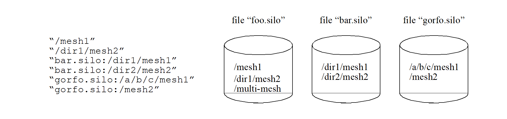

# Multi-Block Objects and Parallel I/O

Individual pieces of mesh created with a number of `DBPutXxxmesh()` calls can be assembled together into larger, multi-block objects.
Likewise for variables and materials defined on these meshes.

In Silo, multi-block objects are really just lists of all the individual pieces of a larger, coherent object.
For example, a multi-mesh object is really just a long list of object names, each name being the string passed as the name argument to a `DBPutXxxmesh()` call.

A key feature of multi-block object is that references to the individual pieces include the option of specifying the name of the Silo file in which a piece is stored.
This option is invoked when the colon operator (`:`) appears in the name of an individual piece.
All characters before the colon specify the name of a Silo file in the host file system.
All characters after a colon specify a directory path within the Silo file where the object lives.

The fact that multi-block objects can reference individual pieces that reside in different Silo files means that Silo, a serial I/O library, can be used very effectively and scalably in parallel without resorting to writing a file per processor.
The technique used to affect parallel I/O in this manner with Silo is [Multiple Independent File Parallel I/O](https://www.hdfgroup.org/2017/03/mif-parallel-io-with-hdf5/).

A separate convenience interface, PMPIO, is provided for this purpose.
The `PMPIO` interface provides almost all of the functionality necessary to use Silo in the MIF paradigm.
The application is required to implement a few callback functions.
The `PMPIO` interface is described at the end of this section.

The functions described in this section of the manual include...

{{ EndFunc }}

## `DBPutMultimesh()`

* **Summary:** Write a multi-block mesh object into a Silo file.

* **C Signature:**

  ```
  int DBPutMultimesh (DBfile *dbfile, char const *name, int nmesh,
      char const * const meshnames[], int const meshtypes[],
      DBoptlist const *optlist)
  ```

* **Fortran Signature:**

  ```
  integer function dbputmmesh(dbid, name, lname, nmesh,
     meshnames, lmeshnames, meshtypes, optlist_id, status)
  ```

  `character*N meshnames` (See [`dbset2dstrlen`](./fortran.md#dbset2dstrlen).)

* **Arguments:**

  Arg name | Description
  :---|:---
  `dbfile` | Database file pointer.
  `name` | Name of the multi-block mesh object.
  `nmesh` | Number of meshes pieces (blocks) in this multi-block object.
  `meshnames` | Array of length `nmesh` containing pointers to the names of each of the mesh blocks written with a `DBPutXxxmesh()` call. See below for description of how to populate `meshnames` when the pieces are in different files as well as `DBOPT_MB_FILE_NS` and `DBOPT_MB_BLOCK_NS` options to use a printf-style namescheme for large `nmesh`  in lieu of explicitly enumerating them here.
  `meshtypes` | Array of length `nmesh` containing the type of each mesh block such as `DB_QUAD_RECT`, `DB_QUAD_CURV`, `DB_UCDMESH`, `DB_POINTMESH`, and `DB_CSGMESH`. Be sure to see description, below, for `DBOPT_MB_BLOCK_TYPE` option to use single, constant value when all pieces are the same type.
  `optlist` | Pointer to an option list structure containing additional information to be included in the object written into the Silo file. Use a `NULL` if there are no options.

* **Returned value:**

  DBPutMultimesh returns zero on success and -1 on failure.


* **Description:**

  The `DBPutMultimesh` function writes a multi-block mesh object into a Silo file.
  It accepts as input the names of the various sub-meshes (blocks) which are part of this mesh.

  The mesh blocks may be stored in different sub-directories within a Silo file and, optionally, even in different Silo files altogether.
  So, the `name` of each mesh block is specified using its full Silo path `name`.
  The full Silo path name is the form...

  ```
  [<silo-filename>:]<path-to-mesh>
  ```

  The existence of a colon (':') anywhere in meshnames[i] indicates that the ith mesh block `name` is specified using both the Silo filename and the path in the file.
  All characters before the colon are the Silo file path name within the file system on which the file(s) reside.
  Use whatever slash character ('\' for Windows or '/' for Unix) is appropriate for the underlying file system in this part of the string only.
  Silo will automatically handle changes in the slash character in this part of the string if this data is ever read on a different file system.
  All characters after the colon are the path of the object within the Silo file and must use only the '/' slash character.

  Use the keyword "EMPTY" for any block for which the associated mesh object does not exist.
  This convention is often convenient in cases where there are many related multi-block objects and/or that evolve in time in such a way that some blocks do not exist for some times.

  The individual mesh names referenced here `CANNOT` be the names of other multi-block meshes.
  In other words, it is not valid to create a multi-mesh that references other multi-meshes.

  For example, in the case where the are 6 blocks to be assembled into a larger mesh named 'multi-mesh' in the file 'foo.silo' and the blocks are stored in three files as in the figure below,

  
  Figure 0-7: Strings for multi-block objects.

  the array of strings to be passed as the `meshnames` argument of `DBPutMultimesh` are illustrated.
  Note that the two pieces of mesh that are in the same file as the multi-mesh object itself, 'multi-mesh', do **not** require the colon and filename option.
  Only those pieces of the multi-mesh object that are in different files from the one the multi-block object itself resides in require the colon and filename option.

  You may pass `NULL` for the `meshnames` argument and instead use the namescheme options, `DBOPT_MB_FILE_NS` and `DBOPT_MB_BLOCK_NS` described in the table of options, below.
  This is particularly important for meshes consisting of O(105) or more blocks because it saves substantial memory and I/O time.
  See [`DBMakeNamescheme`](subsets.md#dbmakenamescheme) for how to specify nameschemes.

  Note, however, that with the `DBOPT_MB_FILE|BLOCK_NS` options, you are specifying only the string that a reader will later use in a call to `DBMakeNamescheme()` to create a namescheme object suitable for generating the `meshnames` and not the namescheme object itself.

  For convenience, two namescheme options are supported.
  One namescheme maps block numbers to filenames.
  The other maps block numbers to object names.
  A reader is required to then combine both to generate the complete block `name` for each mesh block.
  Optionally and where appropriate, one can specify a block namescheme only.
  External array references may be used in the nameschemes.
  Any such array names found in the namescheme are assumed to be the names of simple, 1D, integer arrays written with a `DBWrite()` call and existing in the same directory as the multi-block object . Finally, keep in mind that in the nameschemes, blocks are numbered starting from zero.

  If you are using the namescheme options and have `EMPTY` blocks, since the `meshnames` argument is `NULL`, you can use the `DBOPT_MB_EMPTY_COUNT|LIST` options to explicitly enumerate any empty blocks instead of having to incorporate them into your nameschemes.

  Similarly, when the mesh consists of blocks of all the same type, you may pass `NULL` for the `meshtypes` argument and instead use the `DBOPT_MB_BLOCK_TYPE` option to specify a single, constant block type for all blocks.
  This option can result in important savings for large numbers of blocks.

  Finally, note that what is described here for the multimesh object in the way of `name` for the individual blocks applies to all multi-block objects (e.g. `DBPutMultixxx`).

  Notes:

  The following table describes the options accepted by this function:

  **Optlist options:**

  Option Name|Value Data Type|Option Meaning|Default Value
  :---|:---|:---|:---
  `DBOPT_BLOCKORIGIN`|`int`|The origin of the block numbers.|1
  `DBOPT_CYCLE`|`int`|Problem cycle value.|0
  `DBOPT_TIME`|`float`|Problem time value.|0.0
  `DBOPT_DTIME`|`double`|Problem time value.|0.0
  `DBOPT_EXTENTS_SIZE`|`int`|Number of values in each extent tuple|0
  `DBOPT_EXTENTS`|`double*`|Pointer to an array of length `nmesh` * `DBOPT_EXTENTS_SIZE` doubles where each group of `DBOPT_EXTENTS_SIZE` doubles is an extent tuple for the mesh coordinates (see below). `DBOPT_EXTENTS_SIZE` must be set for this option to work correctly.|`NULL`
  `DBOPT_ZONECOUNTS`|`int*`|Pointer to an array of length `nmesh` indicating the number of zones in each block.|`NULL`
  `DBOPT_HAS_EXTERNAL_ZONES`|`int*`|Pointer to an array of length `nmesh` indicating for each block whether that block has zones external to the whole multi-mesh object. A non-zero value at index i indicates block i has external zones. A value of 0 (zero) indicates it does not.|`NULL`
  `DBOPT_HIDE_FROM_GUI`|`int`|Specify a non-zero value if you do not want this object to appear in menus of downstream tools|0
  `DBOPT_MRGTREE_NAME`|`char*`|Name of the mesh region grouping tree to be associated with this multimesh.|`NULL`
  `DBOPT_TV_CONNECTIVTY`|`int`|A non-zero value indicates that the connectivity of the mesh varies with time.|0
  `DBOPT_DISJOINT_MODE`|`int`|Indicates if any elements in the mesh are disjoint. There are two possible modes. One is `DB_ABUTTING` indicating that elements abut spatially but actually reference different node ids (but spatially equivalent nodal positions) in the node list. The other is `DB_FLOATING` where elements neither share nodes in the nodelist nor abut spatially.|`DB_NONE`
  `DBOPT_TOPO_DIM`|`int`|Used to indicate the topological dimension of the mesh apart from its spatial dimension.|-1 (not specified)
  `DBOPT_MB_BLOCK_TYPE`|`int`|Constant block type for all blocks|(not specified)
  `DBOPT_MB_FILE_NS`|`char*`|Multi-block file namescheme. This is a namescheme, indexed by block number, to generate filename in which each block is stored.|`NULL`
  `DBOPT_MB_BLOCK_NS`|`char*`|Multi-block block namescheme. This is a namescheme, indexed by block number, used to generate names of each block object apart from the file in which it may reside.|`NULL`
  `DBOPT_MB_EMPTY_LIST`|`int*`|When namescheme options are used, there is no `meshnames` argument in which to use the keyword 'EMPTY' for empty blocks. Instead, the empty blocks can be enumerated here, indexed from zero.|`NULL`
  `DBOPT_MB_EMPTY_COUNT`|`int`|Number of entries in the argument to `DBOPT_MB_EMPTY_LIST`|0
  The options specified below have been deprecated. Use Mesh Region Group (MRG) trees instead.|||
  `DBOPT_GROUPORIGIN`|`int`|The origin of the group numbers.|1
  `DBOPT_NGROUPS`|`int`|The total number of groups in this multimesh object.|0
  `DBOPT_ADJACENCY_NAME`|`char*`|Name of a multi-mesh, nodal adjacency object written with a call to adj.|`NULL`
  `DBOPT_GROUPINGS_SIZE`|`int`|Number of integer entries in the associated groupings array|0
  `DBOPT_GROUPINGS`|`int*`|Integer array of length specified by `DBOPT_GROUPINGS_SIZE` containing information on how different mesh blocks are organized into, possibly hierarchical, groups. See below for detailed discussion.|`NULL`
  `DBOPT_GROUPINGS_NAMES`|`char**`|Optional set of names to be associated with each group in the groupings array|`NULL`

  There is a class of options for multiblock objects that is *very important* in helping to accelerate performance in down-stream post-processing tools.
  We call these Downstream Performance Options.
  In order of utility, these options are `DBOPT_EXTENTS`, `DBOPT_MIXLENS` and `DBOPT_MATLISTS` and `DBOPT_ZONECOUNTS`.
  Although these options are creating redundant data in the Silo database, the data is stored in a manner that is far more convenient to down-stream applications that read Silo databases.
  Therefore, the user is strongly encouraged to make use of these options.

  Regarding the `DBOPT_EXTENTS` option, see the notes for [`DBPutMultivar`](#dbputmultivar).
  Note, however, that here the extents are for the coordinates of the mesh.

  Regarding the `DBOPT_ZONECOUNTS` option, this option will help down-stream post-processing tools to select an appropriate static load balance of blocks to processors.

  Regarding the `DBOPT_HAS_EXTERNAL_ZONES` option, this option will help down-stream post-processing tools accelerate computation of external boundaries.
  When a block is known not to contain any external zones, it can be quickly skipped in the computation.
  Note that while false positives can negatively effect only performance during downstream external boundary calculations, false negatives will result in serious errors.

  In other words, it is ok for a block that does not have external zones to be flagged as though it does.
  In this case, all that will happen in down-stream post-processing tools is that work to compute external faces that could have been avoided will be wasted.
  However, it is not ok for a block that has external zones to be flagged as though it does not.
  In this case, down-stream post-processing tools will skip boundary computation when it should have been computed.

  Three options, `DBOPT_GROUPINGS_SIZE`, `DBOPT_GROUPINGS` are deprecated.
  Instead, use MRG trees to handle grouping.
  Also, see notes regarding [`_visit_domain_groups`](conventions.md#visit-domain-groups) variable convention.

{{ EndFunc }}

## `DBGetMultimesh()`

* **Summary:** Read a multi-block mesh from a Silo database.

* **C Signature:**

  ```
  DBmultimesh *DBGetMultimesh (DBfile *dbfile, char const *meshname)
  ```

* **Fortran Signature:**

  ```
  None
  ```

* **Arguments:**

  Arg name | Description
  :---|:---
  `dbfile` | Database file pointer.
  `meshname` | Name of the multi-block mesh.


* **Returned value:**

  Returns a pointer to a [`DBmultimesh`](header.md#dbmultimesh) structure on success and `NULL` on failure.

* **Description:**

  The `DBGetMultimesh` function allocates a [`DBmultimesh`](header.md#dbmultimesh) data structure, reads a multi-block mesh from the Silo database, and returns a pointer to that structure.
  If an error occurs, `NULL` is returned.

{{ EndFunc }}

## `DBPutMultimeshadj()`

* **Summary:** Write some or all of a multi-mesh adjacency object into a Silo file.

* **C Signature:**

  ```
  int DBPutMultimeshadj(DBfile *dbfile, char const *name,
      int nmesh, int const *mesh_types, int const *nneighbors,
      int const *neighbors, int const *back,
      int const *nnodes, int const * const nodelists[],
      int const *nzones, int const * const zonelists[],
      DBoptlist const *optlist)
  ```

* **Fortran Signature:**

  ```
  None
  ```

* **Arguments:**

  Arg name | Description
  :---|:---
  `dbfile` | Database file pointer.
  `name` | Name of the multi-mesh adjacency object.
  `nmesh` | The number of mesh pieces in the corresponding multi-mesh object. This value must be identical in repeated calls to `DBPutMultimeshadj`.
  `mesh_types` | Integer array of length `nmesh` indicating the type of each mesh in the corresponding multi-mesh object. This array must be identical to that which is passed in the `DBPutMultimesh` call and in repeated calls to `DBPutMultimeshadj`.
  `nneighbors` | Integer array of length `nmesh` indicating the number of `neighbors` for each mesh piece. This array must be identical in repeated calls to `DBPutMultimeshadj`.  In the argument descriptions to follow, let $S_k = \sum_{i=1}^k \text{nneighbors}[i]$, which sums the first `k` elements from the `nneighbors` array.
  `neighbors` | Array of $S_{\text{nmesh}}$ integers enumerating for each mesh piece all other mesh pieces that neighbor it. Entries from index $S_k$ to index $S_{k+1}-1$ enumerate the `neighbors` of mesh piece `k`. This array must be identical in repeated calls to `DBPutMultimeshadj`.
  `back` | Array of $S_{\text{nmesh}}$ integers enumerating for each mesh piece, the local index of that mesh piece in each of its `neighbors` lists of `neighbors`. Entries from index $S_k$ to index $S_{k+1}-1$ enumerate the local indices of mesh piece `k` in each of the `neighbors` of mesh piece `k`. This argument may be `NULL`. In any case, this array must be identical in repeated calls to `DBPutMultimeshadj`.
  `nnodes` | Array of $S_{\text{nmesh}}$ integers indicating for each mesh piece, the number of nodes that it shares with each of its `neighbors`. Entries from index $S_k$ to index $S_{k+1}-1$ indicate the number of nodes that mesh piece k shares with each of its `neighbors`. This array must be identical in repeated calls to `DBPutMultimeshadj`. This argument may be `NULL`.
  `nodelists` | Array of $S_{\text{nmesh}}$ pointers to arrays of integers. Entries from index $S_k$ to index $S_{k+1}-1$ enumerate the nodes that mesh piece `k` shares with each of its `neighbors`. The contents of a specific nodelist array depend on the types of meshes that are neighboring each other (See description below). `nodelists[m]` may be `NULL` even if `nnodes[m]` is non-zero. See below for a description of repeated calls to `DBPutMultimeshadj`. This argument must be `NULL` if `nnodes` is `NULL`.
  `nzones` | Array of $S_{\text{nmesh}}$ integers indicating for each mesh piece, the number of zones that are adjacent with each of its `neighbors`. Entries from index $S_k$ to index $S_{k+1}-1$ indicate the number of zones that mesh piece `k` has adjacent to each of its `neighbors`. This array must be identical in repeated calls to `DBPutMultimeshadj`. This argument may be `NULL`.
  `zonelists` | Array of $S_{\text{nmesh}}$ pointers to arrays of integers. Entries from index $S_k$ to index $S_{k+1}-1$ enumerate the zones that mesh piece `k` has adjacent with each of its `neighbors`. The contents of a specific zonelist array depend on the types of meshes that are neighboring each other (See description below). `zonelists[m]` may be `NULL` even if `nzones[m]` is non-zero. See below for a description of repeated calls to `DBPutMultimeshadj`. This argument must be `NULL` if `nzones` is `NULL`.
  `optlist` | Pointer to an option list structure containing additional information to be included in the object written into the Silo file. Use a `NULL` if there are no options.

* **Description:**

  **Note: This object suffers from scalability issues above about 10{sup}5 blocks.**

  **The functionality this object provides is now more efficiently and conveniently handled via Mesh Region Grouping (MRG) trees.**
  Users are encouraged to use MRG trees as an alternative to `DBPutMultimeshadj()`.
  See [`DBMakeMrgtree`](subsets.md#dbmakemrgtree).

  `DBPutMultimeshadj` is another down-stream performance option (See [`DBPutMultimesh`](#dbputmultimesh)).
  It is an alternative to including ghost-zones (See [`DBPutMultimesh`](#dbputmultimesh)) in the mesh and may help to reduce file size, particularly for unstructured meshes.

  A multi-mesh adjacency object informs down-stream, post-processing tools such as VisIt how nodes and/or zones, should be shared between neighboring mesh blocks of a multi-block mesh to eliminate post-processing discontinuity artifacts along the boundaries between the pieces.
  If neither this information is provided nor ghost zones are stored in the file, post-processing tools must then infer this information from global node or zone ids (if they exist) or, worse, by matching coordinates which is a time-consuming and unreliable process.

  `DBPutMultimeshadj` is used to indicate how various mesh pieces in a multi-mesh object abut by specifying for each mesh piece, the nodes it shares with other mesh pieces and/or the zones is has adjacent to other mesh pieces.
  Note the important distinction in how nodes and zones are classified here.
  Nodes are shared between mesh pieces while zones are merely adjacent between mesh pieces.
  In a call to DBPutMultimeshadj, a caller may write information for either shared nodes or adjacent zones, or both.

  In practice, applications tend to use the same mesh type for every mesh piece.
  Thus, for ucd and point meshes, the nodelist (or zonelist) arrays will consists of pairs of integers where the first of the pair identifies a node (or zone) in the given mesh while the second identifies the shared node (or adjacent zone) in a neighbor.
  Likewise, for quad meshes, the nodelist (or zonelist) arrays will consists of 15 integers the first 6 of which identify a slab of nodes (or zones) in the given quad mesh.
  The second set of 6 integers identify the slab of shared nodes (or zones) in a neighbor quad mesh and the last 3 integers indicate the orientation of the neighbor quad mesh relative to the given quad mesh.
  For example the entries (1,2,3) for these 3 integers mean that all axes are aligned.
  The entries (-2,1,3) mean that the -J axis of the neighbor mesh piece aligns with the +I axis of the given mesh piece, the +I axis of the neighbor mesh piece aligns with the +J axis of the given mesh piece, and the +K axes both align the same way.

  The specific contents of a given nodelist array depend on the types of meshes between which it enumerates shared nodes.
  The table below describes the contents of nodelist array m given the different mesh types that it may enumerate shared nodes for.

  | &nbsp; | `DB_POINT` or `DB_UCD` | `DB_QUAD` |
  |-|-|-|
  | `DB_POINT`<br>or `DB_UCD` | `nnodes[m]` pairs of integers | `nnodes[m]+6` integers<br><br>The first `nnodes[m]` integers identify the nodes in the given point or ucd mesh block.<br><br>The next 6 integers identify ijk bounds of the corresponding nodes in the quad mesh neighbor block. |
  | `DB_QUAD` | `6+nnodes[m]` integers.<br><br>The first 6 integers identify ijk bounds of the nodes in the given quad mesh block.<br><br>The last `nnodes[m]` integers identify the nodes in the neighbor point or ucd mesh block.|15 integers<br><br>The first set of 6 integers identify ijk bounds of nodes in the given quad mesh block.<br><br>The second set of 6 integers identify ijk bounds of nodes in the neighbor quad mesh block.<br><br>The next 3 integers specify the orientation of the neighbor quad mesh block *relative* to the given mesh block. |

  This function is designed so that it may be called multiple times, each time writing a different portion of multi-mesh adjacency information to the object.
  On the first call, space is allocated in the Silo file for the entire object.
  The required space is determined by the contents of all but the `nodelists` (and/or zonelists) arrays.
  The contents of the `nodelists` (and/or zonelists) arrays are the only arguments that are permitted to vary from call to call and then they may vary only in which entries are `NULL` and non-`NULL`.
  Whenever an entry is `NULL` and the corresponding entry in `nnodes` (or nzones) array is non-zero, the assumption is that the information is provided in some other call to `DBPutMultimeshadj`.

{{ EndFunc }}

## `DBGetMultimeshadj()`

* **Summary:** Get some or all of a multi-mesh nodal adjacency object

* **C Signature:**

  ```
  DBmultimeshadj *DBGetMultimeshadj(DBfile *dbfile,
      char const *name,
      int nmesh, int const *mesh_pieces)
  ```

* **Fortran Signature:**

  ```
  None
  ```

* **Arguments:**

  Arg name | Description
  :---|:---
  `dbfile` | Database file pointer
  `name` | Name of the multi-mesh nodal adjacency object
  `nmesh` | Number of mesh pieces for which nodal adjacency information is being obtained. Pass zero if you want to obtain all nodal adjacency information in a single call.
  `mesh_pieces` | Integer array of length `nmesh` indicating which mesh pieces nodal adjacency information is desired for. May pass `NULL` if `nmesh` is zero.

* **Returned value:**

  A pointer to a fully or partially populated [`DBmultimeshadj`](header.md#dbmultimeshadj) object or `NULL` on failure.

* **Description:**

  `DBGetMultimeshadj` returns a nodal adjacency object.
  This function is designed so that it may be called multiple times to obtain information for different mesh pieces in different calls.
  The `nmesh` and `mesh_pieces` arguments permit the caller to specify for which mesh pieces adjacency information shall be obtained.

{{ EndFunc }}

## `DBPutMultivar()`

* **Summary:** Write a multi-block variable object into a Silo file.

* **C Signature:**

  ```
  int DBPutMultivar (DBfile *dbfile, char const *name, int nvar,
      char const * const varnames[], int const vartypes[],
      DBoptlist const *optlist);
  ```

* **Fortran Signature:**

  ```
  integer function dbputmvar(dbid, name, lname, nvar,
     varnames, lvarnames, vartypes, optlist_id, status)
  ```

  `character*N varnames` (See [`dbset2dstrlen`](./fortran.md#dbset2dstrlen).)

* **Arguments:**

  Arg name | Description
  :---|:---
  `dbfile` | Database file pointer.
  `name` | Name of the multi-block variable.
  `nvar` | Number of variables associated with the multi-block variable.
  `varnames` | Array of length `nvar` containing pointers to the names of the variables written with `DBPutXxxvar()` call. See [`DBPutMultimesh`](#dbputmultimesh) for description of how to populate `varnames` when the pieces are in different files as well as `DBOPT_MB_BLOCK|FILE_NS` options to use a printf-style namescheme for large `nvar` in lieu of explicitly enumerating them here.
  `vartypes` | Array of length `nvar` containing the types of the variables such as `DB_POINTVAR`, `DB_QUADVAR`, or `DB_UCDVAR`.  See [`DBPutMultimesh`](#dbputmultimesh), for `DBOPT_MB_BLOCK_TYPE` option to use single, constant value when all pieces are the same type.
  `optlist` | Pointer to an option list structure containing additional information to be included in the object written into the Silo file. Use a `NULL` if there are no options.

* **Returned value:**

  DBPutMultivar returns zero on success and -1 on failure.

* **Description:**

  The `DBPutMultivar` function writes a multi-block variable object into a Silo file.

  Notes:

  The following table describes the options accepted by this function:

  **Optlist options:**

  Option Name|Value Data Type|Option Meaning|Default Value
  :---|:---|:---|:---
  `DBOPT_BLOCKORIGIN`|`int`|The origin of the block numbers.|1
  `DBOPT_CYCLE`|`int`|Problem cycle value.|0
  `DBOPT_TIME`|`float`|Problem time value.|0.0
  `DBOPT_DTIME`|`double`|Problem time value.|0.0
  `DBOPT_HIDE_FROM_GUI`|`int`|Specify a non-zero value if you do not want this object to appear in menus of downstream tools|0
  `DBOPT_EXTENTS_SIZE`|`int`|Number of values in each extent tuple|0
  `DBOPT_EXTENTS`|`double*`|Pointer to an array of length `nvar` * `DBOPT_EXTENTS_SIZE` doubles where each group of `DBOPT_EXTENTS_SIZE` doubles is an extent tuple (see below). `DBOPT_EXTENTS_SIZE` must be set for this option to work correctly.|`NULL`
  `DBOPT_MMESH_NAME`|`char*`|Name of the multimesh this variable is associated with. Note, this option is very important as down-stream post processing tools are otherwise required to guess as to the mesh a given variable is associated with. Sometimes, the tools can guess wrong.|`NULL`
  `DBOPT_TENSOR_RANK`|`int`|Specify the variable type; one of either `DB_VARTYPE_SCALAR`, `DB_VARTYPE_VECTOR` `DB_VARTYPE_TENSOR`, `DB_VARTYPE_SYMTENSOR`,<br>`DB_VARTYPE_ARRAY`<br>`DB_VARTYPE_LABEL`|DB_VARTYPE_SCALAR
  `DBOPT_REGION_PNAMES`|`char**`|A null-pointer terminated array of pointers to strings specifying the pathnames of regions in the mrg tree for the associated mesh where the variable is defined. If there is no mrg tree associated with the mesh, the names specified here will be assumed to be material names of the material object associated with the mesh. The last pointer in the array must be null and is used to indicate the end of the list of names. See [`DBOPT_REGION_PNAMES`](subsets.md#dbopt-region-pnames).|`NULL`
  `DBOPT_CONSERVED`|`int`|Indicates if the variable represents a physical quantity that must be conserved under various operations such as interpolation.|0
  `DBOPT_EXTENSIVE`|`int`|Indicates if the variable represents a physical quantity that is extensive (as opposed to intensive). Note, while it is true that any conserved quantity is extensive, the converse is not true. By default and historically, all Silo variables are treated as intensive.|0
  `DBOPT_MB_BLOCK_TYPE`|`int`|Constant block type for all blocks|(not specified)
  `DBOPT_MB_FILE_NS`|`char*`|Multi-block file namescheme. This is a namescheme, indexed by block number, to generate filename in which each block is stored.|`NULL`
  `DBOPT_MB_BLOCK_NS`|`char*`|Multi-block block namescheme. This is a namescheme, indexed by block number, used to generate names of each block object apart from the file in which it may reside.|`NULL`
  `DBOPT_MB_EMPTY_LIST`|`int*`|When namescheme options are used, there is no `varnames` argument in which to use the keyword 'EMPTY' for empty blocks. Instead, the empty blocks can be enumerated here, indexed from zero.|`NULL`
  `DBOPT_MB_EMPTY_COUNT`|`int`|Number of entries in the argument to `DBOPT_MB_EMPTY_LIST`|0
  `DBOPT_MISSING_VALUE`|`double`|Specify a numerical value that is intended to represent "missing values" in the x or y data arrays. Default is `DB_MISSING_VALUE_NOT_SET`|DB_MISSING_VALUE_NOT_SET
  The options below have been deprecated. Use MRG trees instead.|||
  `DBOPT_GROUPORIGIN`|`int`|The origin of the group numbers.|1
  `DBOPT_NGROUPS`|`int`|The total number of groups in this multimesh object.|0

  Regarding the `DBOPT_EXTENTS` option, an extent tuple is a tuple of the variable's minimum value(s) followed by the variable's maximum value(s).
  If the variable is a single, scalar variable, each extent tuple will be 2 values of the form {min,max}. Thus, `DBOPT_EXTENTS_SIZE` will be 2.
  If the variable consists of nvars subvariables (e.g. the nvars argument in any of DBPutPointvar, DBPutQuadvar, `DBPutUcdvar` is greater than 1), then each extent tuple is 2*nvars values of each subvariable's minimum value followed by each subvariable's maximum value.
  In this case, `DBOPT_EXTENTS_SIZE` will be 2*nvars.

  For example, if we have a multi-var object of a 3D velocity vector on 2 blocks, then `DBOPT_EXTENTS_SIZE` will be 2*3=6 and the `DBOPT_EXTENTS` array will be an array of 2*6 doubles organized as follows...

  {Vx_min_0, Vy_min_0, Vz_min_0, Vx_max_0, Vy_max_0, Vz_max_0,

  Vx_min_1, Vy_min_1, Vz_min_1, Vx_max_1, Vy_max_1, Vz_max_1}

  Note that if ghost zones are present in a block, the extents must be computed such that they include contributions from data in the ghost zones.
  On the other hand, if a variable has mixed components, that is component values on materials mixing within zones, then the extents should **not** include contributions from the mixed variable values.


{{ EndFunc }}

## `DBGetMultivar()`

* **Summary:** Read a multi-block variable definition from a Silo database.

* **C Signature:**

  ```
  DBmultivar *DBGetMultivar (DBfile *dbfile, char const *varname)
  ```

* **Fortran Signature:**

  ```
  None
  ```

* **Arguments:**

  Arg name | Description
  :---|:---
  `dbfile` | Database file pointer.
  `varname` | Name of the multi-block variable.

* **Returned value:**

  DBGetMultivar returns a pointer to a [`DBmultivar`](header.md#dbmultivar) structure on success and `NULL` on failure.

* **Description:**

  The `DBGetMultivar` function allocates a [`DBmultivar`](header.md#dbmultivar) data structure, reads a multi-block variable from the Silo database, and returns a pointer to that structure.
  If an error occurs, `NULL` is returned.

{{ EndFunc }}

## `DBPutMultimat()`

* **Summary:** Write a multi-block material object into a Silo file.

* **C Signature:**

  ```
  int DBPutMultimat (DBfile *dbfile, char const *name, int nmat,
      char const * const matnames[], DBoptlist const *optlist)
  ```

* **Fortran Signature:**

  ```
  integer function dbputmmat(dbid, name, lname, nmat,
     matnames, lmatnames, optlist_id, status)
  ```

* **Arguments:**

  Arg name | Description
  :---|:---
  `dbfile` | Database file pointer.
  `name` | Name of the multi-material object.
  `nmat` | Number of material blocks provided.
  `matnames` | Array of length `nmat` containing pointers to the names of the material block objects, written with `DBPutMaterial()`. See [`DBPutMultimesh`](#dbputmultimesh) for description of how to populate `matnames` when the pieces are in different files as well as `DBOPT_MB_BLOCK|FILE_NS` options to use a printf-style namescheme for large `nmat` in lieu of explicitly enumerating them here.
  `optlist` | Pointer to an option list structure containing additional information to be included in the object written into the Silo file. Use a `NULL` if there are no options

* **Returned value:**

  DBPutMultimat returns zero on success and -1 on error.

* **Description:**

  The `DBPutMultimat` function writes a multi-material object into a Silo file.

  Notes:

  The following table describes the options accepted by this function:

  **Optlist options:**

  Option Name|Value Data Type|Option Meaning|Default Value
  :---|:---|:---|:---
  `DBOPT_BLOCKORIGIN`|`int`|The origin of the block numbers.|1
  `DBOPT_NMATNOS`|`int`|Number of material numbers stored in the `DBOPT_MATNOS` option.|0
  `DBOPT_MATNOS`|`int*`|Pointer to an array of length `DBOPT_NMATNOS` containing a complete list of the material numbers used in the Multimat object. `DBOPT_NMATNOS` must be set for this to work correctly.|`NULL`
  `DBOPT_MATNAMES`|`char**`|Pointer to an array of length `DBOPT_NMATNOS` containing a complete list of the material names used in the Multimat object. `DBOPT_NMATNOS` must be set for this to work correctly.|`NULL`
  `DBOPT_MATCOLORS`|`char**`|Array of strings defining the names of colors to be associated with each material. The color names are taken from the X windows color database. If a color `name` begins with a'#' symbol, the remaining 6 characters are interpreted as the hexadecimal `RGB` value for the color. `DBOPT_NMATNOS` must be set for this to work correctly.|`NULL`
  `DBOPT_CYCLE`|`int`|Problem cycle value.|0
  `DBOPT_TIME`|`float`|Problem time value.|0.0
  `DBOPT_DTIME`|`double`|Problem time value.|0.0
  `DBOPT_MIXLENS`|`int*`|Array of `nmat` ints which are the values of the mixlen arguments in each of the individual block's material objects.|
  `DBOPT_MATCOUNTS`|`int*`|Array of `nmat` counts indicating the number of materials actually in each block. |`NULL`
  `DBOPT_MATLISTS`|`int*`|Array of material numbers in each block. Length is the sum of values in `DBOPT_MATCOUNTS`. `DBOPT_MATCOUNTS` must be set for this option to work correctly.|`NULL`
  `DBOPT_HIDE_FROM_GUI`|`int`|Specify a non-zero value if you do not want this object to appear in menus of downstream tools|0
  `DBOPT_ALLOWMAT0`|`int`|If set to non-zero, indicates that a zero entry in the matlist array is actually not a valid material number but is instead being used to indicate an 'unused' zone. |0
  `DBOPT_MMESH_NAME`|`char*`|Name of the multimesh this material is associated with. Note, this option is very important as down-stream post processing tools are otherwise required to guess as to the mesh a given material is associated with. Sometimes, the tools can guess wrong.|`NULL`
  `DBOPT_MB_FILE_NS`|`char*`|Multi-block file namescheme. This is a namescheme, indexed by block number, to generate filename in which each block is stored.|`NULL`
  `DBOPT_MB_BLOCK_NS`|`char*`|Multi-block block namescheme. This is a namescheme, indexed by block number, used to generate names of each block object apart from the file in which it may reside.|`NULL`
  `DBOPT_MB_EMPTY_LIST`|`int*`|When namescheme options are used, there is no varnames argument in which to use the keyword 'EMPTY' for empty blocks. Instead, the empty blocks can be enumerated here, indexed from zero.|`NULL`
  `DBOPT_MB_EMPTY_COUNT`|`int`|Number of entries in the argument to `DBOPT_MB_EMPTY_LIST`|0
  The options below have been deprecated. Use MRG trees instead.|||
  `DBOPT_GROUPORIGIN`|`int`|The origin of the group numbers.|1
  `DBOPT_NGROUPS`|`int`|The total number of groups in this multimesh object.|0

  Regarding the `DBOPT_MIXLENS` option, this option will help down-stream post-processing tools to select an appropriate load balance of blocks to processors.
  Material mixing and material interface reconstruction have a big effect on cost of certain post-processing operations.

  Regarding the `DBOPT_MATLISTS` options, this option will give down-stream post-processing tools better knowledge of how materials are distributed among blocks.

{{ EndFunc }}

## `DBGetMultimat()`

* **Summary:** Read a multi-block material object from a Silo database

* **C Signature:**

  ```
  DBmultimat *DBGetMultimat (DBfile *dbfile, char const *name)
  ```

* **Fortran Signature:**

  ```
  None
  ```

* **Arguments:**

  Arg name | Description
  :---|:---
  `dbfile` | Database file pointer
  `name` | Name of the multi-block material object

* **Returned value:**

  DBGetMultimat returns a pointer to a [`DBmultimat`](header.md#dbmultimat) structure on success and `NULL` on failure.

* **Description:**

  The `DBGetMultimat` function allocates a [`DBmultimat`](header.md#dbmultimat) data structure, reads a multi-block material from the Silo database, and returns a pointer to that structure.
  If an error occurs, `NULL` is returned.

{{ EndFunc }}

## `DBPutMultimatspecies()`

* **Summary:** Write a multi-block species object into a Silo file.

* **C Signature:**

  ```
  int DBPutMultimatspecies (DBfile *dbfile, char const *name,
      int nspec, char const * const specnames[],
      DBoptlist const *optlist)
  ```

* **Fortran Signature:**

  ```
  None
  ```

* **Arguments:**

  Arg name | Description
  :---|:---
  `dbfile` | Database file pointer.
  `name` | Name of the multi-block species structure.
  `nspec` | Number of species objects provided.
  `specnames` | Array of length `nspec` containing pointers to the names of each of the species. See [`DBPutMultimesh`](#dbputmultimesh) for description of how to populate `specnames` when the pieces are in different files as well as `DBOPT_MB_BLOCK|FILE_NS` options to use a printf-style namescheme for large `nspec` in lieu of explicitly enumerating them here.
  `optlist` | Pointer to an option list structure containing additional information to be included in the object written into the Silo file. Use a `NULL` if there are no options.

* **Returned value:**

  DBPutMultimatspecies returns zero on success and -1 on failure.

* **Description:**

  The `DBPutMultimatspecies` function writes a multi-block material species object into a Silo file.
  It accepts as input descriptions of the various sub-species (blocks) which are part of this mesh.

  Notes:

  The following table describes the options accepted by this function:

  **Optlist options:**

  Option Name|Value Data Type|Option Meaning|Default Value
  :---|:---|:---|:---
  `DBOPT_BLOCKORIGIN`|`int`|The origin of the block numbers.|1
  `DBOPT_MATNAME`|`char*`|Character string defining the `name` of the multi-block material with which this object is associated.|`NULL`
  `DBOPT_NMAT`|`int`|The number of materials in the associated material object.|0
  `DBOPT_NMATSPEC`|`int*`|Array of length `DBOPT_NMAT` containing the number of material species associated with each material. `DBOPT_NMAT` must be set for this to work correctly.|`NULL`
  `DBOPT_CYCLE`|`int`|Problem cycle value.|0
  `DBOPT_TIME`|`float`|Problem time value.|0.0
  `DBOPT_DTIME`|`double`|Problem time value.|0.0
  `DBOPT_HIDE_FROM_GUI`|`int`|Specify a non-zero value if you do not want this object to appear in menus of downstream tools|0
  `DBOPT_SPECNAMES`|`char**`|Array of strings defining the names of the individual species. `DBOPT_NMATSPEC` must be set for this to work correctly. The length of this array is the sum of the values in the argument to the `DBOPT_NMATSPEC` option.|`NULL`
  `DBOPT_SPECCOLORS`|`char**`|Array of strings defining the names of colors to be associated with each species. The color names are taken from the X windows color database. If a color `name` begins with a'#' symbol, the remaining 6 characters are interpreted as the hexadecimal `RGB` value for the color. `DBOPT_NMATSPEC` must be set for this to work correctly. The length of this array is the sum of the values in the argument to the `DBOPT_NMATSPEC` option.|`NULL`
  `DBOPT_MB_FILE_NS`|`char*`|Multi-block file namescheme. This is a namescheme, indexed by block number, to generate filename in which each block is stored.|`NULL`
  `DBOPT_MB_BLOCK_NS`|`char*`|Multi-block block namescheme. This is a namescheme, indexed by block number, used to generate names of each block object apart from the file in which it may reside.|`NULL`
  `DBOPT_MB_EMPTY_LIST`|`int*`|When namescheme options are used, there is no varnames argument in which to use the keyword 'EMPTY' for empty blocks. Instead, the empty blocks can be enumerated here, indexed from zero.|`NULL`
  `DBOPT_MB_EMPTY_COUNT`|`int`|Number of entries in the argument to `DBOPT_MB_EMPTY_LIST`|0
  The options below have been deprecated. Use MRG trees instead.|||
  `DBOPT_GROUPORIGIN`|`int`|The origin of the group numbers.|1
  `DBOPT_NGROUPS`|`int`|The total number of groups in this multimesh object.|0


{{ EndFunc }}

## `DBGetMultimatspecies()`

* **Summary:** Read a multi-block species from a Silo database.

* **C Signature:**

  ```
  DBmultimesh *DBGetMultimatspecies (DBfile *dbfile,
      char const *name)
  ```

* **Fortran Signature:**

  ```
  None
  ```

* **Arguments:**

  Arg name | Description
  :---|:---
  `dbfile` | Database file pointer.
  `name` | Name of the multi-block material species.


* **Returned value:**

  DBGetMultimatspecies returns a pointer to a [`DBmultimatspecies`](header.md#dbmultimatspecies) structure on success and `NULL` on failure.

* **Description:**

  The `DBGetMultimatspecies` function allocates a [`DBmultimatspecies`](header.md#dbmultimatspecies) data structure, reads a multi-block material species from the Silo database, and returns a pointer to that structure.
  If an error occurs, `NULL` is returned.

{{ EndFunc }}

## `DBOpenByBcast()`

* **Summary:** Specialized, read-only open method for parallel applications needing all processors to read all (or most of) a given Silo file

* **C Signature:**

  ```
  DBfile *DBOpenByBcast(char const *filename, MPI_Comm comm,
      int rank_of_root)
  ```

* **Fortran Signature:**

  ```
  None
  ```

* **Arguments:**

  Arg name | Description
  :---|:---
  `filename` | name of the Silo file to open
  `comm` | MPI communicator to use for the broadcast operation
  `rank_of_root` | MPI rank of the processor in the communicator `comm` that shall serve as the root of the broadcast (typically 0).


* **Returned value:**

  A Silo database file handle just as returned from `DBOpen` or `DBCreate` except that the file is read-only.
  Available only for reading Silo files produced via the HDF5 driver.

* **Description:**

  This is an experimental interface!
  It is not fully integrated into the Silo library.

  In many parallel applications, there is a master or root file that all processors need all (or most of) the information from in order to bootstrap opening a larger collection of Silo files (similar to PMPIO)

  This method is provided to perform the operation in a way that is friendly to the underlying file system by opening the file on a single processor using the HDF5 file-in-core feature and then broadcasting the "file" buffer to all processors which then turn around and open the buffer as a file.
  In this way, the application can avoid many processors interacting with and potentially overwhelming the file system.

  But, there are some important limitations too.
  First, it works only for reading Silo files.
  Next, the entire Silo file is loaded into a buffer in memory and the broadcast in its entirety to all other processors.
  If only some processors need only some of the data from the file, then there is potentially a lot of memory and communication wasted for parts of the file not used on various processors.

  When the file is closed with `DBClose()` all memory used by the file is released.

  This method is not compiled into libsilo[h5].a.
  Instead, you are required to obtain the bcastopen.c source file (which is installed to the include dir of the Silo install point) and compile it into your application and then include a line of this form...

  ```
  extern `DBfile` *DBOpenByBcast(char const *, MPI_Comm, int);
  ```

  in your application.

  Note that you can find an example of its use in the Silo source release "tests" directory in the source file "bcastopen_test.c"

{{ EndFunc }}

## `PMPIO_Init()`

* **Summary:** Initialize a MIF Parallel I/O interaction with the Silo library

* **C Signature:**

  ```
  PMPIO_baton_t *PMPIO_Init(int numFiles, PMPIO_iomode_t ioMode,
      MPI_Comm mpiComm, int mpiTag,
      PMPIO_CreateFileCallBack createCb,
      PMPIO_OpenFileCallBack openCb,
      PMPIO_CloseFileCallBack closeCB,
      void *userData)
  ```

* **Fortran Signature:**

  ```
  None
  ```

* **Arguments:**

  Arg name | Description
  :---|:---
  `numFiles` | The number of individual Silo files to generate. Note, this is the number of parallel I/O streams that will be running simultaneously during I/O. A value of 1 causes `PMPIO` to behave serially. A value equal to the number of processors causes `PMPIO` to create a file-per-processor. Both values are unwise. For most parallel `HPC` platforms, values between 8 and 64 are appropriate.
  `ioMode` | Choose one of either `PMPIO_READ` or `PMPIO_WRITE`. Note, you can not use `PMPIO` to handle both read and write in the same interaction.
  `mpiComm` | The MPI communicator you would like `PMPIO` to use when passing the tiny baton messages it needs to coordinate access to the underlying Silo files. See documentation on MPI for a description of MPI communicators.
  `mpiTag` | The MPI message tag you would like `PMPIO` to use when passing the tiny baton messages it needs to coordinate access to the underlying Silo files.
  `createCb` | The file creation callback function. This is a function you implement that `PMPIO` will call when the first processor in each group needs to create the Silo file for the group. It is needed only for `PMPIO_WRITE` operations. If default behavior is acceptable, pass PMPIO_DefaultCreate here.
  `openCb` | The file open callback function. This is a function you implement that `PMPIO` will call when the second and subsequent processors in each group need to open a Silo file. It is needed for both `PMPIO_READ` and `PMPIO_WRITE` operations. If default behavior is acceptable, pass PMPIO_DefaultOpen here.
  `closeCb` | The file close callback function. This is a function you implement that `PMPIO` will call when a processor in a group needs to close a Silo file. If default behavior is acceptable, pass PMPIO_DefaultClose here.
  `userData` | [OPT] Arbitrary user data that will be passed back to the various callback functions. Pass `NULL`(0) if this is not needed.

* **Returned value:**

  A pointer to a `PMPIO_baton_t` object to be used in subsequent `PMPIO` calls on success.
  `NULL` on failure.

* **Description:**

  The `PMPIO` interface was designed to be separate from the Silo library.
  To use it, you must include the `PMPIO` header file, pmpio.h, after the MPI header file, mpi.h, in your application.
  This interface was designed to work with any serial library and not Silo specifically.
  For example, these same routines can be used with raw HDF5 or PDB files if so desired.

  The `PMPIO` interface decomposes a set of P processors into N groups and then provides access, in parallel, to a separate Silo file per group.
  This is the essence of MIF Parallel I/O.

  For `PMPIO_WRITE` operations, each processor in a group creates its own Silo sub-directory within the Silo file to write its data to.
  At any one moment, only one processor from each group has a file open for writing.
  Hence, the I/O is serial within a group.
  However, because a processor in each of the N groups is writing to its own Silo file, simultaneously, the I/O is parallel across groups.

  The number of files, N, can be chosen wholly independently of the total number of processors permitting the application to tune N to the underlying file system.
  If N is set to 1, the result will be serial I/O to a single file.
  If N is set to P, the result is one file per processor.
  Both of these are poor choices.

  Typically, one chooses N based on the number of available I/O channels.
  For example, a parallel application running on 2,000 processors and writing to a file system that supports 8 parallel I/O channels could select N=8 and achieve nearly optimum I/O performance and create only 8 Silo files.

  On every processor, the sequence of `PMPIO` operations takes the following form...

  ```C
  PMPIO_baton_t *bat = PMPIO_Init(...);

  dbFile = (DBfile *) PMPIO_WaitForBaton(bat, ...);

  /* local work (e.g. DBPutXxx() calls) for this processor
  .
  .
  .
  */

  PMPIO_HandOffBaton(bat, ...);

  PMPIO_Finish(bat);
  ```

  For a given `PMPIO` group of processors, only one processor in the group is in the *local work* block of the above code.
  All other processors have either completed it or are waiting their predecessor to finish.
  However, every `PMPIO` group will have one processor working in the *local work* block, concurrently, to different files.

  After `PMPIO_Finish()`, there is still one final step that `PMPIO` DOES **not** HELP with.
  That is the creation of the multi-block objects that reference the individual pieces written by all the processors with `DBPutXXX` calls in the "local work" part of the above sequence.
  It is the application's responsibility to correctly assembly the names of all these pieces and then create the multi-block objects that reference them.
  Ordinarily, the application designates one processor to write these multi-block objects and one of the N Silo files to write them to.
  Again, this last step is not something `PMPIO` will help with.

  MIF Parallel I/O is a simple and effective I/O strategy that has been used by codes like Ale3d and SAMRAI for many years and has shown excellent scaling behavior.
  A drawback of this approach is, of course, that multiple files are generated.
  However, when used appropriately, this number of files is typically small (e.g. 8 to 64).
  In addition, our experience has been that concurrent, parallel I/O to a single file which also supports sufficient variation in size, shape and pattern of I/O requests from processor to processor is a daunting challenge to perform scalably.
  So, while MIF Parallel I/O is not truly concurrent, parallel I/O, it has demonstrated that it is not only highly flexible and highly scalable but also very easy to implement and for these reasons, often a superior choice to true, concurrent, parallel I/O.

{{ EndFunc }}

## `PMPIO_CreateFileCallBack()`

* **Summary:** The `PMPIO` file creation callback

* **C Signature:**

  ```
  typedef void *(*PMPIO_CreateFileCallBack)(const char *fname,
      const char *dname, void *udata);
  ```

* **Fortran Signature:**

  ```
  None
  ```

* **Arguments:**

  Arg name | Description
  :---|:---
  `fname` | The name of the Silo file to create.
  `dname` | The name of the directory within the Silo file to create.
  `udata` | A pointer to any additional user data. This is the pointer passed as the userData argument to PMPIO_Init().

* **Returned value:**

  A void pointer to the created file handle.

* **Description:**

  This defines the `PMPIO` file creation callback interface.

  Your implementation of this file creation callback should minimally do the following things.

  For `PMPIO_WRITE` operation, your implementation should `DBCreate()` a Silo file of name fname, `DBMkDir()` a directory of name `dname` for the first processor of a group to write to and `DBSetDir()` to that directory.

  For `PMPIO_READ` operations, your implementation of this callback is never called.

  The `PMPIO_DefaultCreate` function does only the minimal work, returning a void pointer to the created `DBfile` Silo file handle.

{{ EndFunc }}

## `PMPIO_OpenFileCallBack()`

* **Summary:** The `PMPIO` file open callback

* **C Signature:**

  ```
  typedef void *(*PMPIO_OpenFileCallBack)(const char *fname,
      const char *dname, PMPIO_iomode_t iomode, void *udata);
  ```

* **Fortran Signature:**

  ```
  None
  ```

* **Arguments:**

  Arg name | Description
  :---|:---
  `fname` | The name of the Silo file to open.
  `dname` | The name of the directory within the Silo file to work in.
  `iomode` | The `iomode` of this `PMPIO` interaction. This is the value passed as ioMode argument to PMPIO_Init().
  `udate` | A pointer to any additional user data. This is the pointer passed as the userData argument to PMPIO_Init().

* **Returned value:**

  A void pointer to the opened file handle that was.

* **Description:**

  This defines the `PMPIO` open file callback.

  Your implementation of this open file callback should minimally do the following things.

  For `PMPIO_WRITE` operations, it should `DBOpen()` the Silo file named fname, `DBMkDir()` a directory named `dname` and `DBSetDir()` to directory `dname`.

  For `PMPIO_READ` operations, it should `DBOpen()` the Silo file named `fname` and then `DBSetDir()` to the directory named `dname`.

  The `PMPIO_DefaultOpen` function does only the minimal work, returning a void pointer to the opened `DBfile` Silo handle.

{{ EndFunc }}

## `PMPIO_CloseFileCallBack()`

* **Summary:** The `PMPIO` file close callback

* **C Signature:**

  ```
  typedef void  (*PMPIO_CloseFileCallBack)(void *file, void *udata);
  ```

* **Fortran Signature:**

  ```
  None
  ```

* **Arguments:**

  Arg name | Description
  :---|:---
  `file` | void pointer to the `file` handle (DBfile pointer).
  `udata` | A pointer to any additional user data. This is the pointer passed as the userData argument to PMPIO_Init().

* **Returned value:**

  void

* **Description:**

  This defines the `PMPIO` close `file` callback interface.

  Your implementation of this callback function should simply close the `file`.
  It us up to the implementation to know the correct time of the `file` handle passed as the void pointer `file`.

  The `PMPIO_DefaultClose` function simply closes the Silo `file`.

{{ EndFunc }}

## `PMPIO_WaitForBaton()`

* **Summary:** Wait for exclusive access to a Silo file

* **C Signature:**

  ```
  void *PMPIO_WaitForBaton(PMPIO_baton_t *bat,
      const char *filename, const char *dirname)
  ```

* **Fortran Signature:**

  ```
  None
  ```

* **Arguments:**

  Arg name | Description
  :---|:---
  `bat` | The `PMPIO` baton handle obtained via a call to PMPIO_Init().
  `filename` | The name of the Silo file this processor will create or open.
  `dirname` | The name of the directory within the Silo file this processor will work in.


* **Returned value:**

  `NULL` (0) on failure.
  Otherwise, for `PMPIO_WRITE` operations the return value is whatever the create or open file callback functions return.
  For `PMPIO_READ` operations, the return value is whatever the open file callback function returns.

* **Description:**

  All processors should call this function as the next `PMPIO` function to call following a call to `PMPIO_Init()`.

  For all processors that are the *first* processors in their groups, this function will return immediately after having called the file creation callback specified in `PMPIO_Init()`.
  Typically, this callback will have created a file with the name `filename` and a directory in the file with the name `dirname` as well as having set the current working directory to `dirname`.

  For all processors that are not the *first* in their groups, this call will block, waiting for the processor preceding it to finish its work on the Silo file for the group and pass the baton to the next processor.

  A typical naming convention for `filename` is something like `"my_file_%03d.silo"` where the `"%03d"` is replaced with the group rank (See [`PMPIO_GroupRank`](#pmpio-grouprank) of the processor.
  Likewise, a typical naming convention for `dirname` is something like `"domain_%03d"` where the "%03d" is replaced with the rank-in-group (See [`PMPIO_RankInGroup`](#pmpio-rankingroup) of the processor.

{{ EndFunc }}

## `PMPIO_HandOffBaton()`

* **Summary:** Give up all access to a Silo file

* **C Signature:**

  ```
  void PMPIO_HandOffBaton(const PMPIO_baton_t *bat, void *file)
      
  ```

* **Fortran Signature:**

  ```
  None
  ```

* **Arguments:**

  Arg name | Description
  :---|:---
  `bat` | The `PMPIO` baton handle obtained via a call to PMPIO_Init().
  `file` | A void pointer to the Silo `DBfile` object.

* **Returned value:**

  void

* **Description:**

  When a processor has completed all its work on a Silo file, it gives up access to the `file` by calling this function.
  This has the effect of closing the Silo `file` and then passing the baton to the next processor in the group.

{{ EndFunc }}

## `PMPIO_Finish()`

* **Summary:** Finish a MIF Parallel I/O interaction with the Silo library

* **C Signature:**

  ```
  void PMPIO_Finish(PMPIO_baton *bat)
  ```

* **Fortran Signature:**

  ```
  None
  ```

* **Arguments:**

  Arg name | Description
  :---|:---
  `bat` | The `PMPIO` baton handle obtained via a call to PMPIO_Init().

* **Returned value:**

  void

* **Description:**

  After a processor has finished a `PMPIO` interaction with the Silo library, call this function to free the baton object associated with the interaction.

{{ EndFunc }}

## `PMPIO_GroupRank()`

* **Summary:** Obtain group rank (e.g. which `PMPIO` group) of a processor

* **C Signature:**

  ```
  int PMPIO_GroupRank(const PMPIO_baton_t *bat, int rankInComm)
  ```

* **Fortran Signature:**

  ```
  None
  ```

* **Arguments:**

  Arg name | Description
  :---|:---
  `bat` | The `PMPIO` baton handle obtained via a call to PMPIO_Init().
  `rankInComm` | Rank of processor in the MPI communicator passed in PMPIO_Init() for which group rank is to be queried.

* **Returned value:**

  The 'group rank' of the queiried processor.
  In other words, the group number of the queried processor, indexed from zero.

* **Description:**

  This is a convenience function to help applications identify which `PMPIO` group a given processor belongs to.

{{ EndFunc }}

## `PMPIO_RankInGroup()`

* **Summary:** Obtain the rank of a processor *within* its `PMPIO` group

* **C Signature:**

  ```
  int PMPIO_RankInGroup(const PMPIO_baton_t *bat, int rankInComm)
  ```

* **Fortran Signature:**

  ```
  None
  ```

* **Arguments:**

  Arg name | Description
  :---|:---
  `bat` | The `PMPIO` baton handle obtained via a call to PMPIO_Init().
  `rankInComm` | Rank of the processor in the MPI communicator used in PMPIO_Init() to be queried.

* **Returned value:**

  The rank of the queried processor within its `PMPIO` group.

* **Description:**

  This is a convenience function for applications to determine which processor a given processor is *within* its `PMPIO` group.

{{ EndFunc }}

